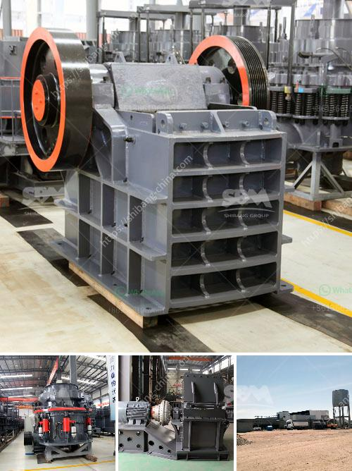

<h3>second hand ball mill and gauteng</h3>
In recent years, the demand for second-hand machinery has increased significantly due to various reasons such as cost-saving and environmental sustainability. One of the most sought-after second-hand machinery in the industrial sector is the ball mill. A ball mill is a type of grinding mill that is used to grind and blend materials for use in mineral processes, ceramics, and paints. A ball mill works on the principle of impact and attrition: size reduction is done by impact as the balls drop from near the top of the shell.

Gauteng, a province in South Africa, is well-known for its industrial prowess. It is a hub for various industries, including mining and manufacturing. Second-hand ball mills in Gauteng are popular due to their lower price point and reliability. The availability of these mills enables mining companies to process raw materials at a reduced cost. Moreover, these mills also find applications in various other industries, such as the ceramics industry, where they are used for materials processing.

When considering a second-hand ball mill in Gauteng, certain factors should be taken into account. Firstly, one must ensure that the mill is in good working condition and has minimal wear and tear. It is advisable to inspect the mill thoroughly before purchasing to avoid any future maintenance issues. Additionally, the reputation and credibility of the seller should also be carefully evaluated to ensure a smooth buying experience.

Second-hand ball mills in Gauteng offer a cost-effective solution to those seeking to expand their operations or replace old machinery. By purchasing a second-hand ball mill, businesses can save significantly on capital expenditure. This, in turn, can be invested in other areas of the business, such as research and development or marketing.

In conclusion, second-hand ball mills in Gauteng provide a practical and efficient solution for businesses requiring this type of machinery. With proper research and inspection, companies can find reliable and cost-effective mills that meet their operational needs. By embracing the concept of recycling and reuse, businesses can also contribute to environmental sustainability, making it a win-win situation for all stakeholders involved.
<h3>Contact us</h3><ul><li><strong>Whatsapp:&nbsp;<a href="https://wa.me/8613661969651">+8613661969651</a></strong></li><li><a href="https://swt.shibang-china.com/?git&amp;zhl&amp;second hand ball mill and gauteng"><strong>Online Service(chat now)</strong></a></li></ul><h3>Related</h3><ul><li><a href='mining and quarrying crusher machinery and equipment.md'>mining and quarrying crusher machinery and equipment</a></li><li><a href='used rock crushers for sale in germany.md'>used rock crushers for sale in germany</a></li><li><a href='gypsum production powder manufacturers in europe.md'>gypsum production powder manufacturers in europe</a></li><li><a href='crusher for marble.md'>crusher for marble</a></li><li><a href='price for cone crusher.md'>price for cone crusher</a></li></ul>