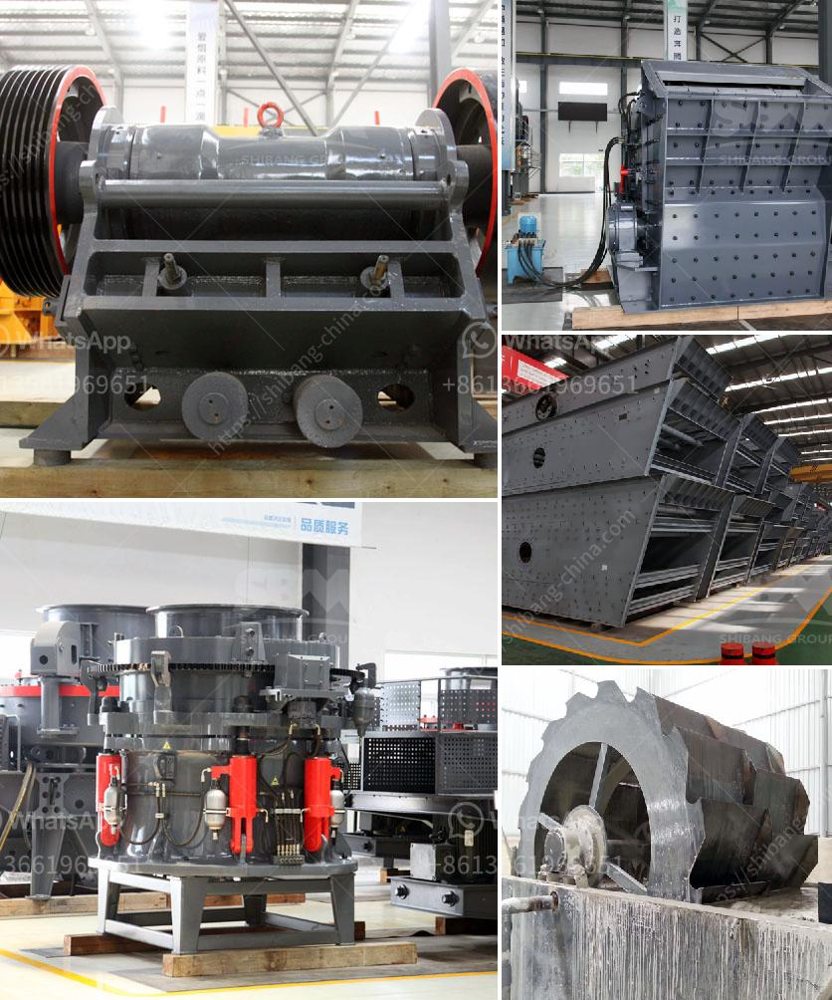

<h3>second hand ball mill manufacturer in india</h3>
Second-hand ball mill manufacturers in India are prevalent since the mill is extremely vital in both small scale as well as large scale industries. It is used in the grinding materials like ores, chemicals, ceramic raw materials and paints.

Second-hand ball mills are sold widely in India due to their unique advantages. It is widely used in mineral processing, building materials and chemical industry. These mills are devices that are used to grind materials into desired sizes using steel balls as the grinding medium. The ball mill equipment is widely used in the production of cement, silicate products, new building materials, refractory materials, fertilizers, black and non-ferrous metal beneficiation, and glass ceramics, among others.

India is a country with a rapidly growing industrial infrastructure, and hence, the demand for second-hand ball mills is also increasing. Several manufacturers are offering used ball mills for sale at competitive prices, enabling buyers to find quality products at affordable rates. They also cater to the specific needs of various industries, ensuring efficient and reliable operation.

There are several advantages of buying second-hand ball mills from reputable manufacturers in India. Firstly, these manufacturers adhere to strict quality standards, ensuring that their refurbished mills are in excellent condition. They perform thorough inspections and conduct necessary repairs, replacements, or refurbishments to ensure the mill operates optimally.

Secondly, buying from reputable manufacturers offers a reliable source of supply. They have an extensive network and can provide the required technical support, spare parts, and expertise whenever needed. This ensures problem-free operation and reduces downtime, ultimately benefiting the customer.

Thirdly, purchasing a second-hand ball mill is an environmentally friendly decision. By opting for a used mill, industries can contribute to the reduction of waste generation. Recycling and reusing equipment extend its lifespan, avoiding unnecessary disposal and minimizing the strain on natural resources.

Moreover, second-hand ball mills are cost-effective compared to new mills. They offer significant savings, particularly for small-scale businesses or industries that are starting on a tight budget. Used mills are available at lower prices compared to new ones, making them an attractive option for those looking for high-quality equipment at a reasonable price.

However, while considering buying a second-hand ball mill, it is essential to research and select a reputable manufacturer. Conducting due diligence ensures that the used mill is reliable, genuine, and in good condition. It is advisable to inspect the mill personally or seek expert advice before finalizing the purchase.

In conclusion, the demand for second-hand ball mills in India is rising due to their unique advantages, including affordability, reliability, and eco-friendliness. Reputable manufacturers in India offer a wide range of used mills that cater to various industries' needs. Choosing a reliable manufacturer ensures quality equipment, technical support, and a seamless buying experience. By opting for second-hand equipment, businesses can save costs, contribute to sustainability efforts, and achieve efficient operation.
<h3>Contact us</h3><ul><li><strong>Whatsapp:&nbsp;<a href="https://wa.me/8613661969651">+8613661969651</a></strong></li><li><a href="https://swt.shibang-china.com/?git&amp;zhl&amp;second hand ball mill manufacturer in india"><strong>Online Service(chat now)</strong></a></li></ul><h3>Related</h3><ul><li><a href='crushing plants suppliers sales in nigeria.md'>crushing plants suppliers sales in nigeria</a></li><li><a href='mining equipment for hire in kenya.md'>mining equipment for hire in kenya</a></li><li><a href='grinding calcium carbonate equipment.md'>grinding calcium carbonate equipment</a></li><li><a href='lime stone crusher manufacture in india.md'>lime stone crusher manufacture in india</a></li><li><a href='crushing plant equipment.md'>crushing plant equipment</a></li></ul>