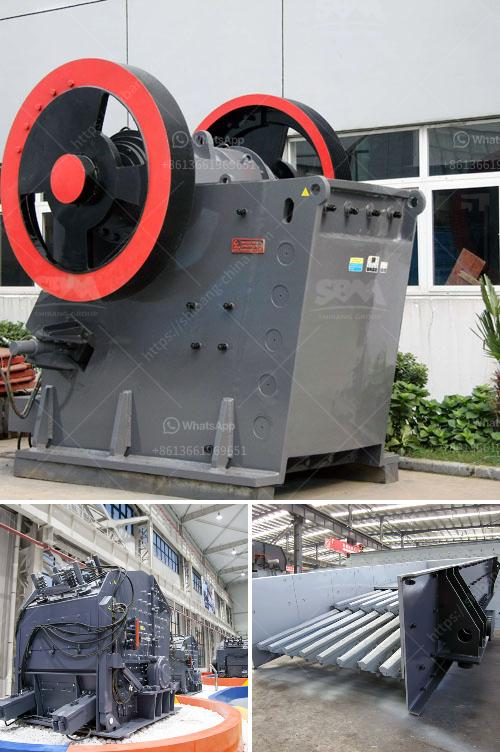

<h3>second hand concrete grinding machine supplier in dubai</h3>
If you are in the market for a concrete grinding machine, it's always worth considering the option of buying second-hand equipment. Not only can it save you a significant amount of money, but it also allows you to find machines that are still in excellent condition and ready to serve your needs. When it comes to sourcing a second-hand concrete grinding machine in Dubai, one supplier stands out from the rest - [Supplier Name]. With their extensive range of quality machinery and exceptional customer service, they have become the go-to destination for many professionals in the industry.

What makes [Supplier Name] a reliable choice for second-hand concrete grinding machines is their rigorous screening and testing process. Before accepting any used equipment, they carefully inspect each machine to ensure it is in good working condition and meets the highest standards of quality. This guarantees that you are getting a machine that will perform optimally and give you the desired results.

By purchasing a second-hand machine from [Supplier Name], you also benefit from their extensive knowledge and expertise. Their team of professionals is well-versed in the concrete grinding industry and can guide you towards the most suitable equipment for your specific requirements. Whether you are a contractor, a DIY enthusiast, or a facility owner, they can help you find the right machine that fits your budget and needs.

Furthermore, [Supplier Name] takes pride in their commitment to customer satisfaction. They understand that investing in a concrete grinding machine is a significant decision, and they strive to make the process as smooth and hassle-free as possible. From providing detailed product information to offering after-sales support, they are dedicated to ensuring that their customers are fully satisfied with their purchase.

In conclusion, if you are looking for a second-hand concrete grinding machine supplier in Dubai, [Supplier Name] should be your top choice. With their quality machinery, thorough testing process, and exceptional customer service, they tick all the boxes when it comes to reliability and professionalism. Trust in their expertise and find the perfect machine that will meet all your concrete grinding needs at a fraction of the cost.
<h3>Contact us</h3><ul><li><strong>Whatsapp:&nbsp;<a href="https://wa.me/8613661969651">+8613661969651</a></strong></li><li><a href="https://swt.shibang-china.com/?git&amp;zhl&amp;second hand concrete grinding machine supplier in dubai"><strong>Online Service(chat now)</strong></a></li></ul><h3>Related</h3><ul><li><a href='milling grinding machines manufacturer europe.md'>milling grinding machines manufacturer europe</a></li><li><a href='working scale model stone crusher.md'>working scale model stone crusher</a></li><li><a href='black powder ball mill grinder.md'>black powder ball mill grinder</a></li><li><a href='jaw crusher in uganda.md'>jaw crusher in uganda</a></li><li><a href='mining and quarrying crusher machinery and equipment.md'>mining and quarrying crusher machinery and equipment</a></li></ul>