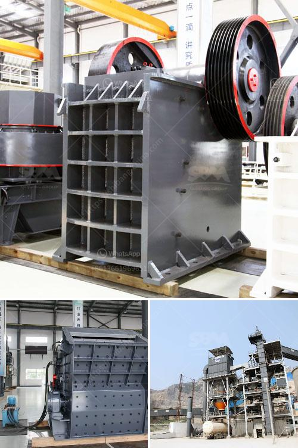

<h3>second hand gypsum powder line</h3>
Construction firms constantly seek ways to save costs without compromising quality. One such option is purchasing second-hand equipment, including a gypsum powder line. A gypsum powder line is essential for producing high-quality plaster for internal and external walls, as well as for molds and decorative elements. Here, we explore the benefits of opting for a second-hand gypsum powder line.

Firstly, the cost advantage is significant when purchasing second-hand equipment. Construction firms can save a substantial amount of money by opting for a used gypsum powder line. The initial investment is significantly lower compared to buying a brand-new line, which is especially beneficial for small- and medium-sized companies operating on tight budgets.

Second-hand gypsum powder lines also offer a quicker return on investment. With reduced upfront costs, companies can recoup the investment faster. Construction firms can start production and generating revenues sooner, enabling them to meet project deadlines and quickly recover their investment.

The availability of second-hand equipment is another advantage. As construction firms often require flexibility due to varying project demands, having access to readily available second-hand gypsum powder lines can be invaluable. This allows firms to expand their production capabilities without the long lead times associated with ordering new equipment.

Furthermore, second-hand gypsum powder lines are often thoroughly inspected and refurbished before resale. Reputable sellers ensure that the equipment is in good working condition and meets safety standards. This provides buyers with peace of mind that the machinery will perform to the required standards and last for a foreseeable period.

Despite the benefits, buyers should exercise caution when purchasing second-hand gypsum powder lines. Conduct thorough research, inspect the machinery, and request documentation to ensure that the equipment is in good condition and has a reliable history of operation.

In conclusion, opting for a second-hand gypsum powder line is a sensible choice for construction firms looking to cut costs without compromising quality. The significant cost advantages, quicker return on investment, availability, and reliable performance make used equipment a compelling option for firms operating in the construction industry. However, buyers should exercise diligence to ensure they purchase a reliable and well-maintained second-hand gypsum powder line.
<h3>Contact us</h3><ul><li><strong>Whatsapp:&nbsp;<a href="https://wa.me/8613661969651">+8613661969651</a></strong></li><li><a href="https://swt.shibang-china.com/?git&amp;zhl&amp;second hand gypsum powder line"><strong>Online Service(chat now)</strong></a></li></ul><h3>Related</h3><ul><li><a href='hydroton pebbles clay manufacturing process.md'>hydroton pebbles clay manufacturing process</a></li><li><a href='portable crusher in malaysia.md'>portable crusher in malaysia</a></li><li><a href='hp ball mill motors.md'>hp ball mill motors</a></li><li><a href='quartz processing technique.md'>quartz processing technique</a></li><li><a href='marble and granite plant.md'>marble and granite plant</a></li></ul>