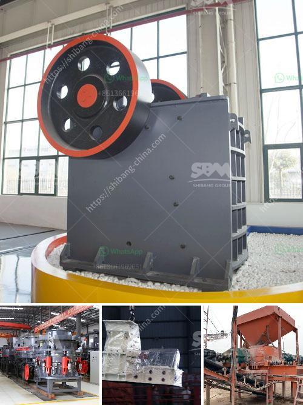

<h3>second hand mobile jaw crusher in spain</h3>
Spain is renowned for its diverse landscapes and rich cultural heritage, attracting more than 83 million tourists annually. However, the country's construction industry has experienced a decline in recent years due to the global economic crisis. Amidst this slowdown, quarrying remains an essential industry in Spain, providing raw materials for infrastructure, building, and road construction projects.

To keep up with the demand for crushed stone and various other aggregates, quarry owners and operators are constantly seeking cost-effective solutions to upgrade their equipment. In recent times, second-hand mobile jaw crushers have gained popularity among quarry owners as they offer flexibility, mobility, and efficiency. Moreover, they can be easily transported to various locations, making them suitable for both large and small-scale quarrying operations.

The primary function of a mobile jaw crusher is to reduce large pieces of rock, ore, or other materials into smaller pieces. This is achieved by applying force to the material using a fixed and movable jaw plate. As the feed material enters the crusher's chamber, it encounters the fixed jaw plate, which remains stationary. The movable jaw plate exerts pressure on the material, crushing it against the fixed jaw plate. This process continues until the desired size is achieved.

The advantages of using a second-hand mobile jaw crusher in Spain are numerous. First and foremost, they offer a significant cost savings compared to investing in a new crusher. Additionally, they allow quarry owners to put their capital to use more efficiently in other areas of their business. These savings can be reinvested into other equipment or used to expand the quarry, boosting productivity and profitability in the long run.

Second-hand mobile jaw crushers also provide a sustainable solution for reducing environmental impact. By recycling and reusing machinery, carbon emissions associated with manufacturing new crushers can be significantly reduced. In an era of increasing environmental awareness, this is a crucial factor for quarry owners looking to minimize their ecological footprint.

Moreover, the availability of second-hand mobile jaw crushers in the market eliminates the need for extensive lead times associated with purchasing new equipment. Quarry owners can find machines that are readily available, allowing them to start their operations without delays. This is especially crucial when a quarry is facing increased demand or has specific project deadlines to meet.

In conclusion, second-hand mobile jaw crushers have emerged as a cost-effective and sustainable solution for quarrying operations in Spain. Their flexibility, mobility, and efficiency make them an attractive choice for quarry owners looking to upgrade their equipment. Additionally, the cost savings associated with purchasing a second-hand crusher can be reinvested in other areas of the business, promoting growth and modernization. With the ongoing demand for crushed stone in Spain, the market for second-hand mobile jaw crushers is likely to continue thriving in the foreseeable future.
<h3>Contact us</h3><ul><li><strong>Whatsapp:&nbsp;<a href="https://wa.me/8613661969651">+8613661969651</a></strong></li><li><a href="https://swt.shibang-china.com/?git&amp;zhl&amp;second hand mobile jaw crusher in spain"><strong>Online Service(chat now)</strong></a></li></ul><h3>Related</h3><ul><li><a href='rock crushing machine price.md'>rock crushing machine price</a></li><li><a href='aggregate crushing plant sale.md'>aggregate crushing plant sale</a></li><li><a href='barium carbonate manufacturing process.md'>barium carbonate manufacturing process</a></li><li><a href='rock stone zambia mining crushing plants.md'>rock stone zambia mining crushing plants</a></li><li><a href='list of compartment of gypsum crusher plant.md'>list of compartment of gypsum crusher plant</a></li></ul>