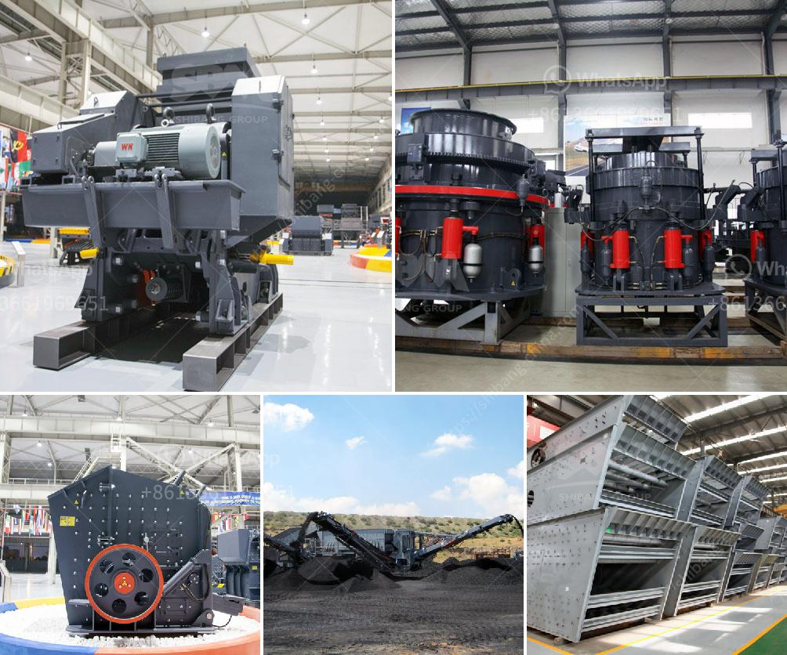

<h3>second hand quarry cruher equipment price south africa</h3>
The mining industry in South Africa is one of the largest contributors to the country's GDP. With abundant mineral resources, it has the potential to significantly boost economic growth and create job opportunities. Quarrying and mining are two of the key sectors driving the country's mining industry.

To extract valuable minerals from the ground, heavy machinery and equipment are required. Quarry crushers are specifically designed to produce high-quality aggregates used in the construction industry such as asphalt, concrete, and road base materials. These crushers have different capacities and specifications to meet the diverse needs of various mining operations.

When it comes to acquiring equipment for quarrying, the cost can be a significant factor for many businesses. New machinery can be expensive, especially for smaller businesses or those just starting out. This is where second-hand quarry crushers come into play. They offer a more affordable option for companies that are looking to expand their operations or replace old equipment.

The price of second-hand quarry crushers in South Africa can range from several thousand dollars to several million dollars, depending on the specific model, size, and condition of the machine. Compared to new machinery, second-hand equipment may require some maintenance and refurbishment, but the cost savings can be substantial.

There are several factors that affect the price of second-hand quarry crushers in South Africa. Firstly, the brand and reputation of the manufacturer play a significant role. Well-known and reputable brands tend to have higher resale values as they are often associated with better quality and durability.

The age and condition of the equipment also impact its price. Older machines may be available at a lower cost, but they may require more frequent repairs and have a shorter lifespan. The condition of the machine should be thoroughly assessed before purchase to determine any potential maintenance or repair expenses.

Additionally, market demand and availability play a role in determining price. If there is a high demand for quarry crushers in South Africa, the prices may be higher due to limited supply. Conversely, if the market is saturated with available equipment, sellers may reduce prices to attract buyers.

It is crucial for potential buyers to conduct thorough research and due diligence before purchasing second-hand quarry crushers. They should compare prices from different sellers and carefully inspect the equipment to ensure it meets their requirements. Consulting with industry experts or hiring a professional to assess the condition of the machine can provide valuable insights and minimize the risk of buying faulty or unreliable equipment.

Overall, the market for second-hand quarry crushers in South Africa offers an affordable option for businesses looking to acquire mining equipment. With proper research and inspection, buyers can find high-quality machinery at a fraction of the cost of new equipment. This not only enables businesses to expand their operations but also contributes to the sustainability of the mining industry in South Africa.
<h3>Contact us</h3><ul><li><strong>Whatsapp:&nbsp;<a href="https://wa.me/8613661969651">+8613661969651</a></strong></li><li><a href="https://swt.shibang-china.com/?git&amp;zhl&amp;second hand quarry cruher equipment price south africa"><strong>Online Service(chat now)</strong></a></li></ul><h3>Related</h3><ul><li><a href='diamond mobile wash plant price.md'>diamond mobile wash plant price</a></li><li><a href='small soft stone crusher.md'>small soft stone crusher</a></li><li><a href='calcium carbide production machinery.md'>calcium carbide production machinery</a></li><li><a href='stone crushers for sale usa.md'>stone crushers for sale usa</a></li><li><a href='aggregate roller crushing mill malaysia.md'>aggregate roller crushing mill malaysia</a></li></ul>