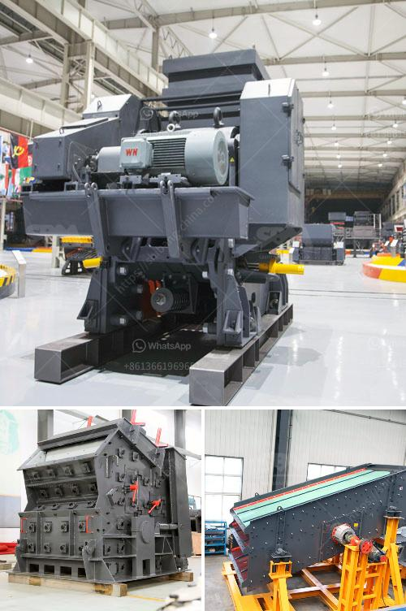

<h3>secondary jaw crusher</h3>
Crushers are vital in the mining and aggregate industry for their ability to break down large chunks of ores and stones into more manageable pieces. Secondary jaw crushers are renowned for their rugged construction, versatility, and capacity to perform efficiently in a variety of applications. Despite being an essential part of any mining operation, they often go unnoticed until further processing is required.

A secondary jaw crusher is generally used in open-pit mining, quarries, and metallurgical industries. In smaller operations, it is typically used as a primary crusher. Major components are cast, testing their durability in demanding conditions. These crushers are fixed with heavy-duty construction plates, ensuring their stability and resistance to vibrations. This stability adds to the overall efficiency of the machine by minimizing the risk of breakdowns and reducing maintenance costs.

The primary function of a secondary jaw crusher is to reduce the size of the material being processed, ensuring an even distribution of particles to the next stage of the crushing process. It achieves this through mechanical pressure, breaking larger rocks into smaller ones. The powerful jaws of the crusher exert force against the material, gradually reducing its size until it is small enough to pass through the gap at the bottom.

One of the main advantages of secondary jaw crushers is their high processing capacity. They can process large quantities of material quickly and efficiently, making them suitable for high-capacity mining operations. Furthermore, the adjustable settings on the crusher allow operators to control the size of the output product, ranging from coarse to fine.

Secondary jaw crushers are well-suited for mining operations seeking a versatile crushing solution. They can be used in a variety of applications to process all types of rocks, ores, and minerals. For example, in a limestone quarry, a secondary jaw crusher can be used to prepare aggregates for the next stage of crushing, such as impact crushers or cone crushers.

In addition to their versatility, secondary jaw crushers are also known for their low operational costs. They consume less energy compared to other crushers and have a longer lifespan. Furthermore, their simple design makes them easy to operate and maintain. Regular maintenance, which includes checking the integrity of wear parts, can significantly extend the lifespan of the machine, saving operators both time and money.

In conclusion, secondary jaw crushers are essential stone crushing equipment in the mining and aggregate industry. They are versatile, reliable, and capable of high production rates. Their durability, low operational costs, and ease of maintenance make them an attractive option for mining operations of all sizes. By efficiently breaking down large rocks and ores, they play a critical role in ensuring a consistent supply of materials for further processing. Embracing the benefits of secondary jaw crushers can lead to increased productivity and profitability within the mining industry.
<h3>Contact us</h3><ul><li><strong>Whatsapp:&nbsp;<a href="https://wa.me/8613661969651">+8613661969651</a></strong></li><li><a href="https://swt.shibang-china.com/?git&amp;zhl&amp;secondary jaw crusher"><strong>Online Service(chat now)</strong></a></li></ul><h3>Related</h3><ul><li><a href='gold crushing plant.md'>gold crushing plant</a></li><li><a href='iron ore crushed second hand machines.md'>iron ore crushed second hand machines</a></li><li><a href='large jaw crusher for sale.md'>large jaw crusher for sale</a></li><li><a href='mobile impact crusher for sale.md'>mobile impact crusher for sale</a></li><li><a href='how much does a jaw crusher cost.md'>how much does a jaw crusher cost</a></li></ul>