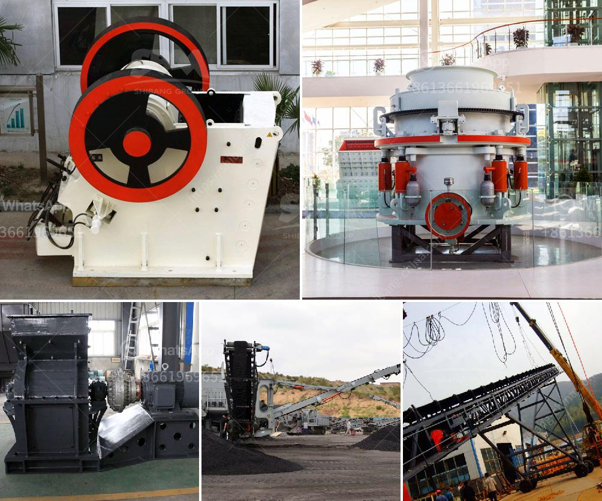

<h3>secondary rock crusher for sale in south africa</h3>
The secondary rock crusher is an important part of the mining machinery which is widely used in various industries such as mining, metallurgy, building materials, railways, highways, water conservancy, and chemical industries.

The current market size of the global mining equipment industry is around $100 billion. South Africa is one of the countries that play a vital role in the global mining industry. The total revenue of the sector in South Africa is estimated to be $4 billion annually, with an average growth rate of around 15%. This growth is largely attributed to the increasing demand for minerals and metals from both domestic and international markets.

Secondary rock crushers are used to break down larger rocks into smaller pieces. These machines are commonly used in quarries, construction sites, and mining operations. In the mining industry, secondary crushers are used after primary crushers to further reduce the size of the rocks. This helps to separate valuable minerals from the waste material and make it easier to extract and process them.

There are various types of secondary rock crushers available in the market. Some of the most commonly used ones include impact crushers, cone crushers, and jaw crushers. Each type has its own unique features and advantages, depending on the specific application and requirements.

Impact crushers are widely used in mining, quarrying, and recycling applications. They are capable of handling a wide range of materials, including soft rock, hard rock, and abrasive materials. They work by utilizing the impact force to crush the material and are known for their high reduction ratios and excellent shape of the final product.

Cone crushers are commonly used in secondary and tertiary crushing stages. They have a rotating mantle that gyrates within a concave bowl, which is lined with manganese. The mantle and concave create a chamber that helps to compress the rock, reducing its size. Cone crushers are known for their high production capacity, excellent particle shape, and low operation costs.

Jaw crushers are primarily used for primary crushing purposes in mines and quarries. However, they can also be used as secondary crushers depending on the application. They operate by compressing the rock between a fixed jaw and a moving jaw. Jaw crushers are known for their reliability, high production capacity, and versatility.

In South Africa, the demand for secondary rock crushers is increasing due to the rapid development of infrastructure projects. The country's mining industry is a major contributor to the GDP, providing jobs to thousands of people. Additionally, secondary rock crushers play a crucial role in the extraction process of minerals such as copper, gold, lead, zinc, and nickel.

There are numerous manufacturers and suppliers of secondary rock crushers in South Africa. They provide different types of crushers that include hydraulic cone crushers, jaw crushers, impact crushers, and others. They also provide comprehensive after-sales service and technical support to ensure smooth operation and maximum productivity.

In conclusion, the secondary rock crusher is an important part of the mining industry in South Africa. It plays a crucial role in the process of extracting valuable minerals from ore. The demand for secondary crushers is driven by the rapid development of infrastructure projects in South Africa, as well as the need for reliable and efficient crushing equipment in the mining industry. With the growth of the mining industry, the secondary rock crusher market is expected to witness significant growth in the coming years.
<h3>Contact us</h3><ul><li><strong>Whatsapp:&nbsp;<a href="https://wa.me/8613661969651">+8613661969651</a></strong></li><li><a href="https://swt.shibang-china.com/?git&amp;zhl&amp;secondary rock crusher for sale in south africa"><strong>Online Service(chat now)</strong></a></li></ul><h3>Related</h3><ul><li><a href='vertically roller mill pakistan.md'>vertically roller mill pakistan</a></li><li><a href='china manufacturers of sand washing machine.md'>china manufacturers of sand washing machine</a></li><li><a href='twist of the ball mill.md'>twist of the ball mill</a></li><li><a href='vibrating feeder for jaw crusher.md'>vibrating feeder for jaw crusher</a></li><li><a href='stone crusher dubai.md'>stone crusher dubai</a></li></ul>