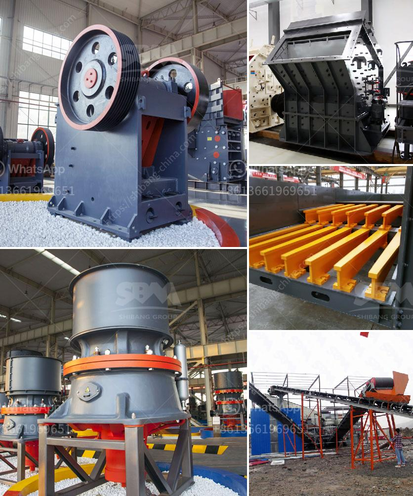

<h3>sell jaw crusher the dubia</h3>
Dubai, a thriving metropolis known for its modern architecture, luxurious lifestyle, and grandeur, has witnessed a rapid growth in the construction industry. Being a key player in the development of the Emirates, Dubai has an immense demand for construction materials, making it an ideal market for the sale of jaw crushers.

Jaw crushers are powerful machines used to reduce the size of larger materials into smaller particles. These machines are commonly used in construction sites and quarries to break down stones, rocks, and other hard materials, making them more manageable for various applications. With the increasing demand for construction materials in Dubai, the sale of jaw crushers has witnessed a significant rise.

One of the major factors fueling the growth of the jaw crusher industry in Dubai is the increase in infrastructure projects. The Emirate is constantly developing its infrastructure to cater to the growing population and attract tourists from all over the world. This has led to a surge in the construction of roads, bridges, buildings, and other structures, creating a huge demand for construction materials.

Jaw crushers play a crucial role in the construction industry as they are used to crush and process materials required for different projects. Whether it is aggregates, asphalt, concrete, or other materials, jaw crushers are essential for breaking them down into uniform sizes, ensuring the quality and efficiency of construction projects.

Additionally, Dubai's strategic location and bustling trade environment make it a hub for businesses from various industries. The city's free trade zones and tax incentives attract companies from around the globe, promoting healthy competition and fostering economic growth. This business-friendly environment has further stimulated the demand for jaw crushers in Dubai, as companies look to meet the construction needs of the city.

Furthermore, the increasing focus on sustainable development and environmental conservation has also contributed to the growing demand for jaw crushers. These machines are designed to be energy-efficient, reducing overall energy consumption and minimizing environmental impacts. With Dubai's commitment to sustainability and reducing carbon footprints, jaw crushers that meet stringent environmental standards are highly sought after.

In recent years, several reputable international manufacturers have entered the Dubai market, offering a wide range of jaw crushers to cater to the diverse needs of construction companies. These manufacturers provide high-quality products with cutting-edge technology, ensuring durability, reliability, and optimal performance. With a plethora of options available, companies in Dubai can select the most suitable jaw crusher that suits their specific requirements.

In conclusion, the sale of jaw crushers in Dubai has seen a sharp increase due to the thriving construction industry, growing infrastructure projects, and the city's business-friendly environment. With a booming economy and an increasing focus on sustainable development, the demand for jaw crushers is set to rise further. Dubai presents a lucrative market for manufacturers and sellers of jaw crushers, providing ample opportunities for growth and success in this industry.
<h3>Contact us</h3><ul><li><strong>Whatsapp:&nbsp;<a href="https://wa.me/8613661969651">+8613661969651</a></strong></li><li><a href="https://swt.shibang-china.com/?git&amp;zhl&amp;sell jaw crusher the dubia"><strong>Online Service(chat now)</strong></a></li></ul><h3>Related</h3><ul><li><a href='calcium carbide production machinery.md'>calcium carbide production machinery</a></li><li><a href='stone crusher machine in south africa.md'>stone crusher machine in south africa</a></li><li><a href='vibrating screen manufacturing process.md'>vibrating screen manufacturing process</a></li><li><a href='sand and gravel wash plants usa.md'>sand and gravel wash plants usa</a></li><li><a href='sale of ball mills used in peru.md'>sale of ball mills used in peru</a></li></ul>