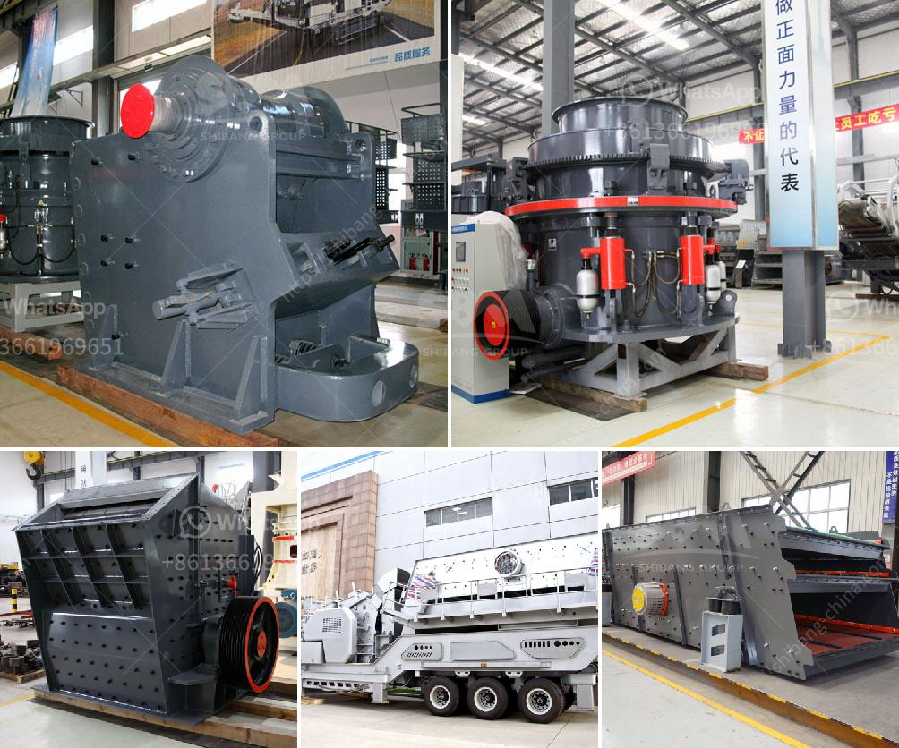

<h3>sell of crushing machine in lima</h3>
The city of Lima has emerged as a major hub for infrastructure development in Peru. With increasing government investments and a growing economy, the demand for construction materials has surged. Consequently, the sale of crushing machines in Lima has experienced a significant upswing.

Lima is currently witnessing an infrastructure boom, with numerous projects underway. These projects involve the construction of highways, bridges, commercial buildings, and residential complexes. The Peruvian government's ambitious plan to develop and modernize transport systems and public facilities has led to an increase in demand for construction materials, especially crushed stones, aggregates, and sand.

Crushing machines play a crucial role in the production of construction materials. They are used to break down larger rocks, boulders, and stones into smaller sizes, making them suitable for further processing and use. These machines help produce various types of crushed materials that are vital for constructing roads, highways, buildings, and other infrastructure projects.

1. Government Investments: The Peruvian government's commitment to improving the country's infrastructure has led to increased investments. This influx of funding has created a favorable environment for construction companies, leading to a surge in demand for crushing machines.

2. Urbanization and Population Growth: Like many other cities worldwide, Lima's population is rapidly increasing. As a result, there is a need to build more housing, schools, hospitals, and other facilities to accommodate the growing population. This has further fueled the demand for crushed materials and subsequently, crushing machines.

3. Renovation and Reconstruction: Lima's existing infrastructure is being renovated and reconstructed to meet modern standards. This process involves demolishing old structures and reusing crushed materials in the new construction. Hence, the demand for crushing machines has increased as it allows for efficient recycling of construction waste.

4. Mining Industry: Lima is located in a mineral-rich region, where extracting valuable minerals is a thriving business. Crushing machines are utilized extensively in the mining industry to break down rocks and ores into smaller sizes for processing. This has also contributed significantly to the demand for crushing machines in Lima.

With the rapid pace of urban development, increasing population, and ongoing infrastructure projects, the sale of crushing machines in Lima is witnessing remarkable growth. Construction companies, mining firms, and individual contractors alike are investing in modern crushing machines to meet the rising demand for construction materials in the city. As Lima continues to progress, the market for crushing machines is expected to grow even further, driving innovation and advancements in this sector.
<h3>Contact us</h3><ul><li><strong>Whatsapp:&nbsp;<a href="https://wa.me/8613661969651">+8613661969651</a></strong></li><li><a href="https://swt.shibang-china.com/?git&amp;zhl&amp;sell of crushing machine in lima"><strong>Online Service(chat now)</strong></a></li></ul><h3>Related</h3><ul><li><a href='portable limestone crushing systems.md'>portable limestone crushing systems</a></li><li><a href='used vsi crusher for sale in india.md'>used vsi crusher for sale in india</a></li><li><a href='ball coal crusher industries.md'>ball coal crusher industries</a></li><li><a href='cost of manganese beneficiation plant.md'>cost of manganese beneficiation plant</a></li><li><a href='india crushers association.md'>india crushers association</a></li></ul>