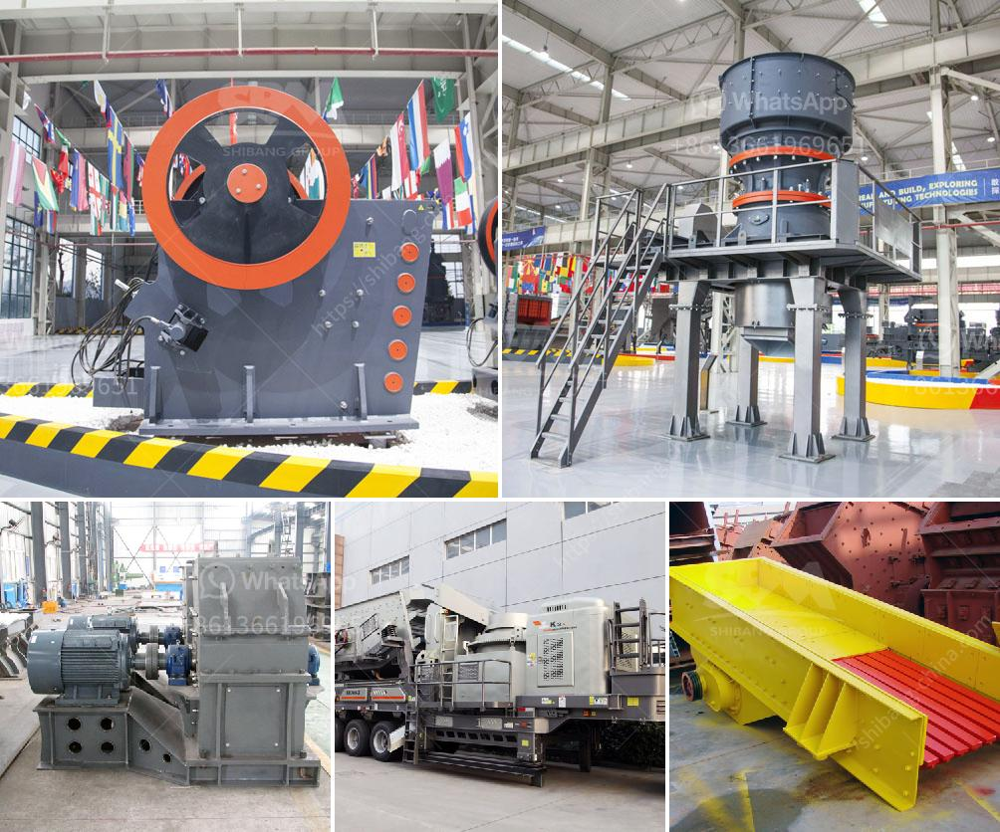

<h3>selling cone crusher made in china</h3>
China has become a major player in the global construction industry. With its booming economy and rapid urbanization, the country has a high demand for infrastructure development. One essential machine in this process is the cone crusher, which plays a crucial role in the stone crushing plant.

When it comes to selecting a cone crusher, there are numerous options available in the market. However, it is important to consider reliability, durability, and performance. One trusted brand that has gained popularity in China is the cone crusher made in China. These machines have been manufactured to meet international standards and are renowned for their excellent quality.

The cone crusher made in China is cost-effective and delivers high performance. The robust design of the machine ensures its durability in the toughest of environments. It can handle a wide range of materials, including limestone, iron ore, granite, basalt, quartzite, and more. This makes it suitable for various applications in the construction industry.

One of the key advantages of the cone crusher made in China is its affordability. Compared to other brands in the market, Chinese cone crushers are offered at competitive prices. This is due to China's high production capacity and expertise in manufacturing machinery. As a result, customers can get a high-quality cone crusher at a reasonable price.

Chinese cone crushers also boast of advanced features that enhance their performance. They are equipped with hydraulic systems, which allow for easy and efficient adjustment of the discharge setting. This ensures consistent particle size distribution and optimal production capacity. Additionally, the cone crusher made in China has a reliable lubrication system that reduces downtime and maintenance costs.

China has been actively exporting its cone crushers to different parts of the world. Many countries, including those in Southeast Asia, Africa, and the Middle East, have recognized the value of Chinese-made machinery. This has further boosted the reputation of the cone crusher made in China and made it a popular choice among international buyers.

Furthermore, Chinese manufacturers provide excellent after-sales service and technical support. They have established a global network of distributors and service centers to ensure that customers receive prompt assistance whenever needed. This level of support adds value to the cone crusher made in China and strengthens customer trust in the brand.

In conclusion, the cone crusher made in China offers a cost-effective solution for construction companies worldwide. Its reliability, durability, and performance make it a top choice for crushing stone in the construction industry. With its competitive pricing and advanced features, Chinese cone crushers are gaining popularity in global markets. Moreover, the excellent after-sales service and technical support provided by Chinese manufacturers add value to the cone crusher made in China.
<h3>Contact us</h3><ul><li><strong>Whatsapp:&nbsp;<a href="https://wa.me/8613661969651">+8613661969651</a></strong></li><li><a href="https://swt.shibang-china.com/?git&amp;zhl&amp;selling cone crusher made in china"><strong>Online Service(chat now)</strong></a></li></ul><h3>Related</h3><ul><li><a href='used hammer mill for sale.md'>used hammer mill for sale</a></li><li><a href='bentonite granules making machinery india.md'>bentonite granules making machinery india</a></li><li><a href='used vsi crusher for sale in india.md'>used vsi crusher for sale in india</a></li><li><a href='basic machines used stone crusher.md'>basic machines used stone crusher</a></li><li><a href='grinding wet ball mill limestone.md'>grinding wet ball mill limestone</a></li></ul>