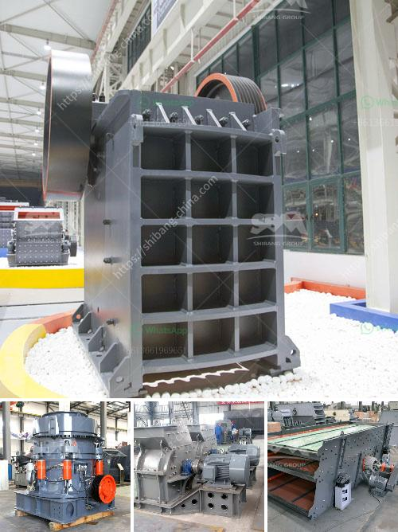

<h3>setting up a coal mining plant</h3>
Coal mining is a lucrative business venture for many investors. With the world's increasing need for energy, the demand for coal is always high. There are several factors to consider while setting up a coal mining plant. These include the location, regulations, and permits, infrastructure, and the overall business plan.

Firstly, the location is crucial for a coal mining plant. Ideally, it should be close to a coal deposit to minimize transportation costs. Conducting a thorough geological survey can help identify an area with a substantial coal reserve. Additionally, the proximity to transportation and markets is also essential for efficient distribution.

Secondly, complying with local regulations and obtaining necessary permits is vital. Each region has specific rules and guidelines regarding environmental concerns and employee safety. Ensuring that all regulations are met will help avoid potential lawsuits and fines. Employing competent legal advisors well-versed in mining laws is imperative during this stage.

Infrastructure is the backbone of any coal mining plant. A well-constructed facility with modern equipment ensures smooth operations. This includes building structures such as shafts, tunnels, and entry points to access the coal deposit. Hiring experienced engineers and contractors familiar with mining projects is essential for efficient construction.

In parallel, a business plan should be formulated to outline the company's objectives, marketing strategies, and financial projections. This plan will serve as a roadmap for the business and attract potential investors. It should encompass details such as funding sources, market analysis, and operating costs to ensure long-term profitability.

When setting up a coal mining plant, safety and environmental concerns should be given utmost priority. Air and water pollution prevention measures must be implemented to mitigate adverse impacts. Implementing a comprehensive safety program and providing proper training for employees is crucial to prevent accidents and ensure a safe working environment.

In conclusion, setting up a coal mining plant requires careful planning and meticulous execution. Factors such as location, regulations, infrastructure, and a well-defined business plan must be considered. Emphasizing safety and environmental sustainability will ensure the long-term success of the operation. While the process may be complex, careful attention to detail can lead to a profitable and sustainable coal mining venture.
<h3>Contact us</h3><ul><li><strong>Whatsapp:&nbsp;<a href="https://wa.me/8613661969651">+8613661969651</a></strong></li><li><a href="https://swt.shibang-china.com/?git&amp;zhl&amp;setting up a coal mining plant"><strong>Online Service(chat now)</strong></a></li></ul><h3>Related</h3><ul><li><a href='crushing stones for gold.md'>crushing stones for gold</a></li><li><a href='rock crusher oman manufacturers in nigeria.md'>rock crusher oman manufacturers in nigeria</a></li><li><a href='quartz powder machine manufacturer in india.md'>quartz powder machine manufacturer in india</a></li><li><a href='china manufacturers of sand washing machine.md'>china manufacturers of sand washing machine</a></li><li><a href='mica powder machine.md'>mica powder machine</a></li></ul>