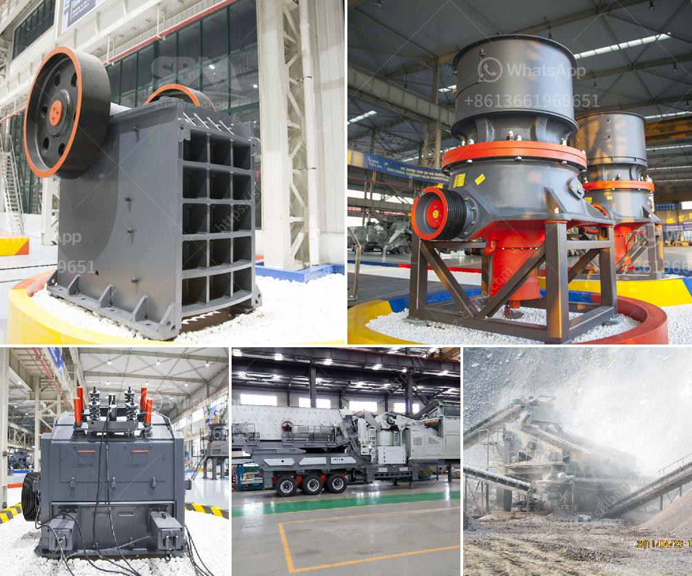

<h3>setting up a quarry in nigeria</h3>
Quarrying is a flourishing industry in Nigeria, with numerous deposits across the country. In recent years, Nigeria has made significant efforts to revitalize its mining industry, which contributes to the country's GDP and creates jobs for its citizens. With a focused approach and strategic investment, Nigeria could rebuild its quarrying infrastructure and take advantage of its abundant resources.

The starting point for setting up a quarry is understanding the geological and economic viability of the deposits. Once the feasibility studies are completed, a detailed business plan is essential to articulate the objectives and strategies of the project. This plan should include information about the site's location, the expected market demand, and potential customers.

Securing the necessary licenses and permits is the next crucial step. Quarrying operations in Nigeria require government approval, depending on the scale of extraction. The Ministry of Mines and Steel Development, in collaboration with relevant agencies, oversees the issuance of mining licenses, environmental permits, and other regulatory requirements. Engaging with these authorities and ensuring compliance with Nigeria's mining laws is vital for a successful quarry operation.

Another critical aspect is sourcing the necessary equipment and machinery. These may include crushers, excavators, loaders, haulage trucks, and drilling rigs, depending on the specific needs and scale of the quarry. It is crucial to invest in high-quality, reliable equipment to ensure efficient and safe operations. Local suppliers should be explored to encourage local economic development and reduce costs.

Employing skilled workers and creating job opportunities is an essential part of setting up a quarry. The hiring process should focus on individuals with relevant experience in quarrying, mining, and geology. Adequate training and professional development programs should be implemented to ensure the workforce is equipped with the necessary skills and knowledge.

Developing a sustainable quarry operation involves environmental considerations. Quarrying activities can potentially have adverse effects on the environment, such as soil erosion, water pollution, and habitat destruction. It is essential to implement effective environmental management plans to mitigate these impacts. This can include measures such as reclamation of the land after extraction, sedimentation ponds to control water runoff, and regular environmental monitoring.

Marketing and selling the extracted materials are critical for the success of a quarry operation. Building relationships with construction companies, contractors, and suppliers can help secure long-term contracts and steady demand for the quarry's products. Attractively pricing products competitively while maintaining profitability is also crucial.

To conclude, setting up a quarry in Nigeria is a lucrative and rewarding investment opportunity. It requires substantial strategic planning, careful consideration of various factors, and a deep understanding of the local market. With the right resources, commitment to environmental sustainability, and adherence to regulatory frameworks, Nigeria can develop a thriving quarrying sector that contributes to national growth and development.
<h3>Contact us</h3><ul><li><strong>Whatsapp:&nbsp;<a href="https://wa.me/8613661969651">+8613661969651</a></strong></li><li><a href="https://swt.shibang-china.com/?git&amp;zhl&amp;setting up a quarry in nigeria"><strong>Online Service(chat now)</strong></a></li></ul><h3>Related</h3><ul><li><a href='stone crusher for sale in zimbabwe.md'>stone crusher for sale in zimbabwe</a></li><li><a href='price of jaw crusher germany.md'>price of jaw crusher germany</a></li><li><a href='crusher material for stone crusher.md'>crusher material for stone crusher</a></li><li><a href='buy sand washing plant in sri lanka.md'>buy sand washing plant in sri lanka</a></li><li><a href='zircon sand production line price.md'>zircon sand production line price</a></li></ul>