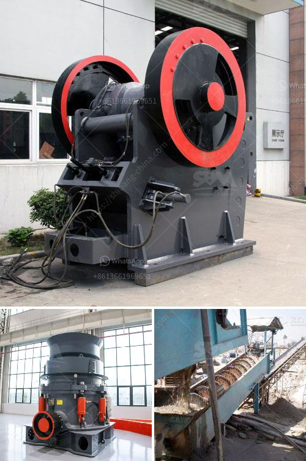

<h3>setting up a stone quarry crusher business</h3>
Stone quarry, the crushing industry is an important industrial sector in the country engaged in producing crushed stone of various sizes depending upon the requirement which acts as raw material for various construction activities such as construction of roads, highways, bridges, buildings, canals etc. It is estimated that there are over 12,000 stone crusher units in India. The number is expected to grow further keeping in view the future plans for development of infrastructure of roads, canals and buildings that are required for the overall development of the country.

In India, the Stone Crushing Industry sector is estimated to have an annual turnover of around Rs. 5000 crore (equivalent to over US$ 1 billion) and is therefore an economically important sector. The sector is estimated to be providing direct employment to over 500,000 people engaged in various activities such as mining, crushing plant, transportation of mined stones and crushed products etc.

Stone crushing is the two-stage process. In the first stage, crush the 175mm stone to about 50mm. Thereafter, fit the crusher with a conversion kit to enable granulation of 5 to 20mm. Then screen the crushed material by the rotary screen. Unit location is a major factor for stone crusher plant business.

It is advantageous if the crushed stone unit is set up near the queries where the granite boulders of various sizes are available for the crushing unit. The wastage from the granite industry will be of much use to the crushed stone unit. The granite stones of various sizes are fed into the jaw crushers for size reduction.

Depending on the desired output size of the crushed stone, the raw material may be fed to one or two jaw crushers in a sequence. Then these crushed stones re passed onto the rotary screen for size gradation. Material is handled through a belt conveyor to the different places of operation. The main machinery involved in the stone crushing industry is hammer crusher, screen, conveyors, etc.

The process involved is to feed the stone in to the hammer crushers to make it further smaller in size as required by the customer. In the hammer crusher, the stone is crushed. The crushed stone is screened to separate the produce in different sizes by the separator. The crushed stone is conveyed to the crusher depending on the desired size of finished product, either conveyored to stockpile or screened accordingly.

The demand for crushed stone will continue to grow with the growth of its user industry. The unit can be set up depending availability of raw material and major commercial centre.

Stone crushed by stone crusher is segregated into various sizes like 35mm, 20mm, 12mm, etc for different uses. The final product of stone crusher aggregates are used for construction of roads, bridges, housing, industrial building construction and other cement-based products like RCC pipes, PSC poles, remolded slabs, frames and beams, etc for fabrication.
<h3>Contact us</h3><ul><li><strong>Whatsapp:&nbsp;<a href="https://wa.me/8613661969651">+8613661969651</a></strong></li><li><a href="https://swt.shibang-china.com/?git&amp;zhl&amp;setting up a stone quarry crusher business"><strong>Online Service(chat now)</strong></a></li></ul><h3>Related</h3><ul><li><a href='beneficiation process of clay.md'>beneficiation process of clay</a></li><li><a href='manufactures hammer mills.md'>manufactures hammer mills</a></li><li><a href='ball mill supliers in south africa.md'>ball mill supliers in south africa</a></li><li><a href='quick lime powder making machine.md'>quick lime powder making machine</a></li><li><a href='crushing and screening of aggregates in mexico.md'>crushing and screening of aggregates in mexico</a></li></ul>