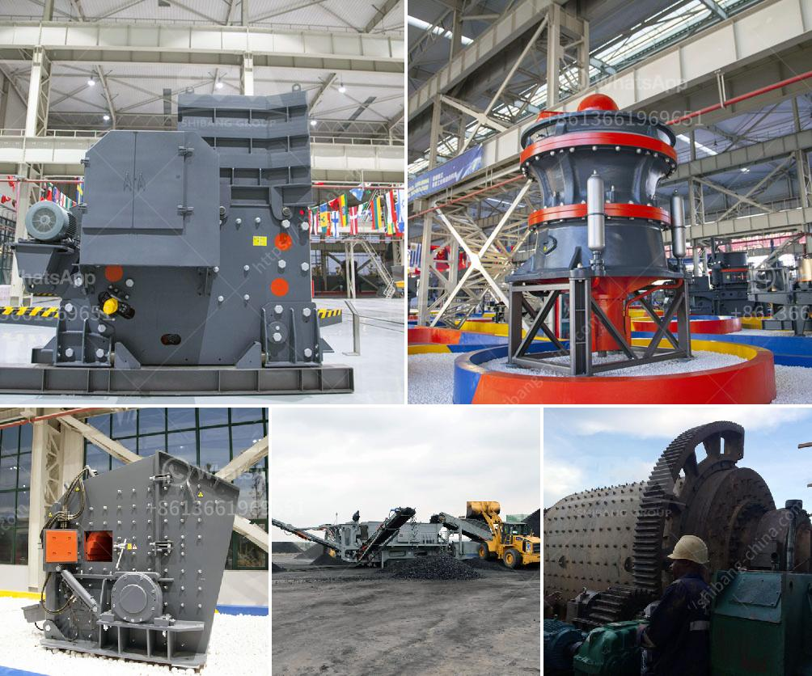

<h3>silica sand crusher in ghana</h3>
Silica sand is a mineral resource that is mined from the earth's crust, primarily for the production of industrial materials such as glass, ceramics, and concrete. In Ghana, silica sand is mined in various communities throughout the country, particularly in the northern and western regions.

The mining of silica sand involves crushing, screening, and washing the sand to remove impurities such as clay, iron, and other minerals. It is then processed through various stages to produce different sizes of silica sand products that are suitable for different applications.

Silica sand crusher machines are used to crush the raw silica sand into smaller particles. Jaw crusher, cone crusher, and sand making machine are mainly used for crushing and grinding in silica sand processing plant. In Ghana, a wide range of silica sand crushers are available to meet the requirements of different customers.

The common silica sand crushers are jaw crusher, cone crusher, and VSI crusher. Jaw crusher is the primary crushing machine, which is used for coarse crushing and has the features of large capacity, high efficiency, and simple structure. Cone crusher is a fine crushing machine, commonly used in secondary or tertiary crushing process. It has a high crushing ratio and a uniform product size. VSI crusher is a sand making machine used for shaping and sand making. It can crush and reshape both hard and soft materials.

With the rapid development of Ghana's construction industry, the demand for silica sand is increasing. This has led to the expansion of silica sand mining operations in various parts of the country. The use of advanced crushing equipment such as silica sand crushers has improved the overall efficiency of silica sand processing plants in Ghana.

In conclusion, silica sand crushers play an important role in the production of silica sand in Ghana. They are widely used in various crushing and grinding processes to produce different sizes of silica sand products. With the growth of Ghana's construction industry, the demand for silica sand will continue to rise, making the silica sand crusher market in Ghana a lucrative one for investment and business opportunities.
<h3>Contact us</h3><ul><li><strong>Whatsapp:&nbsp;<a href="https://wa.me/8613661969651">+8613661969651</a></strong></li><li><a href="https://swt.shibang-china.com/?git&amp;zhl&amp;silica sand crusher in ghana"><strong>Online Service(chat now)</strong></a></li></ul><h3>Related</h3><ul><li><a href='mobile aggregate plant for sale in the philippines.md'>mobile aggregate plant for sale in the philippines</a></li><li><a href='gypsum machine in germany.md'>gypsum machine in germany</a></li><li><a href='quarry dan peralatan yang dibutuhkan.md'>quarry dan peralatan yang dibutuhkan</a></li><li><a href='quick lime powder making machine.md'>quick lime powder making machine</a></li><li><a href='silica sand production plant in germany.md'>silica sand production plant in germany</a></li></ul>