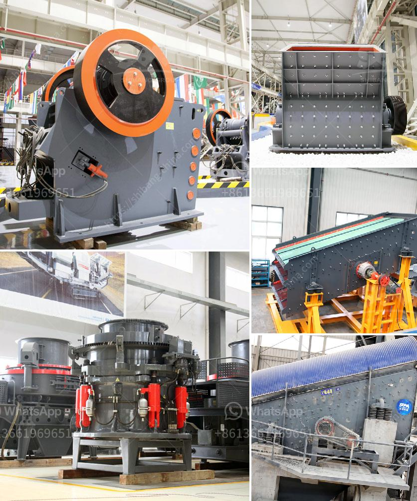

<h3>silica sand machinery manufacturer from india</h3>
Silica is a mineral abundant in the Earth's crust. It is a hard, chemically inert material with high melting and boiling points. Silica sand is extensively used in various industrial sectors such as construction, glassmaking, foundry, filtration, abrasives, and more.

India is one of the largest producers and exporters of silica sand machinery in the global market. With extensive silica deposits, the country has immense potential in silica sand mining and manufacturing. Several silica sand machinery manufacturers in India contribute to the booming industry, catering to the varied needs of different sectors.

One such prominent manufacturer is XYZ Silica Sand Machinery. With years of experience and expertise, XYZ has established itself as a reliable and innovative supplier of silica sand machinery in India. The company offers a comprehensive range of machinery and equipment for silica sand processing and manufacturing.

XYZ's silica sand machinery is designed to meet the specific requirements of different sectors. The machinery includes various crushers, grinders, screens, and separators to efficiently process silica sand. These machines are designed to ensure high productivity, low energy consumption, and maximum material recovery.

Moreover, XYZ's machinery is characterized by its robust construction, durable components, and advanced technologies. The company's commitment to quality and customer satisfaction is evident in its continuous efforts to develop superior machinery that meets international standards.

Additionally, XYZ offers customized solutions to cater to the unique needs of its clients. The company's expert team of engineers and technicians collaborate with customers to understand their requirements and design machinery accordingly. This customization allows businesses to optimize their production processes and maximize efficiency.

Furthermore, XYZ Silica Sand Machinery emphasizes environmental sustainability in its manufacturing practices. The company invests in research and development to introduce eco-friendly technologies and processes. This focus on sustainability ensures that the machinery not only meets the economic needs of businesses but also contributes to a greener future.

Apart from manufacturing high-quality machinery, XYZ also provides excellent after-sales service and support. Their team of skilled technicians is readily available to assist clients with installation, maintenance, and troubleshooting. This commitment to customer satisfaction has earned the company a strong reputation and a loyal customer base.

In conclusion, India's silica sand machinery manufacturers contribute significantly to the global silica sand industry. XYZ Silica Sand Machinery, among others, is recognized for its high-quality machinery, innovative designs, customized solutions, and commitment to sustainability. With increasing demand for silica sand across various sectors, these manufacturers play a vital role in driving India's silica sand market forward.
<h3>Contact us</h3><ul><li><strong>Whatsapp:&nbsp;<a href="https://wa.me/8613661969651">+8613661969651</a></strong></li><li><a href="https://swt.shibang-china.com/?git&amp;zhl&amp;silica sand machinery manufacturer from india"><strong>Online Service(chat now)</strong></a></li></ul><h3>Related</h3><ul><li><a href='buy stone crusher in uae.md'>buy stone crusher in uae</a></li><li><a href='dry ball mill for silica powder.md'>dry ball mill for silica powder</a></li><li><a href='price of 500 tph stone crusher plant in malaysia.md'>price of 500 tph stone crusher plant in malaysia</a></li><li><a href='barium carbonate manufacturing process.md'>barium carbonate manufacturing process</a></li><li><a href='ball milling equipment and milling media.md'>ball milling equipment and milling media</a></li></ul>