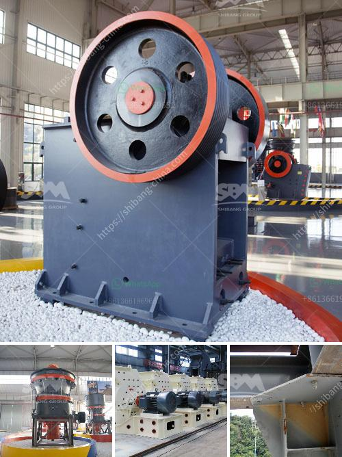

<h3>silica sand production plant in germany</h3>
Silica sand is the primary raw material used in making glass products. The silica sand production plant in Germany is one of the numerous locations across the world where this valuable resource is mined and processed. Plants such as these produce a heavy-duty coarse sand grain that is used in many applications including construction materials and industrial processes.

For example, silica sand is used to make sodium silicate, a key ingredient in the production of detergents and various cleaning products. It is also used in acid-resistant coatings and paints, and in foundries for casting metals.

Germany has a rich history of mining and processing silica sand, particularly in the eastern part of the country. The Lausitz and Erzgebirge regions are renowned for their high-quality silica sand deposits, which have been exploited since the early 20th century. Today, the German silica sand production plant in Wieden is the leading supplier of silica sand to the global glass industry.

Silica sand has a myriad of uses, including as a key component in the production of glass containers, flat glass, and speciality glass. Silica glass, itself a notoriously brittle material, nevertheless plays a vital role in the modern world.

The German silica sand production plant represents a significant investment in economic and technological resources. The plant not only produces silica sand for glass and foundry applications but also for a wide variety of products in the chemical and construction industries. These include flooring compounds, jointing compounds, mortars, grouts, sealants, and epoxy systems.

The production of silica sand requires a considerable amount of energy and water resources. To ensure sustainable operations, the German plant incorporates advanced technologies to optimize energy and water usage, as well as minimize its environmental impact. The management of waste and the reclamation of land post-mining are important aspects of the operating procedures.

Overall, the silica sand production plant in Germany plays a vital role in supplying quality silica sand for various industries and contributing to the country's economic development. It underscores the importance of sustainable practices to ensure the responsible management of resources and protection of the environment.
<h3>Contact us</h3><ul><li><strong>Whatsapp:&nbsp;<a href="https://wa.me/8613661969651">+8613661969651</a></strong></li><li><a href="https://swt.shibang-china.com/?git&amp;zhl&amp;silica sand production plant in germany"><strong>Online Service(chat now)</strong></a></li></ul><h3>Related</h3><ul><li><a href='coal size used for mills.md'>coal size used for mills</a></li><li><a href='komatsu crawler jaw crusher.md'>komatsu crawler jaw crusher</a></li><li><a href='used crushing plants for sale in uae.md'>used crushing plants for sale in uae</a></li><li><a href='total gypsum mill production in india.md'>total gypsum mill production in india</a></li><li><a href='crusher manufacturers prices.md'>crusher manufacturers prices</a></li></ul>