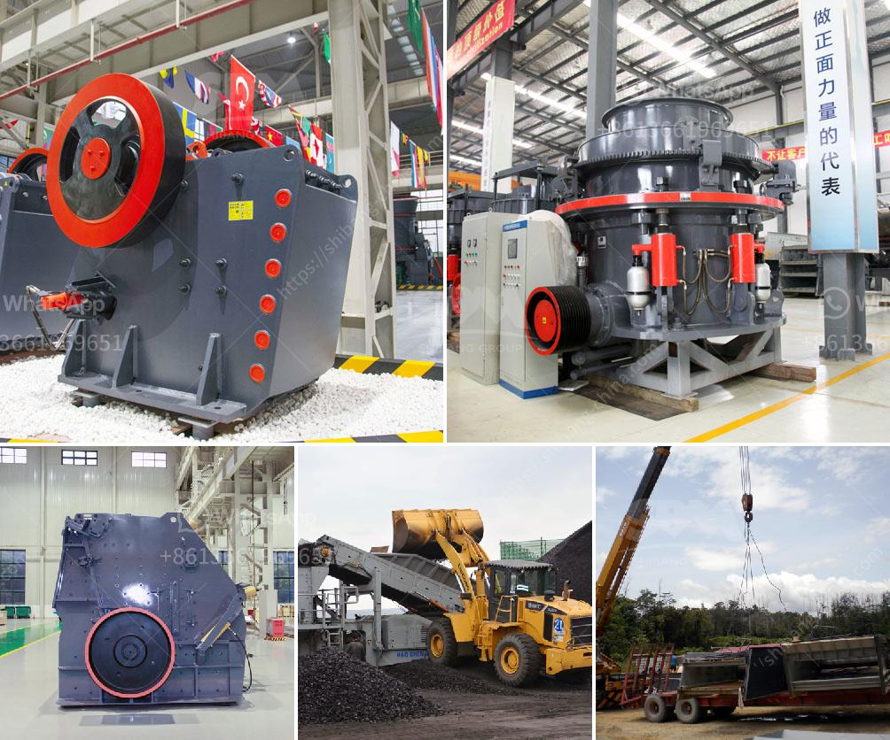

<h3>simple formula for belt conveyor</h3>
A belt conveyor is a machine that utilizes a continuous belt to convey objects from one place to another. It is an efficient and cost-effective way of moving items from point A to point B. They are also known as conveyor belts or conveyor systems. They are widely used in industries such as mining, agriculture, manufacturing, and logistics.

One essential factor to consider when designing a belt conveyor system is the required conveying capacity. This capacity is dependent on various factors such as the size and weight of the objects being transported, the speed of the belt, and the desired throughput.

To determine the required conveying capacity of a belt conveyor, a simple formula can be used. The formula is expressed as:

1. Density of the transported material (ρ): This refers to the mass per unit volume of the material being conveyed. It is crucial to know the density to accurately calculate the conveyor capacity.

2. Belt speed (V): The belt speed determines how fast the objects are transported. It is usually measured in meters per second (m/s). The speed should be chosen based on factors like the type of material and the required throughput.

3. Cross-sectional area of the bulk solid (A): This refers to the actual area occupied by the material on the conveyor belt. It can be calculated by multiplying the width of the belt (W) with the length of the material on the belt (L). The formula for calculating the cross-sectional area is A = W × L.

4. Conveyor capacity coefficient (C): This coefficient takes into account various factors that affect the conveyor capacity, such as material properties, belt type, trough angle, and the coefficient of friction between the belt and the material.

5. Belt sag factor (F): The belt sag factor considers the vertical deflection of the belt under the weight of the material. This factor is essential to prevent excessive sagging, which can affect the performance and lifespan of the conveyor system.

By plugging in the appropriate values into the formula, the required conveying capacity of a belt conveyor can be readily determined. It is important to note that this formula provides a general guideline, and specific applications may require additional considerations.

In conclusion, a simple formula can be employed to calculate the required conveying capacity of a belt conveyor system. This formula takes into account factors such as material density, belt speed, cross-sectional area of the bulk solid, conveyor capacity coefficient, and belt sag factor. By understanding and utilizing this formula, engineers and designers can efficiently design belt conveyor systems that meet the desired throughput and performance requirements.
<h3>Contact us</h3><ul><li><strong>Whatsapp:&nbsp;<a href="https://wa.me/8613661969651">+8613661969651</a></strong></li><li><a href="https://swt.shibang-china.com/?git&amp;zhl&amp;simple formula for belt conveyor"><strong>Online Service(chat now)</strong></a></li></ul><h3>Related</h3><ul><li><a href='nigeria granite crushers.md'>nigeria granite crushers</a></li><li><a href='crushing equipment for sale in kenya.md'>crushing equipment for sale in kenya</a></li><li><a href='business plan for quarry.md'>business plan for quarry</a></li><li><a href='manufacturers of conveyor belts.md'>manufacturers of conveyor belts</a></li><li><a href='crusher machine for marble and granite.md'>crusher machine for marble and granite</a></li></ul>