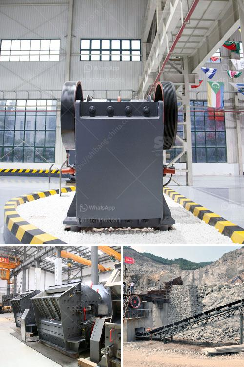

<h3>simple grinding mill type in ethiopia</h3>
Ethiopia is a country dedicated to its agricultural industry. It is the largest producer of coffee in Africa and also produces crops such as maize, teff, wheat, and barley. In order to support its flourishing agriculture sector, Ethiopia relies heavily on simple grinding mills to process grains and enhance food production.

A simple grinding mill is a machine that crushes and grinds grains, such as maize, wheat, teff, or barley, into flour. This mill is typically operated using electricity or diesel fuel. However, in rural areas of Ethiopia where access to electricity is limited, grinding mills are often powered by hand, offering a more sustainable and efficient solution for grain processing.

One common type of grinding mill found in Ethiopia is the hammer mill. It is typically used to grind a variety of grains such as maize, wheat, and teff into flour. These mills are commonly used in rural areas and can be powered by electricity or diesel fuel.

The hammer mill operates by rotating the hammers at high speed to grind the grains. The grains are fed into the mill through a hopper and are crushed and ground by the rotating hammers. The ground flour is then collected and can be used for various food preparations.

Another commonly used grinding mill in Ethiopia is the stone mill. Stone mills have been used for centuries to grind grains into flour, and their simple design makes them easy to operate and maintain. Stone mills are typically made of two circular stones, one fixed and the other rotating. The grains are fed into the gap between the stones and are ground into flour as the rotating stone crushes the grains against the fixed stone.

Stone mills are preferred by many Ethiopians because they produce flour with a coarser texture which is suitable for traditional Ethiopian dishes such as injera, a sourdough flatbread. Injera is a staple food in Ethiopia and is commonly served with various stews and dishes.

Grinding mills play a crucial role in Ethiopia's agriculture sector by processing grains into flour, which is a basic ingredient in many Ethiopian dishes. These mills not only enhance food production but also contribute to the economic growth of the country.

In recent years, there has been a push towards modernizing grinding mills in Ethiopia by introducing more efficient and advanced technologies. This includes the use of solar-powered mills, which can greatly reduce reliance on diesel or electricity and provide a sustainable solution for grain processing.

Overall, simple grinding mills are vital in Ethiopia's agricultural industry as they enable farmers to process grains into flour, supporting food production and improving livelihoods. Whether it's a hammer mill or a stone mill, these grinding machines contribute to Ethiopia's rich culinary heritage and ensure that traditional dishes continue to be enjoyed for generations to come.
<h3>Contact us</h3><ul><li><strong>Whatsapp:&nbsp;<a href="https://wa.me/8613661969651">+8613661969651</a></strong></li><li><a href="https://swt.shibang-china.com/?git&amp;zhl&amp;simple grinding mill type in ethiopia"><strong>Online Service(chat now)</strong></a></li></ul><h3>Related</h3><ul><li><a href='kaolin crusher price.md'>kaolin crusher price</a></li><li><a href='used stone crusher in usa for sale.md'>used stone crusher in usa for sale</a></li><li><a href='crusher concrete and stone.md'>crusher concrete and stone</a></li><li><a href='how does a stone crusher plant operate.md'>how does a stone crusher plant operate</a></li><li><a href='as selecting a hammer mill.md'>as selecting a hammer mill</a></li></ul>