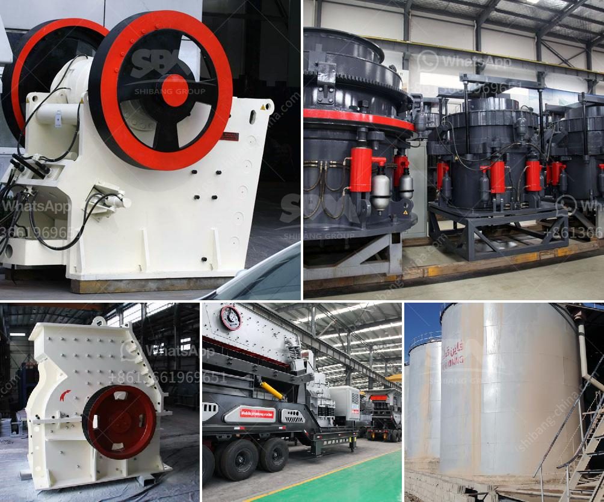

<h3>singh stone crusher nashik</h3>
Singh Stone Crusher Nashik is a well-known name in the stone crushing industry in Nashik. They have a presence in the industry for more than four decades and have always been a trusted and reliable name for their customers. With a focus on customer satisfaction, high-quality products, and ethical business practices, Singh Stone Crusher Nashik has established itself as a leading player in the industry.

Established in the year 1964, Singh Stone Crusher Nashik is a family-owned business run by Mr. Ravi Singh and his brothers. Over the years, the company has witnessed immense growth and success under their able leadership. They have earned a reputation for producing top-notch stone crushing machinery that delivers uncompromising performance and durability.

One of the key reasons for the success of Singh Stone Crusher Nashik is their commitment to delivering high-quality products to their customers. They understand the importance of using superior quality materials for construction, which is why they source their raw materials only from trusted and reputed suppliers. This ensures that their products are of the highest standards, offering durability and longevity.

Singh Stone Crusher Nashik specializes in crushing a variety of materials, including stone, granite, sandstone, limestone, and many more. They provide customized crushing solutions to meet the diverse needs of their customers. The company has a state-of-the-art infrastructure that includes advanced machinery and equipment, which enables them to produce a large number of high-quality crushed stones efficiently.

Customer satisfaction is at the heart of Singh Stone Crusher Nashik's business philosophy. They understand that every customer has unique requirements and strive to provide personalized solutions that cater to their specific needs. Their team of experts works closely with customers to understand their requirements and offers them the most appropriate solutions. The company's dedication to delivering exceptional customer service has earned them a loyal customer base over the years.

Singh Stone Crusher Nashik is also renowned for its ethical business practices. They believe in conducting business with utmost integrity and transparency. They follow all the necessary guidelines and regulations laid down by the authorities to ensure that their operations are environmentally sustainable. Additionally, the company adheres to all the safety norms and quality standards set by the industry.

Apart from their stellar reputation in the stone crushing industry, Singh Stone Crusher Nashik is also actively involved in various social initiatives. They regularly contribute to the upliftment of the local community by supporting education, healthcare, and other social causes. This further establishes their commitment towards the overall welfare of society.

In conclusion, Singh Stone Crusher Nashik has emerged as a trusted and reliable name in the stone crushing industry. With their consistent focus on delivering high-quality products, personalized service, and ethical business practices, they have carved a niche for themselves. Their commitment to customer satisfaction and dedication towards social responsibility sets them apart from their competitors. Whether it's for commercial or residential purposes, Singh Stone Crusher Nashik is the go-to solution for all your stone crushing needs.
<h3>Contact us</h3><ul><li><strong>Whatsapp:&nbsp;<a href="https://wa.me/8613661969651">+8613661969651</a></strong></li><li><a href="https://swt.shibang-china.com/?git&amp;zhl&amp;singh stone crusher nashik"><strong>Online Service(chat now)</strong></a></li></ul><h3>Related</h3><ul><li><a href='harga pasaran stone crusher.md'>harga pasaran stone crusher</a></li><li><a href='stone crusher plant for sale in pakistan.md'>stone crusher plant for sale in pakistan</a></li><li><a href='cement clinker manufacturing plant.md'>cement clinker manufacturing plant</a></li><li><a href='feldspar crusher manufacturer.md'>feldspar crusher manufacturer</a></li><li><a href='marchine stone crusher cost in kenya.md'>marchine stone crusher cost in kenya</a></li></ul>