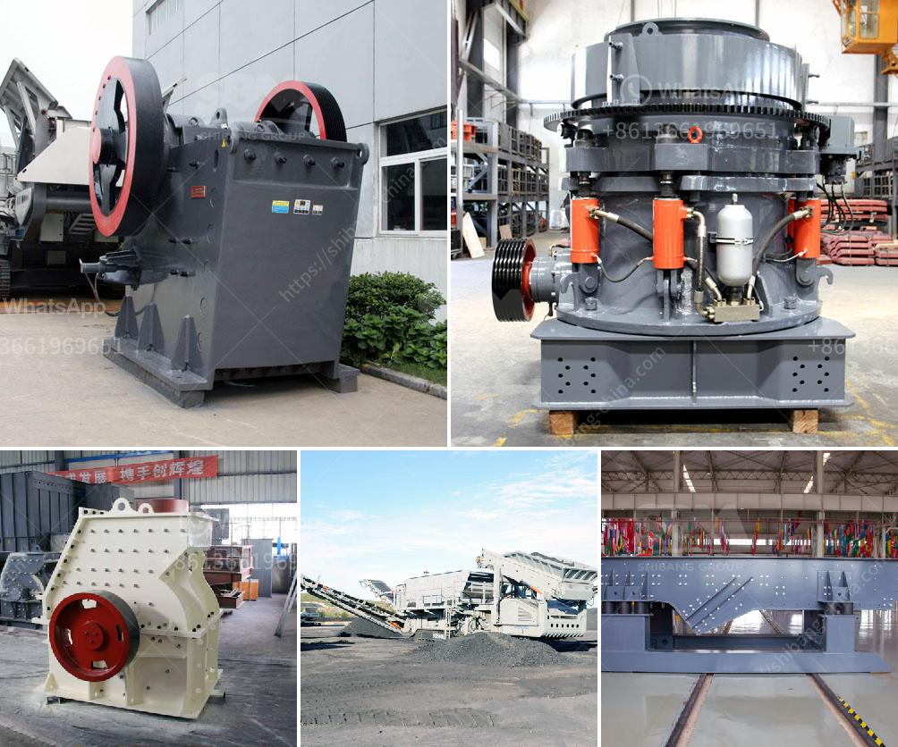

<h3>single cylinder hydraulic cone crusher</h3>
The single-cylinder hydraulic cone crusher is a type of ideal equipment for medium and fine stone crushing. It belongs to a kind of advanced cone crusher and is improved based on the traditional spring cone crusher. The hydraulic cone crusher relies on hydraulic lubrication control system to control the movement of the cone crusher, which can real-time monitor the operation parameters, making the crusher working under safe conditions.

The single-cylinder hydraulic cone crusher has a simple structure, an advanced design, and is easy to operate and maintain. The main equipment components are made of high-quality materials, ensuring the reliability and durability of the equipment. The hydraulic adjustment and oil lubrication systems are convenient to operate, which greatly reduces the downtime and maintenance costs.

One of the key advantages of the single-cylinder hydraulic cone crusher is its high efficiency. Compared with traditional cone crushers, the crushing efficiency is significantly higher due to the optimized eccentric distance, increased cavity volume, and laminar crushing principle. The higher crushing efficiency leads to a higher production capacity and better product particle size distribution.

Moreover, the single-cylinder hydraulic cone crusher has a wide application range. It is suitable for fine crushing and ultra-fine crushing operations in various industries such as mining, metallurgy, construction, and chemical. Its crushing ability can crush hard or medium-hard ores and rocks. It is an ideal choice for secondary and tertiary crushing.

The single-cylinder hydraulic cone crusher also has a good particle shape. The hydraulic cone crusher adopts a unique working principle and shows excellent crushing performance in crushing the material into a cube-like particle shape. The evenly shaped particles make the final product more marketable. In addition, the higher automation level of the hydraulic cone crusher ensures consistent and reliable particle shape control.

Furthermore, the single-cylinder hydraulic cone crusher is energy-saving and environmentally friendly. The crushing efficiency of the hydraulic cone crusher is high, and it consumes less energy by using the hydraulic motor instead of the traditional motor-driven system. The optimized design of the crushing cavity also reduces the dust pollution and noise generated during the crushing process, making it more environmentally friendly.

In summary, the single-cylinder hydraulic cone crusher is an advanced cone crusher with high efficiency, excellent particle shape, and wide application range. It is an ideal equipment for medium and fine stone crushing. With the advantages of reliable performance, convenient maintenance, and low operation costs, it is favored by customers in the mining and construction industries.
<h3>Contact us</h3><ul><li><strong>Whatsapp:&nbsp;<a href="https://wa.me/8613661969651">+8613661969651</a></strong></li><li><a href="https://swt.shibang-china.com/?git&amp;zhl&amp;single cylinder hydraulic cone crusher"><strong>Online Service(chat now)</strong></a></li></ul><h3>Related</h3><ul><li><a href='cost of ball mill 40tonns capacity.md'>cost of ball mill 40tonns capacity</a></li><li><a href='iron ore production from chrysotile.md'>iron ore production from chrysotile</a></li><li><a href='stone crushing process.md'>stone crushing process</a></li><li><a href='ballast crusher for sale kenya.md'>ballast crusher for sale kenya</a></li><li><a href='iron ore beneficiation.md'>iron ore beneficiation</a></li></ul>