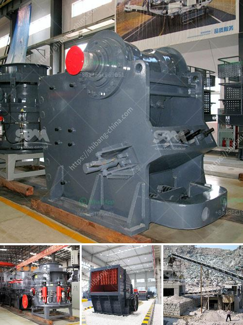

<h3>slag cement manufacturing process youtube</h3>
Slag cement, also known as ground granulated blast-furnace slag (GGBFS), is a byproduct of iron and steel manufacturing. It is obtained by quenching molten iron slag from a blast furnace, which is then pulverized into a fine powder. This slag powder can be used in a variety of applications, including concrete production.

The manufacturing process of slag cement involves several steps. The first step is the collection of iron slag from the blast furnace. This slag is a waste material that is typically disposed of in landfills. However, it can be recycled and processed into a useful product.

After the slag is collected, it is then cooled rapidly using water or air. This process, known as quenching, causes the slag to solidify into a glassy substance. The quenched slag is then ground into a fine powder, which is referred to as slag cement.

To further refine the slag cement, it may undergo additional grinding and drying processes. These processes help to improve the fineness and consistency of the final product. The resulting slag cement is then stored in silos or bags for distribution.

One of the most effective ways to understand the slag cement manufacturing process is through YouTube videos. There are numerous educational and informative videos available that provide detailed insights into each step of the process. These videos often include demonstrations and explanations from industry experts, making it easier for viewers to grasp the intricate details involved in slag cement production.

In conclusion, slag cement is a sustainable alternative to traditional cement that reduces waste and carbon emissions. Understanding its manufacturing process is crucial for anyone interested in the construction industry or sustainable practices. By utilizing educational YouTube videos, individuals can gain valuable knowledge about slag cement and its impact on the environment.
<h3>Contact us</h3><ul><li><strong>Whatsapp:&nbsp;<a href="https://wa.me/8613661969651">+8613661969651</a></strong></li><li><a href="https://swt.shibang-china.com/?git&amp;zhl&amp;slag cement manufacturing process youtube"><strong>Online Service(chat now)</strong></a></li></ul><h3>Related</h3><ul><li><a href='open cast mining equipment for sale south africa.md'>open cast mining equipment for sale south africa</a></li><li><a href='rock crusher gravel production.md'>rock crusher gravel production</a></li><li><a href='copper crusher suppliers in zambia.md'>copper crusher suppliers in zambia</a></li><li><a href='malaysian crusher plant manufacturer and supplier.md'>malaysian crusher plant manufacturer and supplier</a></li><li><a href='trommel ball mill.md'>trommel ball mill</a></li></ul>