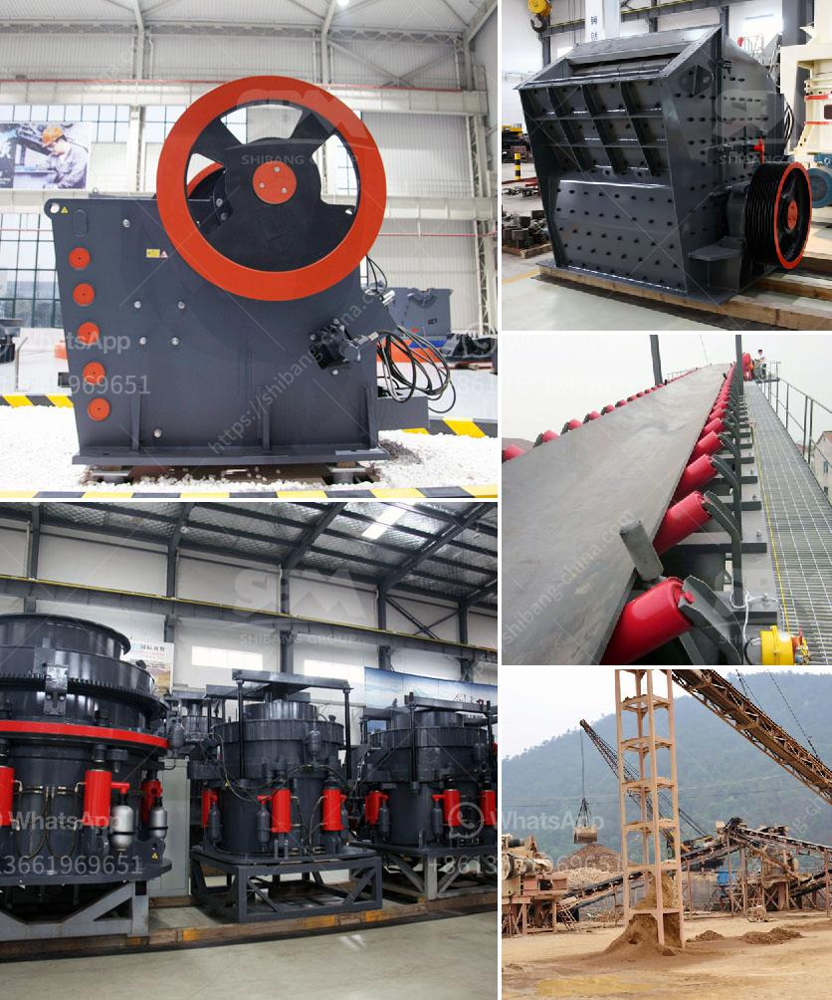

<h3>slag crusher for sale</h3>
The accumulation of industrial waste materials often poses a significant challenge to companies seeking to maintain a sustainable and environmentally friendly approach to their production processes. Slag, a by-product of industrial processes such as smelting, is one such material that often requires proper disposal. However, advancements in technology have paved the way for innovative solutions that not only aid in waste management but also bring economic advantages. One such solution is the slag crusher, which is now available for sale.

A slag crusher is a critical machine that prepares recyclable materials for further use in various production processes. Mining, metallurgy, and recycling companies rely on this machinery to transform large chunks of slag into smaller, more manageable pieces for easier handling and processing. Additionally, the crushed slag can also be utilized as materials in construction projects, adding value to what would otherwise be considered waste.

The primary appeal of a slag crusher lies in its ability to facilitate waste management. By reducing large pieces of slag into smaller fragments, the crusher simplifies the handling, transportation, and storage of the material. This process, in turn, reduces the need for extensive storage space, which can be expensive and inefficient for businesses. The crusher's efficiency in breaking down the slag also helps to prevent environmental issues that might arise from the mishandling or inappropriate storage of this industrial waste.

Apart from aiding in waste management, a slag crusher for sale can also generate revenue for companies. The crushed slag, when processed properly, can be used as a valuable aggregate in various construction projects. It can be mixed with cement or asphalt to create durable and high-performance building materials. As the demand for sustainable construction solutions grows, the use of slag as an alternative to traditional aggregates becomes increasingly attractive.

In addition to the financial benefits, adopting a slag crusher as part of a company's waste management strategy can boost its environmental credentials. Companies that prioritize sustainability and resource efficiency can enhance their reputation and appeal to environmentally conscious customers. The use of slag crushers can minimize the need for conventional disposal methods, such as landfilling or incineration, which are far less eco-friendly and have the potential to result in land or air pollution.

When considering the purchase of a slag crusher, there are a few factors that businesses should keep in mind. Firstly, the size and capacity of the crusher should align with the company's production needs. It is essential to choose a machine that is capable of handling the quantities of slag generated and meet the desired output requirements. Quality and durability should also be considered to ensure a long-lasting and reliable performance.

In conclusion, a slag crusher for sale offers an effective solution for companies dealing with industrial waste materials. By transforming slag into smaller fragments, these crushers aid in waste management, reduce storage needs, generate revenue, and contribute to environmental sustainability. Investing in a reliable and efficient slag crusher can prove beneficial in the long run, both economically and environmentally.
<h3>Contact us</h3><ul><li><strong>Whatsapp:&nbsp;<a href="https://wa.me/8613661969651">+8613661969651</a></strong></li><li><a href="https://swt.shibang-china.com/?git&amp;zhl&amp;slag crusher for sale"><strong>Online Service(chat now)</strong></a></li></ul><h3>Related</h3><ul><li><a href='copper ore machine in china.md'>copper ore machine in china</a></li><li><a href='dolomite powder making machine for processing line.md'>dolomite powder making machine for processing line</a></li><li><a href='secondary jaw crusher.md'>secondary jaw crusher</a></li><li><a href='china roller mill kenya.md'>china roller mill kenya</a></li><li><a href='used conical crushers for sale.md'>used conical crushers for sale</a></li></ul>