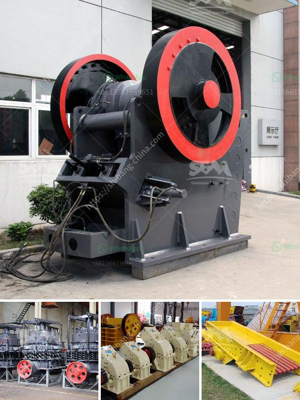

<h3>slag crusher korean dealer in india</h3>
India, with its rapid industrialization and growing economy, has witnessed a tremendous increase in metal production and consumption. Along with this growth, there has also been a substantial rise in the generation of industrial waste, including slag. Slag, a byproduct of steel manufacturing, is often discarded as waste material, causing environmental pollution and occupying valuable land. However, with the introduction of slag crushers by Korean dealers in India, the metal recycling industry is undergoing a significant revolution.

Slag crushers, developed by Korean manufacturers, offer an effective solution for the recycling and utilization of slag. These crushers not only help in reducing the volume of waste material but also enable the recovery of valuable metals present in the slag. By crushing and separating the slag into smaller particles, these crushers facilitate easy sorting and enable the extraction of iron and other metals for reuse.

The Korean dealers' expertise and technology have brought about a paradigm shift in the metal recycling industry in India. These crushers ensure maximum recovery of metal, minimizing environmental impact and conserving natural resources. Moreover, the process of slag crushing is highly efficient, saving energy and reducing production costs for steel manufacturers.

One of the key advantages of Korean slag crushers is their durability and reliability. These machines are built to withstand the harsh conditions of the steel industry and offer a long operational life with minimal maintenance requirements. As a result, Indian steel manufacturers are increasingly opting for Korean slag crushers, knowing that they can rely on the equipment for seamless operations.

The expansion of the metal recycling industry in India not only benefits the environment but also contributes to the country's economy. With Korean dealers supplying state-of-the-art slag crushers, Indian steel manufacturers can now efficiently process and recycle their slag waste, reducing their dependence on scarce natural resources and improving their sustainability credentials.

In conclusion, the introduction of slag crushers by Korean dealers in India has brought about a revolution in the metal recycling industry. These crushers play a crucial role in reducing waste volumes, conserving natural resources, and extracting valuable metals from slag. They have become an integral part of the Indian steel manufacturing process, promoting sustainable practices and contributing to the country's economic growth. With continuous advancements in technology, the future of metal recycling in India looks promising, thanks to the Korean dealers and their innovative slag crushers.
<h3>Contact us</h3><ul><li><strong>Whatsapp:&nbsp;<a href="https://wa.me/8613661969651">+8613661969651</a></strong></li><li><a href="https://swt.shibang-china.com/?git&amp;zhl&amp;slag crusher korean dealer in india"><strong>Online Service(chat now)</strong></a></li></ul><h3>Related</h3><ul><li><a href='singh stone crusher nashik.md'>singh stone crusher nashik</a></li><li><a href='crusher machine plant estimation cost.md'>crusher machine plant estimation cost</a></li><li><a href='definivion jaw crusher.md'>definivion jaw crusher</a></li><li><a href='coal vibrating screen manufacturers in south africa.md'>coal vibrating screen manufacturers in south africa</a></li><li><a href='quartz powder ball mill in tamilnadu.md'>quartz powder ball mill in tamilnadu</a></li></ul>