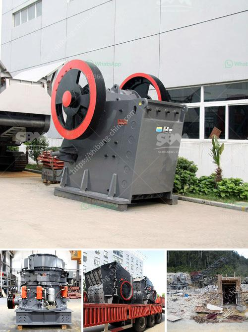

<h3>slag powder making</h3>
Slag powder, also known as ground granulated blast-furnace slag (GGBFS), is a byproduct obtained during the manufacturing of iron in a blast furnace. Essentially, it is a type of cementitious material that is created when iron ore, coke, and limestone are melted together in a blast furnace. This process results in the production of molten iron and a mixture of gases, which are then separated. The molten iron is used for various industrial purposes, while the remaining slag is cooled and ground into a fine powder.

The process of making slag powder begins with the cooling of the hot slag, which is conducted by pouring it into water. This rapid cooling leads to the formation of glassy particles that are then crushed and ground into a fine powder. The resulting product is a powdery material with various chemical and physical properties that make it highly suitable for a wide range of applications.

Slag powder has several advantages over traditional cementitious materials. Firstly, it is highly sustainable, as it is produced as a byproduct of an existing process and therefore does not require any additional raw materials. Additionally, it helps reduce carbon emissions in the cement production process. It is also known for its excellent binding properties, which enhance the durability and strength of concrete. The fine particles of slag powder fill the gaps in the concrete mixture, resulting in a denser and more durable final product.

The applications of slag powder are wide-ranging. It is commonly used as a partial replacement for cement in the production of concrete, thereby reducing the overall environmental impact of construction projects. Its use in concrete improves its workability, resistance to cracking, and long-term durability. Slag powder is also used in the manufacturing of cement blocks, roads, and even as a soil stabilizer in the construction industry.

In conclusion, the production of slag powder is an important and sustainable process that makes use of a byproduct from the iron manufacturing industry. This fine powder has various beneficial properties that make it an excellent addition to cementitious materials, enhancing their strength, durability, and workability. As the demand for sustainable construction materials continues to grow, slag powder is expected to play a crucial role in the development of greener and more reliable infrastructure.
<h3>Contact us</h3><ul><li><strong>Whatsapp:&nbsp;<a href="https://wa.me/8613661969651">+8613661969651</a></strong></li><li><a href="https://swt.shibang-china.com/?git&amp;zhl&amp;slag powder making"><strong>Online Service(chat now)</strong></a></li></ul><h3>Related</h3><ul><li><a href='clay processing technology.md'>clay processing technology</a></li><li><a href='cement concrete crusher equipment.md'>cement concrete crusher equipment</a></li><li><a href='talc powder grinding mills in german.md'>talc powder grinding mills in german</a></li><li><a href='industrial uses of white marble powder.md'>industrial uses of white marble powder</a></li><li><a href='aggregate crushing plant for sale.md'>aggregate crushing plant for sale</a></li></ul>