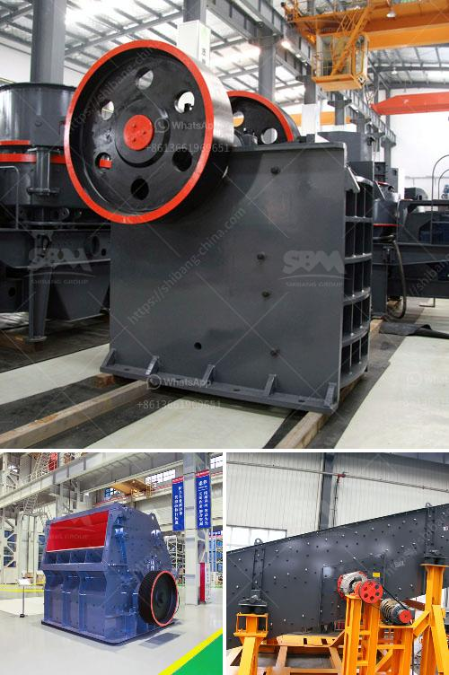

<h3>small ball mill for sale zimbabwe</h3>
The small ball mill for sale in Zimbabwe is a crucial equipment to grind materials into fine particles. The ball mill grinds various materials into powder-like substances, which are widely used in mineral dressing processes, paints, pyrotechnics, and ceramics. The mill can grind materials such as cement, quartz, feldspar, and other minerals effortlessly.

One of the significant advantages of a small ball mill is its small footprint. They occupy only a small space in the production line, making them ideal for compact laboratories or small-scale ventures. In addition to their compact nature, these mills require minimal power consumption, reducing operational costs.

The small ball mill for sale in Zimbabwe is equipped with several safety features to make the process safe and efficient. The equipment is designed with a reliable performance, ensuring continuous operation. Furthermore, it is dust-proof and easy to maintain. This ensures prolonged service life and reduces downtime, resulting in higher productivity.

Maintenance of the small ball mill is straightforward, requiring minimal expertise and resources. The simplified design allows for easy access to internal components for inspection, cleaning, and repair, enhancing the overall user experience. Additionally, the high-quality materials used in the construction of the mills contribute to their durability, ensuring longevity.

Investing in a small ball mill in Zimbabwe can be a profitable venture. It enables businesses to produce fine particles of various materials efficiently and effectively. Whether it is for research purposes or small-scale production, these mills offer a versatile solution.

Overall, a small ball mill for sale in Zimbabwe provides an easy-to-use, compact, and economical solution for both grinding and mixing applications. Its low power consumption and minimal maintenance requirements make it an attractive choice for any business looking to enhance its productivity and profitability.
<h3>Contact us</h3><ul><li><strong>Whatsapp:&nbsp;<a href="https://wa.me/8613661969651">+8613661969651</a></strong></li><li><a href="https://swt.shibang-china.com/?git&amp;zhl&amp;small ball mill for sale zimbabwe"><strong>Online Service(chat now)</strong></a></li></ul><h3>Related</h3><ul><li><a href='marble factory production line.md'>marble factory production line</a></li><li><a href='philippines crusher manufacturers in pakistan.md'>philippines crusher manufacturers in pakistan</a></li><li><a href='limestone ball mill italy.md'>limestone ball mill italy</a></li><li><a href='cement making machines for factory.md'>cement making machines for factory</a></li><li><a href='safety sings for crusher plant and quarry.md'>safety sings for crusher plant and quarry</a></li></ul>