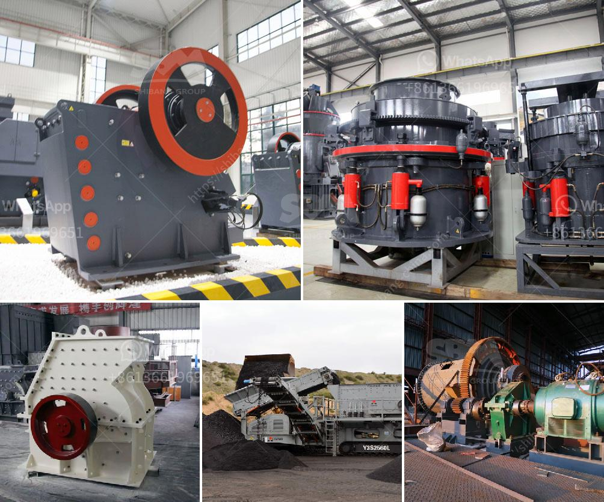

<h3>small concrete crusher</h3>
Concrete is one of the most versatile and durable materials used in construction projects. However, it generates a significant amount of waste during demolition and renovation processes. With the increasing focus on sustainable development and environmental conservation, finding effective ways to recycle concrete waste has become a crucial task.

In recent years, small concrete crushers have gained traction in the construction industry for their potential to recycle waste concrete into reusable aggregates. These crushers are compact, mobile, and powerful, making them an ideal solution for recycling concrete waste on construction sites.

One of the primary advantages of using small concrete crushers is that they are environmentally friendly. Instead of disposing of concrete waste in landfills, which contributes to pollution and soil degradation, these crushers convert the waste into reusable materials. The crushers crush the concrete into smaller pieces, reducing its volume and making it easier to transport and recycle.

Furthermore, recycling concrete waste using a small concrete crusher can significantly reduce construction costs. Traditional methods of disposing of concrete waste involve hauling it to landfills, which can be expensive due to transportation and disposal fees. By recycling concrete waste on-site with small crushers, construction companies can save on these costs while also meeting sustainability goals.

The small concrete crushers are designed with powerful jaws that work on the principle of compression. These crushers apply force to break down the concrete into smaller pieces that can be reused for various construction applications. The crushed concrete can be used as aggregate for new concrete, reducing the need for virgin materials and decreasing the carbon footprint of the construction industry.

Another advantage of using small concrete crushers is their versatility. They can be used in various settings, ranging from small-scale residential projects to large construction sites. The compact design allows these crushers to navigate through tight spaces and access hard-to-reach areas. Their mobility enables contractors to bring the crushers directly to the site, minimizing transportation and logistics challenges.

Despite their small size, these crushers are powerful and efficient. They can crush large chunks of concrete into fine particles in a matter of minutes. The crushers are equipped with adjustable jaws that allow contractors to control the size of the crushed concrete according to their specific requirements. With their high crushing capacity, these crushers can process a significant amount of concrete waste in a short period, increasing productivity on construction sites.

In conclusion, small concrete crushers offer construction companies a sustainable and cost-effective solution for recycling concrete waste. With their ability to convert waste into reusable materials, these crushers contribute to environmental conservation efforts. Their versatility and efficiency make them suitable for various construction projects, regardless of their scale. By embracing the use of small concrete crushers, the construction industry takes a step toward a greener and more sustainable future.
<h3>Contact us</h3><ul><li><strong>Whatsapp:&nbsp;<a href="https://wa.me/8613661969651">+8613661969651</a></strong></li><li><a href="https://swt.shibang-china.com/?git&amp;zhl&amp;small concrete crusher"><strong>Online Service(chat now)</strong></a></li></ul><h3>Related</h3><ul><li><a href='what is a mobile crusher.md'>what is a mobile crusher</a></li><li><a href='mobile crushing stone machines from austria.md'>mobile crushing stone machines from austria</a></li><li><a href='used concrete crusher manufacturer in malaysia.md'>used concrete crusher manufacturer in malaysia</a></li><li><a href='quarry aggregate manufacturing process ppt.md'>quarry aggregate manufacturing process ppt</a></li><li><a href='mining equipment hire indonesia.md'>mining equipment hire indonesia</a></li></ul>