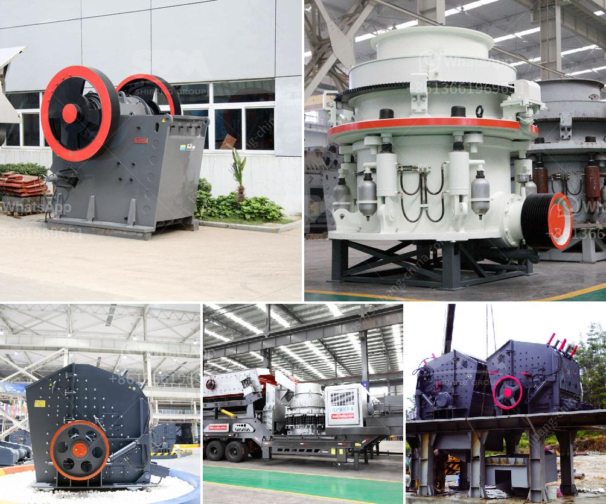

<h3>small concrete crushers for low capacity</h3>
When it comes to small concrete crushers, many people may think of small-sized portable crushers. Because there are many types and models of small concrete crushers for sale, it is important to choose the right equipment with low capacity to avoid waste of resources. What's more, compared with large-capacity concrete crushers, small plants are characterized by lower operating costs and relatively low initial investment.

Portable small concrete crushers are composed of different types of small crushers, such as jaw crusher, impact crusher, cone crusher and hammer crusher. Before being subjected to the crushing process, these machines perform separation of fine and foreign materials. Larger particles are then crushed inside the crusher itself. After the final crushing, the final product will have a uniform shape and size. It can be used as a construction material, a road base, or even as a filling material.

The portable small concrete crusher is a special crushing equipment developed for the waste concrete materials. It can process the coarse and medium crushing of concrete crushing. Through the reinforced crusher machine crushing process, they can realize a more efficient disposal of waste concrete mixture. These low capacity small concrete crushers usually have a capacity of 100 or 200 tons per hour. The maximum feed size is about 500 mm, and the discharging output size ranges from 10-80 mm.

The current mainstream technology with gold small mobile jaw crusher, impact crusher, pe jaw crusher machine, LM vertical roller mill, used in mining crushing, construction waste recycling, construction aggregate production, highway, railway, road and bridge construction and other industries. Its production capacity can reach: 1-2200t/h, and the vibrating screen is 55-2400 m³/h. During the development of the company, our company has been at the forefront of the industry, adopting a new type of crusher to satisfy customer's comprehensive requirements.

Small portable concrete crusher has features like simple structure, small volume, little weight, high production, low production cost, and suitable for materials with good hardness. Equipped with dual motors of 7.5KW, respectively, this machine can be operated simultaneously, saving more energy. The discharging size of this concrete jaw crusher is adjustable, and our company provides different models of portable concrete crushers for sale according to the actual needs of customers.

While the size of the concrete crushing site is a key factor in determining whether the crusher can meet the production requirements, the overall technological level of the concrete crusher is very mature, and the performance of the equipment is stable. Portable concrete crushers for recycling blocks can save many resources for urban construction projects. Moreover, the recycled concrete aggregate can be used as a foundation layer for new asphalt pavement, reducing the need for a large amount of aggregate and cement.

Overall, the small portable concrete crusher has a high degree of automation, and the feeding and discharging speed can be adjusted freely to achieve the maximum production capacity. It has strong mobility and can be easily transferred to different construction sites, so it is more suitable for various harsh environments. In conclusion, the small portable concrete crusher has a wide range of applications and high-cost performance. It is suitable for customers with small-scale production or low-cost investment in projects.
<h3>Contact us</h3><ul><li><strong>Whatsapp:&nbsp;<a href="https://wa.me/8613661969651">+8613661969651</a></strong></li><li><a href="https://swt.shibang-china.com/?git&amp;zhl&amp;small concrete crushers for low capacity"><strong>Online Service(chat now)</strong></a></li></ul><h3>Related</h3><ul><li><a href='marble granite stone grinding machine price.md'>marble granite stone grinding machine price</a></li><li><a href='cheap used quarry machines italy.md'>cheap used quarry machines italy</a></li><li><a href='buy a cement blending plant in south africa.md'>buy a cement blending plant in south africa</a></li><li><a href='used coal washing plants for sale in india.md'>used coal washing plants for sale in india</a></li><li><a href='gold crusher for sale in turkey.md'>gold crusher for sale in turkey</a></li></ul>