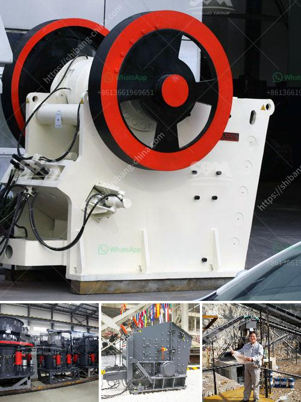

<h3>small mobile stone crusher</h3>
The small mobile stone crusher is a revolutionary concept that brings together conceptual designs and innovative technology to provide a solution to the barriers that currently exist in the crushing and screening industries.

No matter the size and complexity of the project, this machine is designed to simplify the crushing process and save time, energy, and money. It is specially designed to meet the needs of contractors working in tight spaces and with limited resources. The small mobile stone crusher is perfect for materials that cannot be transported easily from a specific location to another.

The portable crusher enables contractors to recycle materials at the construction site, thus saving a lot of time and effort. It also eliminates the need for transporting the waste materials from one location to another. This means lower transportation costs and less pollution. The small mobile stone crusher is flexible and convenient, and has a strong mobility, which can save a lot of infrastructure and relocation costs.

Another great feature of this mobile crusher is its versatility. With the ability to customize the machine to suit specific requirements, it can be used in various applications, such as sidewalks, road bases, and landscaping. The small mobile stone crusher can be easily adapted to various crushing applications.

The integrated design allows the machine to be operated in different terrains. It has a compact structure and can be used in narrow spaces, making it suitable for crushing operations on construction sites with limited space.

In conclusion, the small mobile stone crusher is highly efficient, easy to use, and can process materials on-site, thus saving time and money. The integrated design makes it suitable for a variety of applications, allowing contractors to complete their projects with ease and efficiency. It is a perfect solution for contractors working in tight spaces or with limited resources, as it eliminates the need for transportation and reduces the environmental impact.
<h3>Contact us</h3><ul><li><strong>Whatsapp:&nbsp;<a href="https://wa.me/8613661969651">+8613661969651</a></strong></li><li><a href="https://swt.shibang-china.com/?git&amp;zhl&amp;small mobile stone crusher"><strong>Online Service(chat now)</strong></a></li></ul><h3>Related</h3><ul><li><a href='cement company in protea glen.md'>cement company in protea glen</a></li><li><a href='stone crushing machines in oman.md'>stone crushing machines in oman</a></li><li><a href='milling machine of jaw crusher.md'>milling machine of jaw crusher</a></li><li><a href='mobile crusher plant for hire in south africa.md'>mobile crusher plant for hire in south africa</a></li><li><a href='quarry crusher machine usa.md'>quarry crusher machine usa</a></li></ul>