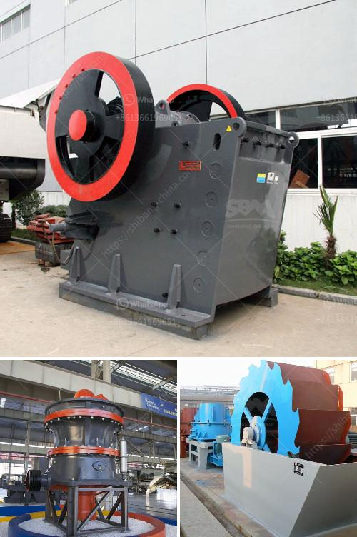

<h3>small operations rock crushing equipment for sale</h3>
In today's construction landscape, it is important for small operations to maximize efficiency and minimize costs in order to stay competitive. One key factor in achieving this goal is having access to reliable and affordable rock crushing equipment. Whether for use in road construction, site development, or landscaping projects, rock crushing equipment is essential in transforming large rocks into smaller, more manageable sizes. In this article, we will explore the different types of rock crushing equipment available for sale, their advantages, and how they can benefit small operations.

One popular option for small operations is the jaw crusher. This type of rock crusher uses compressive force to break down larger stones into smaller pieces. Jaw crushers have two jaws, one fixed and one moving, which work together to crush materials. The movable jaw exerts force on the rock and pushes it against the fixed jaw, breaking it into smaller sizes. One advantage of jaw crushers is their versatility; they can handle a wide range of materials, from soft limestone to hard granite. Additionally, jaw crushers are known for their reliability and low maintenance requirements, making them ideal for small operations with limited resources.

Another option for small operations is the impact crusher. This type of rock crusher uses impact force to break down rocks into smaller sizes. The impact crusher consists of a rotor with hammers or blow bars that spin at high speeds, striking the rock and breaking it apart. Impact crushers are particularly useful for producing a consistent and high-quality end product. They can handle a variety of materials and are known for their efficiency in reducing the size of rocks. Additionally, many impact crushers are equipped with a screening deck, allowing for the separation of different-sized materials.

Cone crushers are also popular among small operations. These crushers use a spinning cone-shaped mantle to crush rocks against a stationary bowl liner. Cone crushers are known for their efficiency in producing well-shaped and evenly sized aggregates. They are particularly suited for crushing hard and abrasive materials. Cone crushers are often used in secondary or tertiary crushing stages and can be easily integrated into existing crushing plants.

When considering rock crushing equipment for sale, it is important to consider the specific needs of your small operation. Factors such as the size and hardness of the materials you will be crushing, the desired end product size, and your budget will determine which type of crusher is best suited for your needs. Additionally, it is important to ensure that the equipment you choose is reliable and durable, as breakdowns can lead to costly delays.

In conclusion, small operations can benefit greatly from having access to reliable and affordable rock crushing equipment. Jaw crushers, impact crushers, and cone crushers are all viable options depending on the specific needs of your operation. By investing in the right equipment, small operations can increase efficiency, reduce costs, and improve the overall quality of their construction projects. So, whether you are in the road construction, site development, or landscaping industry, consider the advantages of rock crushing equipment for your small operation.
<h3>Contact us</h3><ul><li><strong>Whatsapp:&nbsp;<a href="https://wa.me/8613661969651">+8613661969651</a></strong></li><li><a href="https://swt.shibang-china.com/?git&amp;zhl&amp;small operations rock crushing equipment for sale"><strong>Online Service(chat now)</strong></a></li></ul><h3>Related</h3><ul><li><a href='four roller mill.md'>four roller mill</a></li><li><a href='list of machinery used in the quarry.md'>list of machinery used in the quarry</a></li><li><a href='iron ore processing machine cost.md'>iron ore processing machine cost</a></li><li><a href='jual ball mill second.md'>jual ball mill second</a></li><li><a href='malaysia crusher plant manufacturer and supplier.md'>malaysia crusher plant manufacturer and supplier</a></li></ul>