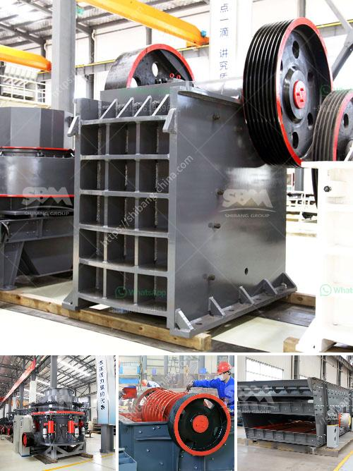

<h3>small quartz appratus for crushing</h3>
Quartz is a commonly found mineral that boasts various industrial applications due to its impressive properties such as high resistance to heat, transparency, and unique piezoelectric properties. From electronics to construction, quartz plays a significant role in numerous industries. However, before it can be utilized in these applications, the raw quartz needs to be crushed into smaller particles to enhance its processing and usage efficiency. This is where small quartz apparatus for crushing comes into the picture.

Small quartz apparatus for crushing refers to compact equipment specifically designed for breaking down larger chunks of raw quartz into smaller, more manageable fragments. These apparatus are instrumental in the mineral processing industry, where the extracted quartz undergoes various processes to extract its desired products. The efficient use of quartz apparatus for crushing ensures maximum extraction, eliminating waste and increasing overall productivity.

One of the key advantages of utilizing small quartz apparatus for crushing is the improved granularity of the quartz particles. The size reduction of quartz is crucial in refining its properties, as it allows for better control over the end product. Crushing quartz into smaller fragments enhances its homogeneity, making it more consistent in terms of composition and quality. This, in turn, improves the performance and reliability of quartz-based products.

The design and functionality of small quartz apparatus for crushing ensure their suitability for both small-scale and large-scale operations. These apparatus are compact, portable, and easy to operate, making them ideal for on-site crushing requirements in quarries or mines. Additionally, their simple setup and maintenance procedures enable efficient usage even in remote locations, reducing downtime and operational costs.

Various types of small quartz apparatus for crushing are available in the market, catering to different crushing needs and production capacities. This offers flexibility to mineral processing plants, enabling them to choose the most suitable apparatus based on their requirements. Whether it is a jaw crusher, impact crusher, or cone crusher, the small quartz apparatus for crushing ensures efficient and precise particle size reduction, essential for further processing.

Incorporating small quartz apparatus for crushing into the mineral processing workflow not only improves productivity but also contributes to environmental sustainability. Efficient crushing equipment minimizes waste generation by processing quartz with minimal loss and maximum yield. This reduces the need for additional extraction processes and associated environmental impacts. The optimized use of raw materials also aligns with the principles of responsible mining and sustainable resource utilization.

Moreover, small quartz apparatus for crushing enables faster and more consistent production, meeting the fluctuating demand across various industries. The ability to control the size and shape of crushed quartz particles ensures consistent performance of quartz-based products. Whether it is quartz sand for glass production, quartz powder for ceramics, or quartz granules for construction, the versatility of small quartz apparatus for crushing facilitates the production of precise and high-quality materials.

In conclusion, small quartz apparatus for crushing is an essential tool for the mineral processing industry. These compact and efficient machines play a pivotal role in breaking down raw quartz into smaller particles, enhancing its processing efficiency and utilization. From improved granularity and homogeneity to optimized resource utilization and sustainable production, these apparatus offer numerous benefits. By investing in small quartz apparatus for crushing, mineral processing plants can enhance their productivity, meet the demand for high-quality quartz-based products, and contribute to a greener, more sustainable future.
<h3>Contact us</h3><ul><li><strong>Whatsapp:&nbsp;<a href="https://wa.me/8613661969651">+8613661969651</a></strong></li><li><a href="https://swt.shibang-china.com/?git&amp;zhl&amp;small quartz appratus for crushing"><strong>Online Service(chat now)</strong></a></li></ul><h3>Related</h3><ul><li><a href='crusher manufacturers in ahmedabad.md'>crusher manufacturers in ahmedabad</a></li><li><a href='mini cement plant project cost india.md'>mini cement plant project cost india</a></li><li><a href='gold processing leaching plant.md'>gold processing leaching plant</a></li><li><a href='limestone plant machinery manufacturers sale tamilnadu.md'>limestone plant machinery manufacturers sale tamilnadu</a></li><li><a href='want to lease diamond mining equipment in south africa.md'>want to lease diamond mining equipment in south africa</a></li></ul>