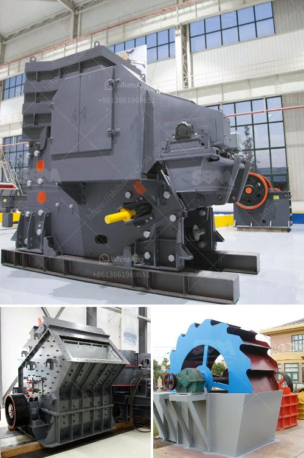

<h3>small scale copper refining equipment</h3>
Copper is one of the most widely used metals in various industries due to its exceptional electrical and thermal conductivity, corrosion resistance, and ductility. As such, the demand for copper continues to rise globally. Artisanal miners play a crucial role in meeting this demand, extracting copper from small-scale mines around the world. However, most artisanal miners face challenges in the refining process, which often leads to significant losses in copper yield. To address these challenges, small-scale copper refining equipment has become essential. 

One of the primary challenges faced by artisanal miners is related to impurities found in copper ores. These impurities can range from other metals, such as iron and lead, to sulfur compounds. Impurities not only decrease the quality of copper but also affect its electrical conductivity and increase the difficulty of casting. Therefore, refining copper to remove these impurities is critical.

Small-scale copper refining equipment is designed to purify copper ore and remove unwanted impurities. This equipment utilizes various techniques, such as smelting, electrorefining, and leaching, to convert impure copper into high-quality, marketable copper metal.

Smelting is the traditional method used for copper refining. It involves heating the copper ore in a furnace to extract the copper content. During smelting, impurities are separated from the copper concentrate, which then solidifies into pure copper. This process requires a smelting furnace, usually equipped with a crucible and a heating source, such as coal or natural gas.

Electrorefining is another technique used for small-scale copper refining. This process involves placing impure copper electrodes into an electrolytic cell filled with a metal sulfate solution. By passing an electric current through the cell, copper ions migrate from the impure electrode to a pure copper electrode, resulting in purified copper. The advantage of electrorefining is its ability to produce high-purity copper.

Leaching is a technique commonly used for low-grade copper ores. This process involves dissolving copper minerals from the ore using chemicals, such as sulfuric acid or ammonium carbonate solution. The dissolved copper can then be precipitated and refined further to obtain pure copper. Leaching processes often require specific equipment, such as tanks and pumps, to facilitate the chemical reactions.

In recent years, various companies have developed compact and portable copper refining equipment specifically designed for artisanal miners. These devices are usually smaller in size, affordable, and user-friendly, making them ideal for small-scale operations. Some equipment manufacturers also provide training and technical support to ensure effective and efficient use of the equipment.

Investing in small-scale copper refining equipment has numerous benefits for artisanal miners. Firstly, it allows them to increase their copper yield and improve the quality of the metal produced. This, in turn, enhances their profitability and competitiveness in the market. Additionally, refining equipment helps reduce environmental pollution as it enables proper handling and disposal of waste materials generated during the refining process.

In conclusion, small-scale copper refining equipment is crucial for artisanal miners to maximize their copper extraction potential and improve the quality of the metal produced. With various techniques such as smelting, electrorefining, and leaching, these equipment options provide a way to remove impurities and achieve higher copper yield. As the demand for copper continues to rise, investing in refining equipment becomes a must for artisanal miners to remain competitive in the industry.
<h3>Contact us</h3><ul><li><strong>Whatsapp:&nbsp;<a href="https://wa.me/8613661969651">+8613661969651</a></strong></li><li><a href="https://swt.shibang-china.com/?git&amp;zhl&amp;small scale copper refining equipment"><strong>Online Service(chat now)</strong></a></li></ul><h3>Related</h3><ul><li><a href='artificial sand vs natural sand.md'>artificial sand vs natural sand</a></li><li><a href='working principle of conveyor belt.md'>working principle of conveyor belt</a></li><li><a href='rock crusher gravel production.md'>rock crusher gravel production</a></li><li><a href='stone crushing equipment zenith.md'>stone crushing equipment zenith</a></li><li><a href='crusher machine for hardened powder.md'>crusher machine for hardened powder</a></li></ul>