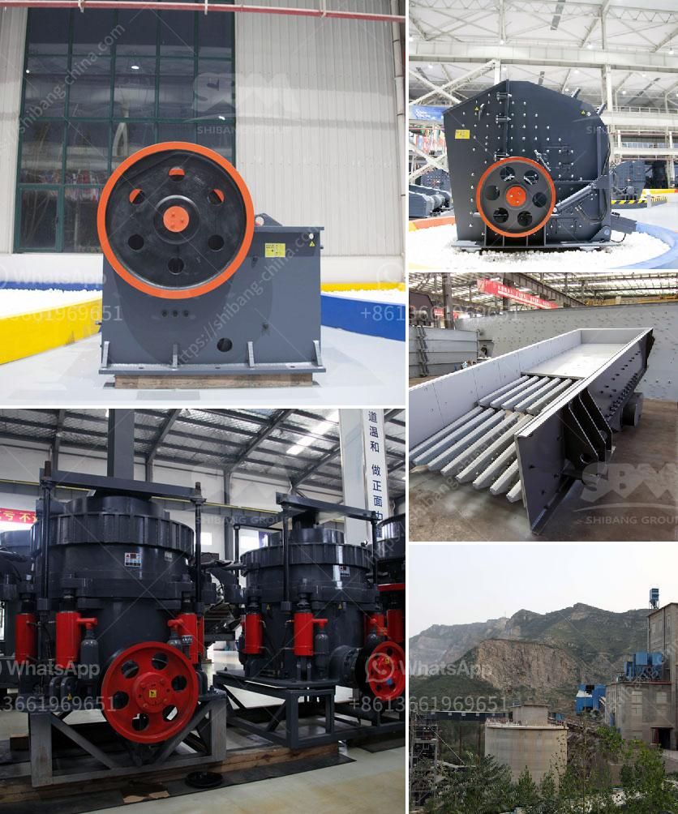

<h3>small scale gold mining equipment in ghana price</h3>
Small-scale gold mining in Ghana has been practiced for centuries. The country's gold reserves are estimated to be worth billions, making it one of the top destinations for mining companies worldwide. However, the sector is mostly dominated by informal and illegal miners who rely on rudimentary technologies and equipment.

The price of small-scale gold mining equipment in Ghana is uncertain. Many factors influence the price of the mining equipment in Ghana, such as the size of the operation, the type of gold deposit, and the hardness and grade of the ore. Nevertheless, gold mining equipment in Ghana is in demand and many small-scale miners are willing to invest in it.

Gold mining can be traced back to the native tribes of Ghana, who discovered gold during their agricultural activities. When Europeans arrived in the late 19th century, they set up large-scale mines to exploit Ghana's gold resources. However, the expensive costs and environmental damage caused by the large-scale operations led to the rise in small-scale mining.

Small-scale mining in Ghana is carried out by individuals, groups, or cooperatives who employ manual or rudimentary tools. They use these tools to dig, sift, and extract gold-bearing ore from the ground. Although this type of mining is considered informal and often illegal, it provides employment opportunities and income for many Ghanaians.

One of the challenges faced by small-scale miners in Ghana is the lack of modern and efficient equipment to extract and process gold ore. These miners often rely on outdated and ineffective technologies that result in low yields and environmental degradation. Additionally, the use of mercury in the extraction process poses health risks to miners and nearby communities.

To address these issues, various organizations and companies have introduced affordable and efficient small-scale mining equipment in Ghana. These equipment options include crushers, ball mills, sluice boxes, and centrifugal concentrators. They are designed to improve the efficiency and productivity of small-scale mining operations, while minimizing the harmful effects on the environment and human health.

However, the price of this equipment remains a significant barrier for small-scale miners. The high costs of importing and maintaining the equipment, as well as the lack of access to financing, make it challenging for small-scale miners to adopt modern technologies. Additionally, the irregularity of gold prices in the international market makes it difficult for miners to plan and invest in equipment.

The government of Ghana and international organizations have recognized the importance of supporting small-scale miners in adopting sustainable and responsible mining practices. They are providing training programs, technical assistance, and access to financing to help miners improve their operations and safety standards.

In conclusion, the price of small-scale gold mining equipment in Ghana remains uncertain, as it depends on many factors. However, there are efforts to introduce modern technologies and equipment to improve the efficiency and sustainability of small-scale mining operations. Support from the government and international organizations is crucial to ensure that small-scale miners can access the necessary equipment to extract gold safely and responsibly.
<h3>Contact us</h3><ul><li><strong>Whatsapp:&nbsp;<a href="https://wa.me/8613661969651">+8613661969651</a></strong></li><li><a href="https://swt.shibang-china.com/?git&amp;zhl&amp;small scale gold mining equipment in ghana price"><strong>Online Service(chat now)</strong></a></li></ul><h3>Related</h3><ul><li><a href='small quartz appratus for crushing.md'>small quartz appratus for crushing</a></li><li><a href='stone grinding machine type raymond mill price.md'>stone grinding machine type raymond mill price</a></li><li><a href='vibrating screens usa.md'>vibrating screens usa</a></li><li><a href='machine supplier of stone crusher in philippines.md'>machine supplier of stone crusher in philippines</a></li><li><a href='used concrete crusher manufacturer in malaysia.md'>used concrete crusher manufacturer in malaysia</a></li></ul>