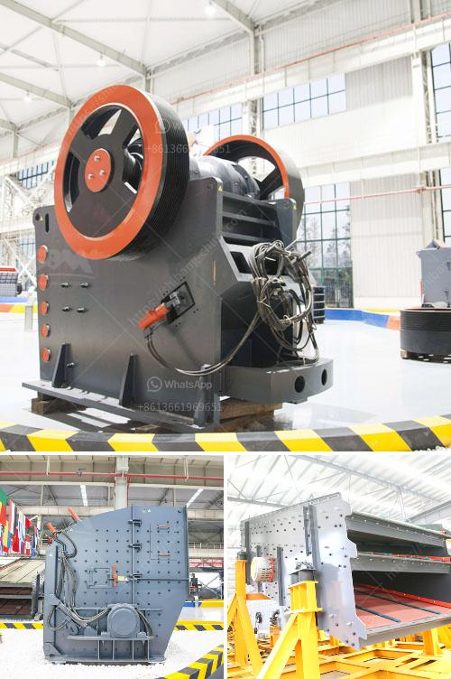

<h3>small scale hard rock gold ore processing</h3>
Small-scale hard rock gold ore processing is an innovative and efficient method to extract precious metals from complex ore samples. This process utilizes high temperatures and electricity to melt and separate gold from other metals, such as silver and copper, in order to extract the gold from the ore.

The first step in this process is the crushing and grinding of the ore into a fine powder. This is done using a crusher and a ball mill or similar grinding equipment. The crushed ore is then mixed with water to create a slurry. This slurry is then heated and agitated in a series of tanks or tanks to separate the gold from other metals.

The next step in the process is the separation of the gold from the slurry. This is done using a process called smelting, which involves heating the slurry to high temperatures in a furnace or similar device. As the slurry is heated, the gold melts and separates from the other metals, forming a liquid gold alloy.

Once the gold has been separated from the other metals, it can be further purified through a process called refining. This involves heating the liquid gold alloy to remove impurities, such as silver and copper, and to further increase the purity of the gold.

Small-scale hard rock gold ore processing is a cost-effective and environmentally friendly method to extract gold from complex ore samples. It offers several advantages over traditional methods, including reduced processing time, lower operational costs, and a reduced environmental footprint.

In conclusion, small-scale hard rock gold ore processing offers a viable and sustainable solution for extracting gold from complex ore samples. This innovative process is highly efficient and cost-effective, making it an attractive option for small-scale miners and individuals interested in sustainable mining practices.
<h3>Contact us</h3><ul><li><strong>Whatsapp:&nbsp;<a href="https://wa.me/8613661969651">+8613661969651</a></strong></li><li><a href="https://swt.shibang-china.com/?git&amp;zhl&amp;small scale hard rock gold ore processing"><strong>Online Service(chat now)</strong></a></li></ul><h3>Related</h3><ul><li><a href='bentonite crushing machine price list.md'>bentonite crushing machine price list</a></li><li><a href='small scale pulverizing ball mill.md'>small scale pulverizing ball mill</a></li><li><a href='definivion jaw crusher.md'>definivion jaw crusher</a></li><li><a href='stone crushers poland.md'>stone crushers poland</a></li><li><a href='activated bentonite production line.md'>activated bentonite production line</a></li></ul>