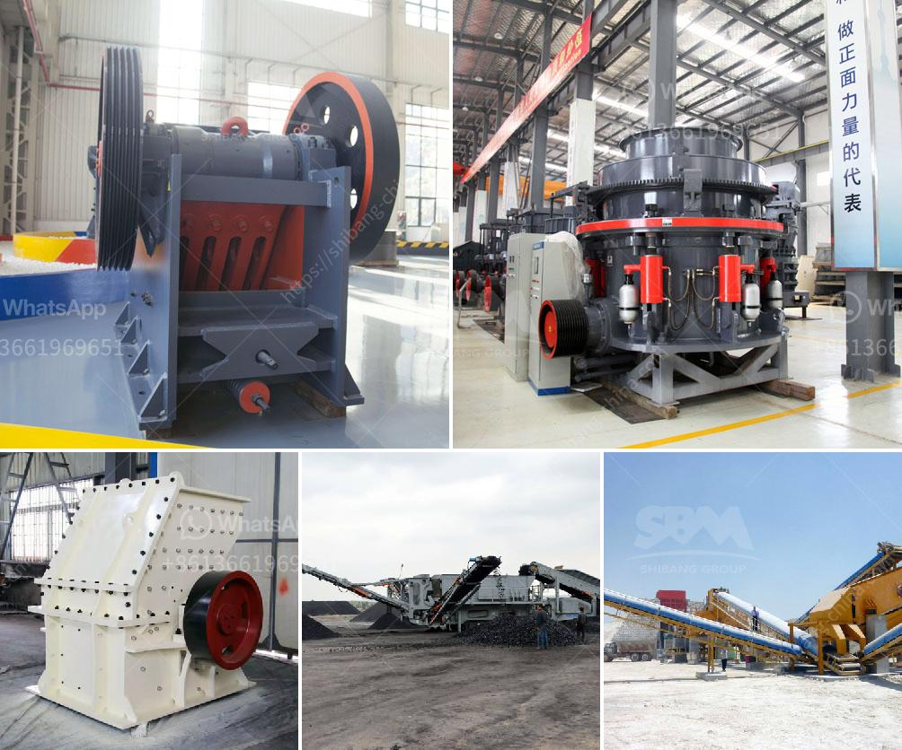

<h3>small scale pulverizing ball mill</h3>
Small Scale Pulverizing Ball Mill: An Efficient and Cost-Effective Solution for Grinding and Pulverizing Materials

Pulverizing ball mills are widely used to grind and pulverize various materials in mining, building materials, chemical, metallurgical, and other industries. However, these machines are often large in size, with high energy consumption and high maintenance costs. In recent years, there has been growing interest in developing small scale pulverizing ball mills to meet the needs of small and startup businesses.

A small scale pulverizing ball mill works in a similar way as a regular ball mill does, but with a smaller size and reduced energy consumption. These machines are ideal for small scale applications and are highly efficient in grinding and pulverizing materials like ores, chemicals, ceramics, glass, and more.

One of the key advantages of a small scale pulverizing ball mill is its compact size, which allows it to fit into tight spaces and be easily transported. This makes it a perfect choice for small workshops or businesses with limited floor space. Additionally, its reduced size also means lower energy consumption, resulting in significant cost savings on electricity bills.

Another benefit of the small scale pulverizing ball mill is its ease of maintenance. These machines are typically designed to be simple and user-friendly, with easy access to key components for cleaning and maintenance. This reduces downtime and ensures that the machine is always in optimal working condition, further minimizing costs.

Despite their small size, these ball mills are highly efficient in grinding and pulverizing materials. They are equipped with high-quality grinding media, such as steel balls or ceramic beads, which ensure effective and uniform grinding. The rotation speed of the ball mill can be adjusted to control the fineness of the final product, making it suitable for a wide range of applications.

Additionally, a small scale pulverizing ball mill can be customized to meet specific requirements. Different types of liners and grinding media can be used to achieve desired grinding effects. Moreover, these machines are often equipped with a variety of safety features to protect both the users and the materials being processed.

In conclusion, a small scale pulverizing ball mill is an efficient and cost-effective solution for grinding and pulverizing materials. Its compact size, low energy consumption, and ease of maintenance make it a valuable choice for small workshops or businesses with limited resources. With their ability to grind and pulverize various materials, these machines offer endless possibilities for application in different industries. If you are looking for an efficient and affordable grinding solution, a small scale pulverizing ball mill may be the perfect choice for you.
<h3>Contact us</h3><ul><li><strong>Whatsapp:&nbsp;<a href="https://wa.me/8613661969651">+8613661969651</a></strong></li><li><a href="https://swt.shibang-china.com/?git&amp;zhl&amp;small scale pulverizing ball mill"><strong>Online Service(chat now)</strong></a></li></ul><h3>Related</h3><ul><li><a href='cde sand washing plant price.md'>cde sand washing plant price</a></li><li><a href='hammer vibrating screens usa.md'>hammer vibrating screens usa</a></li><li><a href='grinding calcium carbonate equipment.md'>grinding calcium carbonate equipment</a></li><li><a href='limestone ore processing plant.md'>limestone ore processing plant</a></li><li><a href='limestone crushing plant sale in pakistan.md'>limestone crushing plant sale in pakistan</a></li></ul>