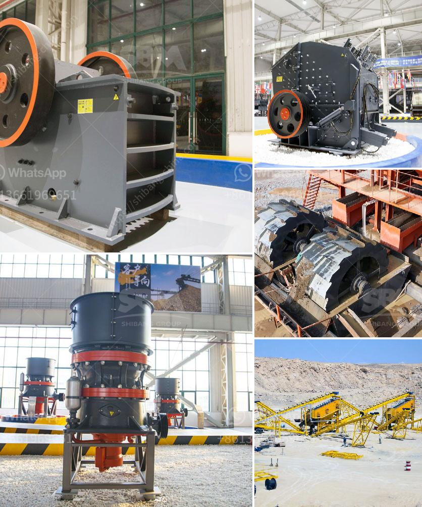

<h3>small scale rock crusher</h3>
A small scale rock crusher is an essential piece of equipment for any miner or prospector as it is versatile and easy to use. It can be used for crushing all kinds of rocks, including quartz, granite, basalt, limestone, river pebbles, etc. The machine is powered by a gasoline engine or electrical motor, making it highly efficient and reliable.

One of the standout features of this crusher is its portability. It is compact and lightweight, allowing miners and prospectors to take it wherever they go. This is especially beneficial for those who need to crush rocks on-site or in remote locations. It can easily fit on the back of a truck or be transported in a backpack.

The small scale rock crusher comes with a hopper that can hold up to 2kg of material at a time. The hopper has a mesh bottom, which allows excess material to pass through and keeps the crusher clean. It also has an adjustable feed tube to ensure a consistent and even feed rate.

Operating the crusher is straightforward. Simply load the hopper with the desired material, start the engine or motor, and feed the rocks into the crusher. The machine will crush the rocks into smaller pieces, which can then be used for various purposes, such as building roads, constructing foundations, or even as landscaping material.

Despite its small size, the rock crusher is capable of crushing rocks of various hardnesses. This is due to its sturdy construction and high-quality materials, which ensure durability and reliability. It can handle both soft and hard rocks, making it a versatile tool for any miner or prospector.

In conclusion, a small scale rock crusher is an essential piece of equipment for miners and prospectors. It is portable, easy to use, and can crush rocks of various hardnesses. Whether it is used for crushing quartz, granite, basalt, or any other type of rock, it is an indispensable tool that should not be overlooked.
<h3>Contact us</h3><ul><li><strong>Whatsapp:&nbsp;<a href="https://wa.me/8613661969651">+8613661969651</a></strong></li><li><a href="https://swt.shibang-china.com/?git&amp;zhl&amp;small scale rock crusher"><strong>Online Service(chat now)</strong></a></li></ul><h3>Related</h3><ul><li><a href='kaolin processing plant machinery.md'>kaolin processing plant machinery</a></li><li><a href='granite crushers in germany.md'>granite crushers in germany</a></li><li><a href='quartz manufacturing process from mineral.md'>quartz manufacturing process from mineral</a></li><li><a href='quick lime hammer crusher.md'>quick lime hammer crusher</a></li><li><a href='cost of a medium size stone crusher.md'>cost of a medium size stone crusher</a></li></ul>