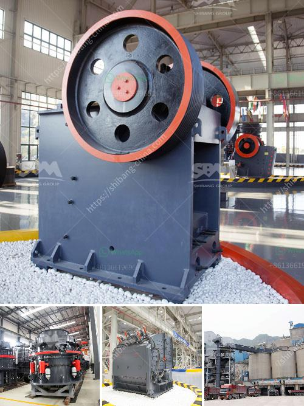

<h3>small soft stone crusher</h3>
A small soft stone crusher is a machine designed to break large rocks into smaller pieces. The size of the crusher depends on the size of the rock, and its output capacity. This machine is used to process rocks and other materials, such as limestone, sandstone, clay, and more.

One of the important features of a small soft stone crusher is its portability. These machines are compact, lightweight, and easy to transport. They can be moved from one location to another, making them suitable for construction sites or remote areas. This flexibility allows users to bring the crusher to where the rocks are, rather than having to transport the rocks to a fixed crusher.

Despite their small size, these crushers are powerful and efficient. They can crush rocks into smaller pieces, which can then be used as construction materials or for other purposes. The crushed materials can be used as aggregates in concrete or asphalt production, for road construction, or as fill material.

Another advantage of a small soft stone crusher is its affordability. These machines are cost-effective and can be a great investment for small-scale businesses or individuals looking to process rocks on a smaller scale. They require minimal maintenance and are easy to operate, making them a user-friendly option for those with limited experience or resources.

In conclusion, a small soft stone crusher is a versatile machine that can break rocks into smaller pieces for various uses. Its portability and affordability make it a practical choice for construction sites or remote areas. Whether it’s for construction purposes or other applications, this machine can efficiently process rocks and provide the desired output.
<h3>Contact us</h3><ul><li><strong>Whatsapp:&nbsp;<a href="https://wa.me/8613661969651">+8613661969651</a></strong></li><li><a href="https://swt.shibang-china.com/?git&amp;zhl&amp;small soft stone crusher"><strong>Online Service(chat now)</strong></a></li></ul><h3>Related</h3><ul><li><a href='manganese ball milling machine.md'>manganese ball milling machine</a></li><li><a href='standar operasional prosedur batubara mininh.md'>standar operasional prosedur batubara mininh</a></li><li><a href='feasibility study for cocoa unit processing.md'>feasibility study for cocoa unit processing</a></li><li><a href='used asphalt plants for sale in japan.md'>used asphalt plants for sale in japan</a></li><li><a href='crusher plant cost estimation.md'>crusher plant cost estimation</a></li></ul>