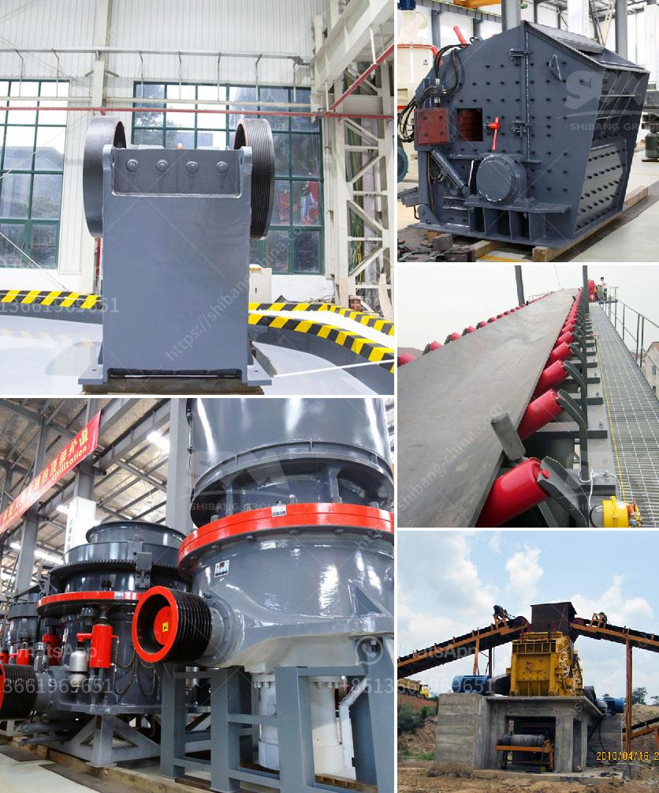

<h3>small stones to building sand crusher</h3>
Small stones are commonly used in the construction industry as a key ingredient in concrete, asphalt, and other building materials. However, in order to transform these small stones into the required size and shape for construction purposes, they must undergo the crushing process. This is where a stone crusher comes into play.

A stone crusher is a type of machine designed to break large stones into smaller pieces or small particles. It is widely used in many industries, such as mining, metallurgy, building materials, highway, railway, water conservancy, chemical and so on. Small stones are fed into the crusher and crushed into specific sizes, depending on the requirements.

One of the primary benefits of using a stone crusher is its effectiveness in reducing the size of the stones. It is a cost-effective method for processing stones into smaller particles that can be used for construction purposes. This process not only saves time and effort but also reduces the expenses associated with transporting large stones.

Furthermore, a stone crusher is often used in conjunction with other machinery such as vibrating screens, conveyor belts, and generators to provide a complete crushing solution. This ensures a smooth and efficient operation, minimizing downtime and maximizing productivity.

Another advantage of using a stone crusher is its versatility. It can crush a wide variety of stones, including granite, limestone, basalt, quartz, river pebbles, etc. This versatility allows contractors to use the same machine for different projects, saving both time and money.

When it comes to choosing a stone crusher, one must consider various factors. The most important factor is the desired size of the crushed stones. Different crushers have different output capacities and can produce different sizes of crushed stones. Therefore, it is crucial to select a crusher that meets the specific requirements of the project.

The efficiency of a stone crusher is also an important consideration. A highly efficient crusher can process more stones in a shorter time, resulting in higher output and increased profitability. It is crucial to choose a crusher with a high productivity rate and low maintenance requirements to maximize efficiency.

Safety is another crucial factor to consider when operating a stone crusher. It is essential to follow all safety guidelines and ensure proper training for the operators. Regular maintenance and inspections of the crusher are also necessary to prevent accidents and ensure smooth operation.

In conclusion, a stone crusher is an essential machine in the construction industry. It plays a crucial role in transforming small stones into the desired size and shape for construction purposes. Its effectiveness, versatility, and efficiency make it a valuable asset for contractors. However, safety should always be a top priority when operating a stone crusher. Proper training and maintenance are necessary to ensure safe and efficient operation.
<h3>Contact us</h3><ul><li><strong>Whatsapp:&nbsp;<a href="https://wa.me/8613661969651">+8613661969651</a></strong></li><li><a href="https://swt.shibang-china.com/?git&amp;zhl&amp;small stones to building sand crusher"><strong>Online Service(chat now)</strong></a></li></ul><h3>Related</h3><ul><li><a href='want to lease diamond mining equipment in south africa.md'>want to lease diamond mining equipment in south africa</a></li><li><a href='aggregates crashing plant in nigeria.md'>aggregates crashing plant in nigeria</a></li><li><a href='biggest jaw crusher in the world.md'>biggest jaw crusher in the world</a></li><li><a href='project proposal for gypsum manufacturing.md'>project proposal for gypsum manufacturing</a></li><li><a href='iron ore crusher for sale.md'>iron ore crusher for sale</a></li></ul>