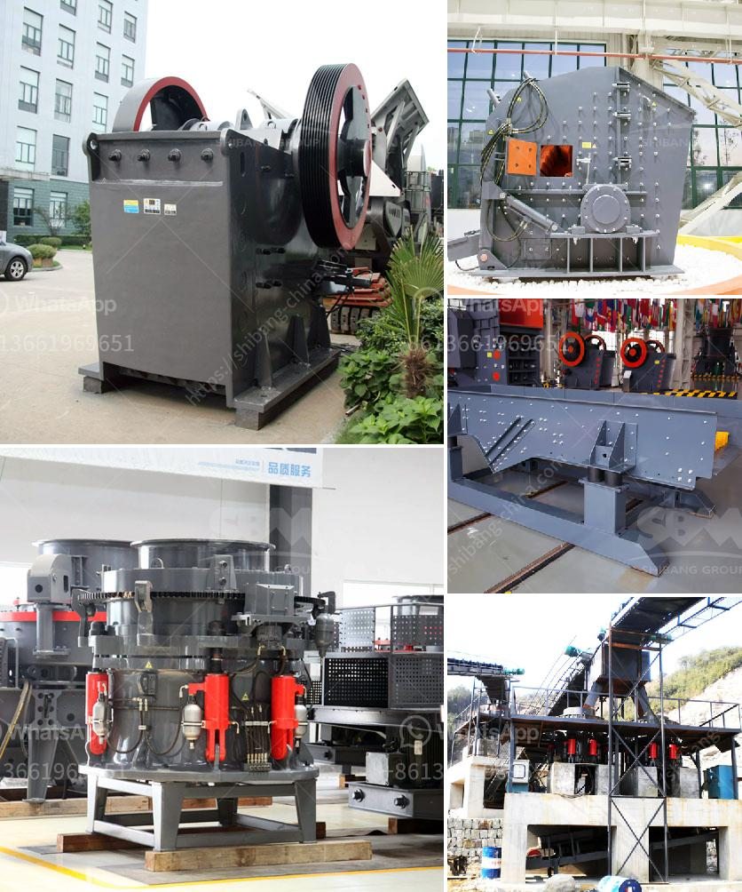

<h3>south africa ballast crushing companies</h3>
South Africa, a country with abundant mineral resources, has played a significant role in the global mining industry. However, the mining sector alone cannot sustain the economic growth of the nation. In recent years, there has been a growing focus on infrastructure development, and ballast crushing companies have emerged as key players in this space.

Ballast refers to the coarse aggregate used in concrete mixtures, which provides stability, strength, and support to the overall structure. Ballast crushing involves the process of breaking down materials into small pieces to fulfill construction requirements. This crucial role has opened up a window of opportunity for South Africa's ballast crushing companies.

These companies, utilizing advanced machinery and technologies, crush and recycle various materials to produce high-quality ballast. They not only contribute to the construction industry but also play a vital role in sustainable waste management. By converting waste materials into usable resources, these companies reduce the strain on landfills, making their operation environmentally friendly.

South Africa's ballast crushing companies prioritize quality, ensuring that their products comply with industry standards. They employ highly skilled workers who are adept at crushing and screening operations. Moreover, they invest in advanced equipment to ensure efficiency and effectiveness in their processes. By utilizing modern machinery and technologies, these companies enhance their productivity and output.

The demand for ballast is steadily increasing due to the surge in infrastructure development projects across the country. Railways, roads, and bridges require a substantial quantity of ballast for stability and longevity. South Africa's ballast crushing companies play a critical role in meeting this demand and contributing to the nation's infrastructure development. Their quality products contribute to the durability and safety of transportation networks, promoting economic growth and connectivity.

Additionally, ballast crushing companies foster inclusive growth by providing employment opportunities to local communities. These companies prioritize hiring and training local personnel, contributing to poverty alleviation and skills development in the region. By creating jobs, they improve livelihoods and reduce unemployment rates, positively impacting the socio-economic landscape of South Africa.

Furthermore, ballast crushing companies contribute to the growth of the small and medium-sized enterprise (SME) sector. They often rely on local suppliers for materials, equipment, and ancillary services. This collaboration creates a ripple effect, stimulating entrepreneurship, and fostering economic diversification. By supporting local suppliers, these companies enhance the resilience and competitiveness of both the ballast industry and the wider economy.

In conclusion, South Africa's ballast crushing companies are vital entities in the construction and infrastructure development sector. They play a crucial role in producing high-quality ballast, contributing to the durability of various construction projects. By employing advanced machinery and technologies, these companies optimize their productivity, while also promoting sustainable waste management practices. Additionally, they create employment opportunities and foster inclusive growth, benefiting local communities and the wider economy. As South Africa continues to prioritize infrastructure development, ballast crushing companies will remain essential players in driving economic growth and creating a sustainable future.
<h3>Contact us</h3><ul><li><strong>Whatsapp:&nbsp;<a href="https://wa.me/8613661969651">+8613661969651</a></strong></li><li><a href="https://swt.shibang-china.com/?git&amp;zhl&amp;south africa ballast crushing companies"><strong>Online Service(chat now)</strong></a></li></ul><h3>Related</h3><ul><li><a href='roller mill type p500.md'>roller mill type p500</a></li><li><a href='chromite crushing plant in karachi pakistan sale.md'>chromite crushing plant in karachi pakistan sale</a></li><li><a href='roll mills supplier in karachi.md'>roll mills supplier in karachi</a></li><li><a href='cost of ball mill 40tonns capacity.md'>cost of ball mill 40tonns capacity</a></li><li><a href='conveyor belts philippine price.md'>conveyor belts philippine price</a></li></ul>