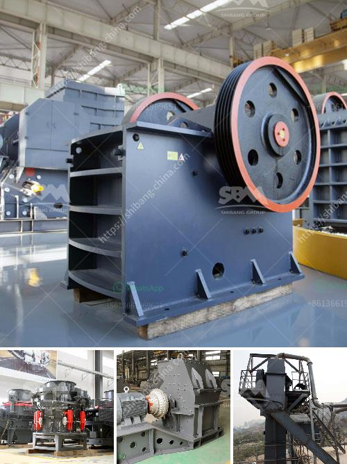

<h3>south africa crusher sale</h3>
South Africa is renowned for its rich mineral resources, contributing significantly to the country's economy. The mining industry plays a vital role in the nation's development, employing thousands of individuals and attracting foreign investment. One of the critical equipment used in mining operations is crushers, which are responsible for breaking down large rocks into smaller pieces. In recent years, South Africa has witnessed a surge in the sale of crushers due to the growing demand for minerals and metals.

The South African crusher market has experienced steady growth in the past decade, mainly driven by the expansion of mining activities. With the increase in demand for minerals globally, mining companies have ramped up their operations, requiring crushing equipment to extract valuable resources efficiently. Crushers are widely used in various mining operations, including coal, gold, platinum, and diamond mines, where they are essential for processing raw materials.

One of the primary factors contributing to the growth of the crusher sales market is the rise in infrastructure development in South Africa. As the government invests in road construction, housing projects, and other infrastructural improvements, the demand for crushed stones and aggregates has surged. Crushers play a crucial role in producing these materials, as they break down large rocks into smaller ones that can be used in construction projects.

Moreover, the increasing demand for sustainable and renewable sources of energy has spurred growth in the sale of crushers. South Africa is making significant strides in renewable energy, particularly in wind and solar power. Crushers are used in the production of materials needed for building wind turbines and solar panels, such as crushed stones and aggregates. As the renewable energy sector expands, the demand for crushers is expected to soar further.

Another factor contributing to the sales of crushers in South Africa is the rapid urbanization and population growth. Urban areas require constant construction and maintenance, creating a continuous need for construction materials. Crushers are crucial in supplying crushed stones and aggregates for various construction projects, including building houses, roads, and bridges.

Furthermore, the advancement in technology has revolutionized the crushing industry in South Africa. Modern crushers are more efficient, robust, and environmentally friendly. They have advanced features that enhance productivity and reduce energy consumption, making them attractive to mining companies. Additionally, crushers equipped with automation and remote-control capabilities improve operational safety, further encouraging their adoption in the mining industry.

Although the South African crusher sales market is thriving, challenges remain. The mining industry faces various hurdles, including regulatory issues, labor disputes, and the fluctuating global commodity prices. These factors can impact the demand and profitability of crushers. It is crucial for manufacturers and suppliers to adapt to the changing market conditions, provide innovative solutions, and maintain strong relationships with customers to stay competitive.

In conclusion, the sale of crushers in South Africa is witnessing a promising growth trajectory. The mining industry's expansion, infrastructure development, renewable energy initiatives, and urbanization are driving the demand for crushers. Technological advancements and environmental considerations have also contributed to the robust sales figures. However, stakeholders in the crusher industry must remain adaptable and resilient to overcome the challenges they may encounter in this dynamic market.
<h3>Contact us</h3><ul><li><strong>Whatsapp:&nbsp;<a href="https://wa.me/8613661969651">+8613661969651</a></strong></li><li><a href="https://swt.shibang-china.com/?git&amp;zhl&amp;south africa crusher sale"><strong>Online Service(chat now)</strong></a></li></ul><h3>Related</h3><ul><li><a href='activated bentonite production line.md'>activated bentonite production line</a></li><li><a href='used vsi crusher for sale in india.md'>used vsi crusher for sale in india</a></li><li><a href='ball mills machine.md'>ball mills machine</a></li><li><a href='stone crusher in subic.md'>stone crusher in subic</a></li><li><a href='china quartz sand dryer manufacturer.md'>china quartz sand dryer manufacturer</a></li></ul>