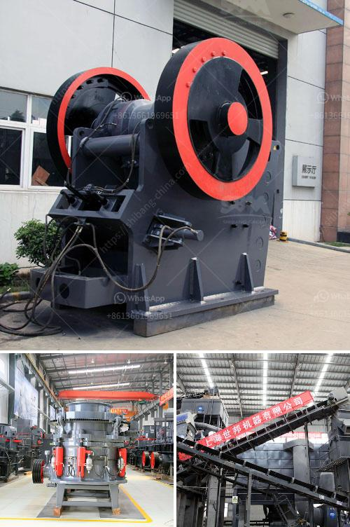

<h3>south africa limestone crushing and blending plant</h3>
South Africa is a country renowned for its immense natural resources. With abundant reserves of limestone, a critical raw material for the construction industry, and other minerals, South Africa has long been a strategic player in the global mining industry. Limestone is used in various applications, including the production of cement, concrete, and as a flux in steel production. 

In recent years, there has been a surge in demand for limestone in South Africa, driven by the country's infrastructure development projects. To meet this growing demand, several limestone crushing and blending plants have been commissioned across the country. One such plant is the fully automated, state-of-the-art limestone crushing plant from Sennetech, which deploys a combination of crushing, screening, and blending techniques to produce limestone products of the highest quality. 

This modern plant incorporates primary and secondary crushing circuits as well as an advanced blending system that ensures a homogenous material is produced for various applications. The plant also boasts advanced dust suppression and noise control systems to ensure a safe working environment for operators and nearby communities. 

The limestone crushing and blending plant has a capacity of 1100 tons per hour. This ensures that the plant is capable of meeting the increased demand for limestone products while minimizing wastage. The plant is also equipped with advanced PLC-based automation systems to ensure smooth operation and consistent product quality. 

In addition to meeting domestic demand, the limestone crushing and blending plant exports its products to neighboring countries such as Botswana and Namibia. This not only generates valuable foreign exchange for South Africa but also contributes to regional infrastructure development through the supply of high-quality construction materials. 

Furthermore, the plant is committed to sustainable practices, adopting measures to minimize its environmental impact. These include the recycling of water used in the production process, the use of energy-efficient equipment, and the restoration of mined-out areas to their natural state. 

Overall, the South Africa limestone crushing and blending plant is a good example of how investment in state-of-the-art technology can deliver exceptional results and maximize efficiency in the crushing and blending of limestone.
<h3>Contact us</h3><ul><li><strong>Whatsapp:&nbsp;<a href="https://wa.me/8613661969651">+8613661969651</a></strong></li><li><a href="https://swt.shibang-china.com/?git&amp;zhl&amp;south africa limestone crushing and blending plant"><strong>Online Service(chat now)</strong></a></li></ul><h3>Related</h3><ul><li><a href='sand washing plant for sale in south africa.md'>sand washing plant for sale in south africa</a></li><li><a href='want to lease diamond mining equipment in south africa.md'>want to lease diamond mining equipment in south africa</a></li><li><a href='cement plant machinery manufacturers in coimbatore.md'>cement plant machinery manufacturers in coimbatore</a></li><li><a href='ball mills for mining in china.md'>ball mills for mining in china</a></li><li><a href='stone crushers from china.md'>stone crushers from china</a></li></ul>