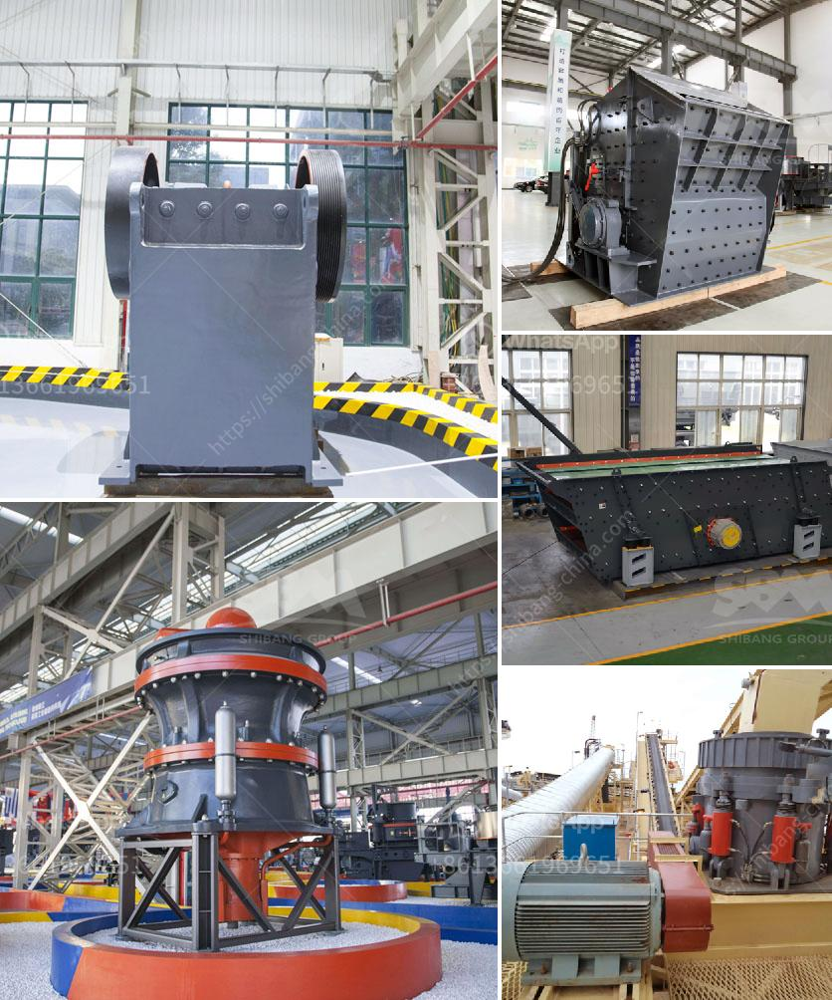

<h3>south africa manganese ore jaw crusher south africa</h3>
South Africa is known for its abundance of mineral resources. It is one of the world leaders in the mining industry. South Africa's manganese ore is found in various locations in the country, including the Kalahari Basin, which is a large underground deposit. The ore is extracted and processed into various grades of manganese ore for export or local use.

Manganese is a widely used metal with numerous applications in various industries. It is used in the production of steel, batteries, chemicals, and many other products. As a result, South Africa's manganese ore is in high demand around the world.

One of the key pieces of equipment used in the mining industry is the jaw crusher. Jaw crushers are used for the coarse reduction and homogenization of brittle, tough materials, making them essential pieces of machinery in many applications. The jaw crusher is well suited for a variety of applications, including rock quarries, sand and gravel, mining, construction and demolition recycling, construction aggregates, road and railway construction, metallurgy, water conservancy, and chemical industries.

In South Africa, jaw crushers are used in various different industries, including mining, construction, metallurgy, coal beneficiation, and many others. These crushers are used for crushing large rocks, ores, and other materials into a manageable size to be further processed or used for specific purposes.

The South Africa manganese ore jaw crusher is designed to handle high levels of shock loads and fatigue force. It is made of heavy-duty, hardened steel construction, which enhances durability and ensures long life service. The modular design allows for quick and easy replacement of parts, minimizing downtime and maximizing productivity.

Additionally, the jaw crusher incorporates advanced technology and features to enhance performance and efficiency. It has a large feed opening and a deep crushing chamber, ensuring high output and low maintenance requirements. The hydraulic system provides easy adjustment of the crusher settings, allowing for precise control of the final product size.

South Africa is an important player in the global manganese ore market and has a significant production capacity. In order to meet the growing demand for manganese ore, the country invests heavily in infrastructure development and mining exploration.

The South Africa manganese ore jaw crusher is an ideal equipment for mining, smelting, and building materials. It is widely used in mining, metallurgy, building materials, highway, railway, water conservancy, chemical industry, and other industries.

In the crushing process, manganese oxide ores are also crushed into particles with 0-6 mm or 0-10 mm by crushing machines. In order to do the best magnetic separation or flotation, manganese ores have been grinded into powder less than 1 mm by ball mill or other manganese ore grinding mills.

In conclusion, South Africa's manganese ore jaw crusher plays an essential role in the mining and mineral industry. It is the preferred equipment for crushing materials with high hardness and high abrasiveness. The jaw crusher ensures high productivity and efficient performance, making it suitable for various applications in the mining industry. With the growing demand for manganese ore, the jaw crusher will continue to be an essential equipment for South Africa's mining industry.
<h3>Contact us</h3><ul><li><strong>Whatsapp:&nbsp;<a href="https://wa.me/8613661969651">+8613661969651</a></strong></li><li><a href="https://swt.shibang-china.com/?git&amp;zhl&amp;south africa manganese ore jaw crusher south africa"><strong>Online Service(chat now)</strong></a></li></ul><h3>Related</h3><ul><li><a href='crushing plant pdf.md'>crushing plant pdf</a></li><li><a href='iron ore beneficiation plant for sale.md'>iron ore beneficiation plant for sale</a></li><li><a href='maize grinding mill in philippines south africa.md'>maize grinding mill in philippines south africa</a></li><li><a href='sand screening plants in south africa.md'>sand screening plants in south africa</a></li><li><a href='hammer mill aluminum slag.md'>hammer mill aluminum slag</a></li></ul>