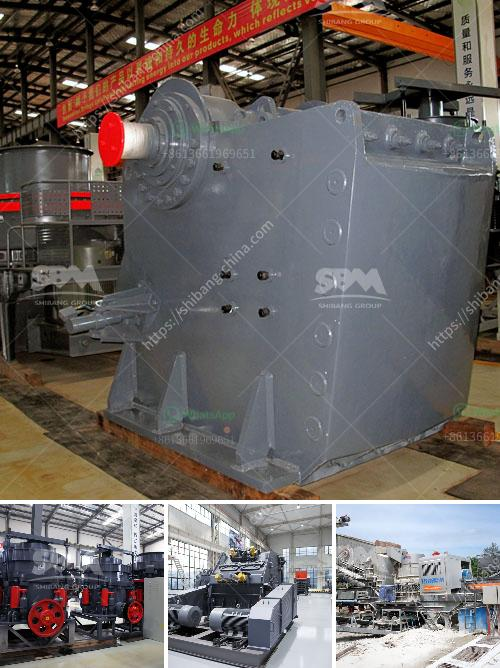

<h3>stamp mill for sale in south africa</h3>
The value of gold ore compared to other metals ore is lower, so the gold ore grinding is a delicate process, both to avoid excessive grinding, cause waste of resources; Inadequate to avoid grinding, resulting in loss of mineral resources, so the Stamp Mill is selected as a gold ore grinding equipment.

In the gold mining industry, the Stamp Mill is installed and widely used in large and medium-sized gold processing plants such as Randfontein, Klerksdorp, Welkom, Johannesburg, Durban, Roodepoort, Kimberley, Benoni, Vereeniging, East London and South Africa's major cities. It is also suitable for small-scale gold processing operations in remote mining areas.

The Stamp Mill main body is made of high-quality steel plates and then shaped by precision welding. The motor drives the disc to rotate through the reducer, so that the material between the grinding roller and the disc is crushed and crushed. Under the action of centrifugal force, the crushed material is thrown up and squeezed by the grinding roller and the grinding ring, and the material comes out from the gap between the grinding roller and the grinding ring. The air enters from the air inlet at the bottom of the Stamp Mill, and the material falls into the center of the disc under the action of the centrifugal force. Due to the action of the rotating disc, the material moves to the edge of the disc, and is ground by the roller. After the roller, the ground material is blown by the airflow of the blower into the analyzer. Above, qualified materials enter the finished product cyclone collector, and the fine powder with the airflow is collected into the dust collector through the pipeline, and then discharged through the powder discharge pipe, which is the finished product.

The Stamp Mill is equipped with a reducer and a motor for rotating the grinding disc and driving grinding roller.Materials are delivered by the feed belt to the center of the grinding disc, and the remaining powdered material is brought up to the grinding roller. The qualified fine powder is ground together with the air at the air inlet of the blower, and the qualified fine powder in the airflow enters the cyclone collector, and is separated and collected by the lower end of the discharge valve in the cyclone collector, and the air with a little fine dust is purifed by the induced draft fan and discharged into the atmosphere.

In summary, the Stamp Mill is highly regarded by users due to its reasonable design, advanced structure and excellent grinding performance. It is widely used in metallurgy, building materials, chemical industry, mining and other industries. With the continuous development of technology, the performance of the Stamp Mill will continue to improve, and it will play an increasingly important role in South Africa's gold mining industry.
<h3>Contact us</h3><ul><li><strong>Whatsapp:&nbsp;<a href="https://wa.me/8613661969651">+8613661969651</a></strong></li><li><a href="https://swt.shibang-china.com/?git&amp;zhl&amp;stamp mill for sale in south africa"><strong>Online Service(chat now)</strong></a></li></ul><h3>Related</h3><ul><li><a href='barite jaw crusher.md'>barite jaw crusher</a></li><li><a href='iron ore processing machine cost.md'>iron ore processing machine cost</a></li><li><a href='hard rock crushers.md'>hard rock crushers</a></li><li><a href='stone crusher plant capacity 500 600 tph.md'>stone crusher plant capacity 500 600 tph</a></li><li><a href='beneficiation process of clay.md'>beneficiation process of clay</a></li></ul>