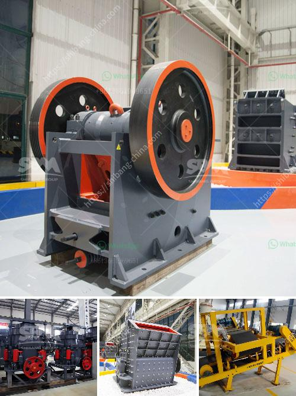

<h3>standar operasional prosedur batubara mininh</h3>
Coal mining is a complex and risky operation that requires careful planning and adherence to standardized processes in order to ensure the safety of workers and maximize efficiency. Standard operating procedures (SOPs) play a crucial role in guiding coal miners through every aspect of their work, from exploration and extraction to transportation and storage. In this article, we will delve into the key SOPs for coal mining, highlighting their importance and the benefits they bring to the industry.

Coal mining begins with exploration, where potential coal reserves are identified and assessed. Exploration SOPs involve activities such as mapping, drilling, and sampling. These protocols ensure that accurate data is collected, providing a solid foundation for subsequent mining operations. SOPs provide guidance on equipment selection, safety precautions, and recording of geological information. They also outline sampling techniques to ensure representative coal samples are collected for analysis and evaluation.

Once coal reserves are identified, mining operations commence. Mining SOPs encompass various processes, from site preparation and coal extraction to blasting and machinery operation. These procedures are designed to safeguard the well-being of workers and minimize the environmental impact of mining activities. SOPs for mining equipment usage specify safety measures, routine maintenance, and quality checks. They also guide workers in the proper handling and storage of explosives, helping to prevent accidents and protect the environment.

After being extracted from the mine, coal needs to be transported to processing plants or storage facilities. Transportation SOPs cover aspects such as loading, unloading, and the use of different modes of transport (e.g., trucks, trains, or conveyors). These protocols ensure that appropriate safety measures are followed, including the securing of loads, maintaining equipment in good condition, and conducting regular checks to prevent spills or accidents during transport.

Coal storage and processing facilities are critical in maintaining the quality and marketability of coal. SOPs for storage emphasize proper ventilation, temperature control, and monitoring for fire hazards. They also outline procedures for coal sampling and testing to ensure compliance with coal quality standards. SOPs for processing facilities cover various processes such as crushing, screening, and washing, providing guidelines for efficient and environmentally responsible coal handling.

Safety is of paramount importance in the coal mining industry due to the inherent risks associated with the operation. Safety SOPs include hazard identification, risk assessment, and safety training for workers. These protocols also establish emergency response procedures and evacuation plans. SOPs for personal protective equipment (PPE) usage and workplace housekeeping help ensure a safe working environment. By following safety SOPs, companies can reduce accident rates, protect their workforce, and maintain compliance with regulatory requirements.

In conclusion, standard operating procedures for coal mining contribute to the efficient and safe conduct of mining operations. SOPs cover various aspects, including exploration, extraction, transportation, storage, and safety. By providing clear guidelines and protocols, SOPs help ensure consistency, reduce risks, and improve the overall operational efficiency of the coal mining industry. Any company involved in coal mining should prioritize the development and implementation of comprehensive SOPs to protect the well-being of their workers and the environment.
<h3>Contact us</h3><ul><li><strong>Whatsapp:&nbsp;<a href="https://wa.me/8613661969651">+8613661969651</a></strong></li><li><a href="https://swt.shibang-china.com/?git&amp;zhl&amp;standar operasional prosedur batubara mininh"><strong>Online Service(chat now)</strong></a></li></ul><h3>Related</h3><ul><li><a href='sample business plan for stone crusher in bolivia.md'>sample business plan for stone crusher in bolivia</a></li><li><a href='usa vertical roller mill.md'>usa vertical roller mill</a></li><li><a href='south africa ballast crushing companies.md'>south africa ballast crushing companies</a></li><li><a href='crushing plant equipment.md'>crushing plant equipment</a></li><li><a href='crusher manufacturers prices.md'>crusher manufacturers prices</a></li></ul>