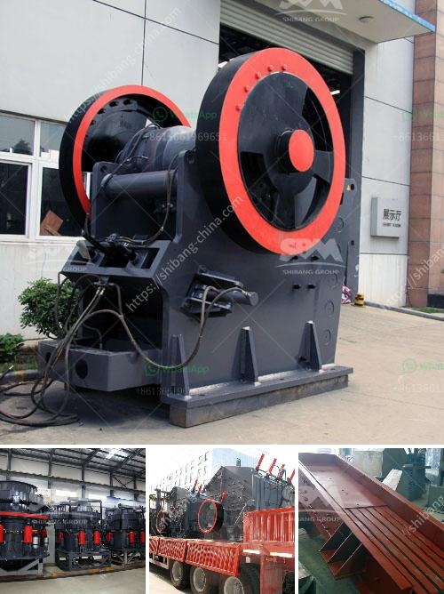

<h3>stationary crusher plant</h3>
A stationary crusher plant is a crucial piece of equipment in construction and mining industries. It is used to crush stones and rocks to produce aggregate materials for various applications. The plant can be equipped with different types of crushers, such as jaw crushers, impact crushers, and cone crushers, depending on the final product requirements.

One of the key advantages of a stationary crusher plant is its easy installation and transportation. Unlike mobile or portable plants, the stationary plant is fixed at a specific location, which means it requires less time and effort to set up. This makes it a cost-effective solution for long-term projects or sites with a stable source of raw materials.

The stationary crusher plant is designed to handle a wide range of materials, such as limestone, granite, basalt, and more. It is ideal for producing high-quality aggregates for construction projects, such as roads, bridges, and buildings. The plant can also be used for mining operations to process various types of ores and minerals.

In addition to its versatility, a stationary crusher plant offers several other benefits. It has a higher production capacity compared to mobile or portable plants, allowing for efficient operations and increased output. The plant is also known for its durability, as it is built with robust materials that can withstand heavy-duty applications.

Furthermore, a stationary crusher plant requires minimal maintenance, reducing downtime and ensuring continuous production. It is equipped with advanced features, such as automated controls, to optimize performance and efficiency. These features also contribute to the plant's safety, reducing the risk of accidents and injuries.

Overall, a stationary crusher plant is an essential investment for construction and mining companies. It provides a reliable and efficient solution for crushing stones and rocks to produce high-quality aggregates. With its easy installation, versatility, and low maintenance requirements, the stationary crusher plant is a valuable asset for any project.
<h3>Contact us</h3><ul><li><strong>Whatsapp:&nbsp;<a href="https://wa.me/8613661969651">+8613661969651</a></strong></li><li><a href="https://swt.shibang-china.com/?git&amp;zhl&amp;stationary crusher plant"><strong>Online Service(chat now)</strong></a></li></ul><h3>Related</h3><ul><li><a href='jaw crusher in uganda.md'>jaw crusher in uganda</a></li><li><a href='artificial sand production line.md'>artificial sand production line</a></li><li><a href='stone crushers for sale usa.md'>stone crushers for sale usa</a></li><li><a href='hammer mill 25 ton hour.md'>hammer mill 25 ton hour</a></li><li><a href='project report on stone crushing unit.md'>project report on stone crushing unit</a></li></ul>