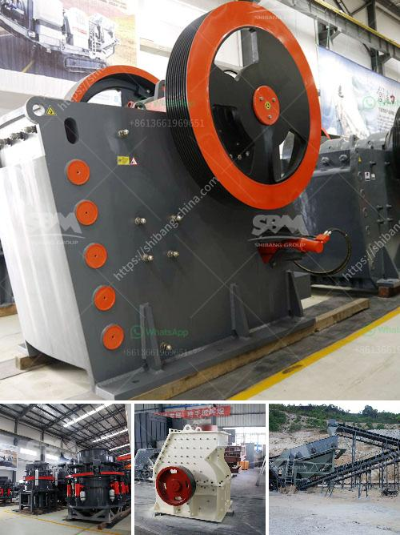

<h3>ston crusher machine in nigeria</h3>
Stone crusher machine, widely used in mining, metallurgy, building materials, roads, railways, water conservancy, chemical and other industries. With the development of the economy, the construction industry is booming, and the demand for stone crushers is growing. More and more investors are investing in the crushing and grinding industry in Nigeria.

For entrepreneurs, Nigeria is abundant with mineral resources, such as limestone, coal, zinc, iron ore, gold, limestone, tin, graphite, and so on. Among these minerals, limestone can be widely used in the construction industry as a building material. Limestone is widely distributed in Nigeria, and its importance cannot be underestimated. The process of crushing the limestone involves three stages: coarse crushing, medium fine crushing, and shaping.

Firstly, large pieces of limestone are evenly fed into the jaw crusher by the vibrating feeder, through the silo for coarse crushing. The coarsely crushed limestone is then transported to the impact crusher or cone crusher for medium fine crushing. This is the key stage for the production of the final product. After crushing, the stone is fed into the vibrating screen to separate the fine stone from the coarse stone. The fine stone material is sent to the sand making machine for further crushing and shaping. The final product is screened and selected, and then conveyed to the storage pile through the belt conveyor for packaging.

In addition to limestone, there are also other types of stone materials that can be processed by crusher machines in Nigeria. For example, granite, marble, talc, barite, kaolin, gypsum, and so on. These non-metallic minerals can be widely used for the construction, industry, agriculture, and other fields. Therefore, investing in a stone crusher machine in Nigeria is a wise choice.

Meanwhile, Oriental Heavy Industry is a professional stone crusher manufacturer in Nigeria. Our company specializes in producing various models of stone crushers, including jaw crushers, cone crushers, hammer crushers, impact crushers, and so on. With a wide range of models, complete functions, and strong technical force, our products have been widely used in Nigeria's mining, quarrying, and construction industries.

Oriental Heavy Industry also provides a perfect after-sales service system, ensuring that customers can use our products without any worries. We not only provide professional equipment, but also provide free professional project plan design, machine installation, and debugging, training guidance, and more. We have won the trust and praise of many customers with our high-quality products and excellent services.

In conclusion, the stone crusher machine in Nigeria is designed to break large rocks into smaller rocks, gravel, or rock dust. It works perfectly and efficiently, and has a strong crushing capacity. With a wide range of applications, the Stone Crusher Machine in Nigeria can be used in many construction industries, such as road and bridge construction, building, water conservancy, and so on. Nigeria's construction industry is a sector that cannot be ignored, and it is also a growing industry. By investing in the stone crusher machine in Nigeria, businesses can be assured that their investment will not be wasted. With our years of experience, we can provide you with professional assistance and advice to help you start a profitable business in the stone crushing industry in Nigeria.
<h3>Contact us</h3><ul><li><strong>Whatsapp:&nbsp;<a href="https://wa.me/8613661969651">+8613661969651</a></strong></li><li><a href="https://swt.shibang-china.com/?git&amp;zhl&amp;ston crusher machine in nigeria"><strong>Online Service(chat now)</strong></a></li></ul><h3>Related</h3><ul><li><a href='gold processing leaching plant.md'>gold processing leaching plant</a></li><li><a href='impact pulverizer model sje25.md'>impact pulverizer model sje25</a></li><li><a href='quick lime hammer crusher.md'>quick lime hammer crusher</a></li><li><a href='japan granite machine.md'>japan granite machine</a></li><li><a href='crusher machines made in saudi.md'>crusher machines made in saudi</a></li></ul>