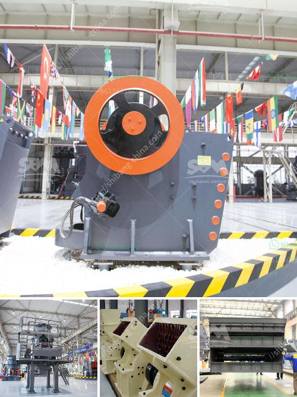

<h3>stone crusher 7 tonne per day</h3>
Stone Crusher 7 Tonne Per Day: An article for stone crusher 7 tonne per day, a compact machine that creates stone boulders from stones, rocks, concrete, or bricks, is a must-have for sustainable construction projects. At a time when manual labor was deemed necessary for such kind of tasks, even more precious, hard to find labor was needed to power the stone crusher. However, the advancement of technology has changed the game.

The stone crusher 7 tonne per day machine is an effective solution to various sand and rock crushing applications that require size reduction. It is categorized as a compact yet strong crusher. It features a roll-out bracing system that allows for a safe and easy on-site installation. The crusher can be easily transported to different sites, making it ideal for construction projects with varying locations.

With an estimated capacity of 7 tonnes per day, this stone crusher can provide great convenience for builders and contractors. It can effortlessly crush stones and rocks into manageable sizes, making it easier to transport and use within construction sites. It can also crush concrete waste and bricks, further contributing to sustainable construction practices by reusing materials that would otherwise end up in landfills.

The stone crusher 7 tonne per day plays a crucial role in sustainable construction. Its efficiency, compactness, and versatility make it an important tool for crushing various materials on-site. It reduces the need for transportation, as the crushed materials can be directly used or easily transported without additional processing.

Moreover, this stone crusher allows builders and contractors to save time and money. Instead of hiring multiple laborers and heavy machinery, they can rely on this compact machine to do the job. Its cost-effectiveness makes it an attractive choice for small to medium-sized construction companies.

In conclusion, the stone crusher 7 tonne per day is a valuable addition to any construction project. Its compact design, efficiency, and versatility make it an essential tool for crushing stones, rocks, concrete, and bricks. This machine not only saves time and money but also contributes to sustainable construction practices by reducing the need for transportation and reusing materials. With its roll-out bracing system and ease of installation, it is a practical choice for builders and contractors looking for an efficient stone crushing solution.
<h3>Contact us</h3><ul><li><strong>Whatsapp:&nbsp;<a href="https://wa.me/8613661969651">+8613661969651</a></strong></li><li><a href="https://swt.shibang-china.com/?git&amp;zhl&amp;stone crusher 7 tonne per day"><strong>Online Service(chat now)</strong></a></li></ul><h3>Related</h3><ul><li><a href='dolomite powder making machine for processing line.md'>dolomite powder making machine for processing line</a></li><li><a href='granite impact crusher.md'>granite impact crusher</a></li><li><a href='crushing plant equipment.md'>crushing plant equipment</a></li><li><a href='quarry crusher machine usa.md'>quarry crusher machine usa</a></li><li><a href='gypsum processing crusher.md'>gypsum processing crusher</a></li></ul>