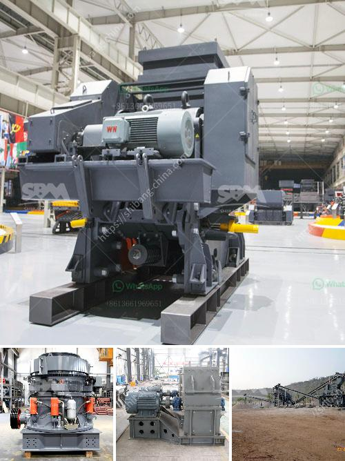

<h3>stone crusher conveyor belts cost</h3>
Stone crusher conveyor belts are widely used in various industries such as mining, metallurgy, coal, power plants, and quarrying, cement, chemical, construction, engineering and rubber manufacturing industries. With the rapid economic development, industries across the globe are experiencing significant growth. As a result, the demand for stone crusher conveyor belts is also on the rise.

Conveyor belts play a crucial role in transporting crushed stone, minerals, and other materials from one place to another. They are a cost-effective and reliable solution for automating repetitive tasks and improving efficiency in various industries. However, the cost of stone crusher conveyor belts can vary depending on several factors. In this article, we will discuss the main factors influencing the cost of stone crusher conveyor belts.

One of the primary factors affecting the cost of stone crusher conveyor belts is the material used for their production. The most common materials used for manufacturing conveyor belts include rubber, nylon, polyester, and steel. Each material has its own unique characteristics, and the choice of material depends on the specific application and requirements.

Rubber conveyor belts are the most commonly used type of conveyor belts due to their excellent elasticity, high tensile strength, and resistance to wear. They offer good impact resistance and can handle bulk materials efficiently. The cost of rubber conveyor belts can vary depending on the quality and thickness of the rubber used.

Nylon conveyor belts are known for their high abrasion resistance, excellent durability, and low elongation. They are ideal for handling heavy materials and can withstand heavy loads. Nylon conveyor belts are typically more expensive than rubber belts due to their superior properties.

Polyester conveyor belts are similar to nylon belts but are less expensive. They offer good durability and can handle moderate loads. Polyester belts are commonly used in industries where high tensile strength and abrasion resistance are required.

Steel conveyor belts are mainly used in heavy-duty applications where high loads and harsh working conditions are present. They are incredibly durable and can withstand extreme temperatures, making them ideal for industries such as mining and steel plants. Steel conveyor belts are the most expensive option due to their complex manufacturing process and high-quality materials.

Apart from the material used, other factors can influence the cost of stone crusher conveyor belts, including the length and width of the belt, the type of conveyor system, and the brand. Longer and wider belts will generally cost more due to the increased material used. Additionally, specialized conveyor systems designed for specific industries or unique requirements may also increase the overall cost.

In conclusion, stone crusher conveyor belts are an essential component in various industries, providing a cost-effective and efficient solution for material transportation. The cost of these belts depends on factors such as the material used, length and width, type of conveyor system, and brand. It is crucial to assess the specific requirements of your industry before selecting the appropriate conveyor belt to ensure optimal performance and cost-effectiveness.
<h3>Contact us</h3><ul><li><strong>Whatsapp:&nbsp;<a href="https://wa.me/8613661969651">+8613661969651</a></strong></li><li><a href="https://swt.shibang-china.com/?git&amp;zhl&amp;stone crusher conveyor belts cost"><strong>Online Service(chat now)</strong></a></li></ul><h3>Related</h3><ul><li><a href='project plan about stone crashing machine.md'>project plan about stone crashing machine</a></li><li><a href='sale of ball mills used in peru.md'>sale of ball mills used in peru</a></li><li><a href='marble crushing line.md'>marble crushing line</a></li><li><a href='100tpd cement mill manufacturers.md'>100tpd cement mill manufacturers</a></li><li><a href='mining and quarrying crusher machinery and equipment.md'>mining and quarrying crusher machinery and equipment</a></li></ul>