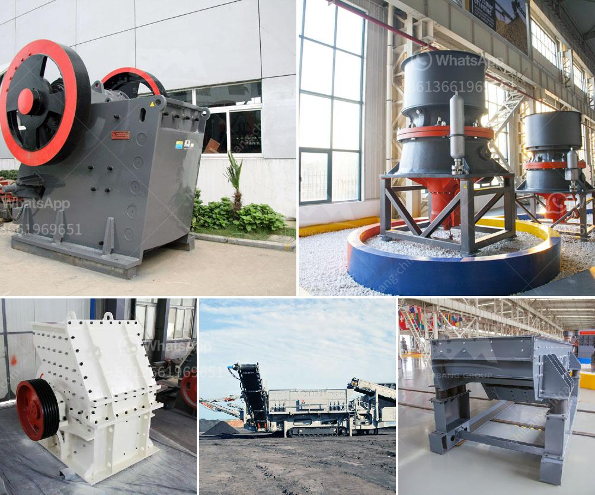

<h3>stone crusher discount</h3>
Stone crusher machines are widely used in mining, smelting, building materials, highways, railways, water conservancy, and chemical industries. Choosing a suitable stone crusher machine is essential for its business success. When choosing a stone crusher machine, consider the various customer needs and aims to provide the best equipment to customers. The stone crusher machines are very popular in the market due to their high productivity and stable performance.

However, as the world economy is experiencing a downturn, and many businesses are facing financial difficulties, stone crusher machine manufacturers have begun offering discounts or promotional activities to attract more customers and boost sales. This article will focus on discussing stone crusher discount and its benefits for customers.

One major benefit of stone crusher discounts is the cost savings. Stone crusher machines are considered a significant investment for any business. Therefore, discounts can help businesses save money by reducing the overall cost of purchasing stone crusher machines. With these savings, businesses can allocate their funds to other areas, such as maintenance and operation costs, or invest in other aspects of their businesses for growth and development.

Another benefit of stone crusher discounts is that they create opportunities for businesses to upgrade their equipment. Technology is constantly advancing, and new stone crusher machines with better features and higher efficiency are being developed. However, upgrading to newer models can be expensive. With the availability of discounts, businesses can take advantage of the opportunity to upgrade their machinery without breaking the bank.

Furthermore, stone crusher discounts can help businesses maintain a competitive advantage. By offering discounted prices, stone crusher machine manufacturers encourage potential customers to choose their products over competitors' offerings. This encourages healthy competition in the market, leading to manufacturers continuously improving their products' quality and performance.

The availability of stone crusher discounts promotes market growth and stimulates the economy. When businesses invest in stone crusher machines, they also tend to purchase other materials and equipment necessary for their operations. This has a domino effect, benefiting suppliers and manufacturers of these materials and equipment. Overall, stone crusher discounts contribute to the growth of the construction and mining industries, creating job opportunities and driving the economy forward.

In conclusion, stone crusher discounts are beneficial for both businesses and the economy. They help businesses save money, upgrade their equipment, and maintain a competitive advantage. These discounts also contribute to the growth of the construction and mining industries, stimulating the economy and creating job opportunities. Therefore, if you are in the market for a stone crusher machine, it is worth considering the available discounts and taking advantage of the cost savings and other benefits they provide.
<h3>Contact us</h3><ul><li><strong>Whatsapp:&nbsp;<a href="https://wa.me/8613661969651">+8613661969651</a></strong></li><li><a href="https://swt.shibang-china.com/?git&amp;zhl&amp;stone crusher discount"><strong>Online Service(chat now)</strong></a></li></ul><h3>Related</h3><ul><li><a href='sand and gravel wash plants usa.md'>sand and gravel wash plants usa</a></li><li><a href='operation of stone crushing plant.md'>operation of stone crushing plant</a></li><li><a href='bauxite crusher manufacturer.md'>bauxite crusher manufacturer</a></li><li><a href='calcium grinding mill.md'>calcium grinding mill</a></li><li><a href='mobile crusher sale.md'>mobile crusher sale</a></li></ul>