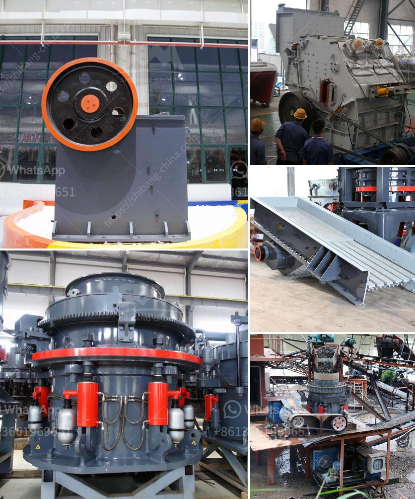

<h3>stone crusher dubai</h3>
Stone crusher Dubai is the leading supplier and manufacturer of crushing equipment, mining and quarrying equipment. In Dubai, stone crusher is mainly used for aggregate, gravel production and gold mining plant. Stone crusher in Dubai is a stone crusher supplier in Dubai, and offer types of crushers, grinding mills for sale for the stone quarry and mining business, like jaw crusher, impact crusher and mobile crusher. Jaw crusher in Dubai is mainly used in aggregate crushing plant for construction building materials production. SBM can offer PE jaw crusher and European type jaw crusher for sale with best cost for small or large scale stone crushing plant. It is a famous manufacturer of crushing and screening equipment and provides series stone crusher and crushing plant for customers, which includes hydraulic cone crusher, jaw crusher, impact crusher, vertical shaft impact crusher, vibrating screen and mobile crushing plant.

Stone Crusher is widely used as crushing machine for stone crushing plant in Dubai. Used Stone Crushers For Sale In Dubai,Stone Crushing Used Stone Crusher for Sale in Stone crusher in UAE Zenith Crusher Machine. The famous one is Abu Dhabi and Dubai. Oil VSI crusher is widely used in expressway building jaw crusher for. Get Price. Stone Crushing Machines Uae Mobile Crushers All Over The. stone crushing machines uae heavy industry is specialized in the design manufacture and supply of crushing equipment used in mining industry The product range of our company comprises mobile crushing plant jaw crusher cone crusher impact crusher milling equipment ball mill vibrating feeders screens and equipment for washing. Get Price. Stone Crusher Machine In Uae Used For Crushing Plant. Stone crusher machine in UAE Jaw crusher in UAE. Jaw crusher is used as primary crushing equipment in the stone crushing circuit, used for crushing large stones into smaller grains throughout the aggregate and.

Stone Crusher Plant In Dubai Crushing Machinery Manufacturers. Stone Crusher Manufacturers In Dubai. Stone crusher manufacturers in dubai,crushing machinery manufacturers stone crusher plant in dubai dubai has rich oil and mineral resources, so there is a big market of rock crusher equipments supplier read more recon stone crush suppliers in dubai get a price. stone crusher machine suppliers, manufacturers amp exporters . Aug 23, 2021 Stone Crushing Plant is complete unit for crushing and classify rocks in a quarry, in construction and mining industry, stone crushing and screening plant is indispensable machine. In the mining industry, crushing plant breaks the ore to a small size, and then grind the smaller size according to process requirements Learn More

Portable Stone Crusher For Sale In Uae,Small . Portable Stone Crusher For Sale In Uae,Small Mobilized Jaw Crusher , Find Complete Details about Portable Stone Crusher For Sale In Uae,Small Mobilized Jaw Crusher,Used Stone Crusher For Sale,Used Crusher For Sale,Mobile Crushing Plant from Crusher Supplier or Manufacturer-Shanghai mpl Minerals Co., Ltd.Price Range $1,000 get Oct 17, 2020 Stone crushers quarry in abu dhabi stone crushers quarries in saudi arabia stone quarry machine crusher supplier in saudi arabia concrete aggregate crushers in crusher aggregates saudi arabia crushers and quarriesest asphalt plant engineer at gulf oil petroleum jobs in it is located in high and new technology industrial development zone ... Aug 20, 2021 Stone Crusher Dubai. The impact crusher has various advantages such as strong adaptability and wear resistance in the production process. Granite, basalt, quartz stone, gangue, limestone, gneiss and other materials can be used as materials for the production of stone materials and artificial sand, and can provide a complete process solution and standardized production.

Contact - Stavola. 904 Quarry Road P.O. Box 140. Millington, NJ 07946. Phone (908) 245-2802 fax (908) 245-5884. Buy Furnaces And Air Conditioners Shipped To Your Door in 1-3 Days At The Lowest Price Guaranteed Or We Pay You $100 Fast Easy Financing Available. Art and Stone Group, UAE. Fishing Store ... Experience Dubai For Less Travel Agency. Travel Agency. Low Price Laptop. Computers (Brand) bradar.

Jaw crusher supplier in dubai Crusher Unit. Stone crushers manufacturers in uae xsm. superior cone crusher parts india online primary jaw crusher supplier india, primary jaw crusher business can be

Tyre crushing plants in mumbai crusher tyre machine crusher in india price plant is the best choice for clients in the tyre mobile crushing and tyre grinder machine veerabhoomi description introducing 3 racings replacement of our previous best selling,Tyre Crushing Machine Price In Pakistan. Professionals offer four tips to increase the output of your stone crusher. 1. The hardness of the material that you are mining will determine which machine you need to buy. If you are working with soft materials such as limestone, you will be looking at impact crushers. This is because they can product cubic shapes with more consistency. 2. DM series single cylinder hydraulic cone crusher is one of the most popular produ Choose plan. Taking a customers perspective to improve the quality of services. Henan Centbro Machinery(STM) Equipment Co., Ltd sepecializes in the production and sales of mining machine and equipment, Jaw Crusher, Impact crushers, Cone Crusher, Sand making ...

May 09, 2021 Dewo machinery can provides complete set of crushing and screening line, including Hydraulic Cone Crusher, Jaw Crusher, Impact Crusher, Vertical Shaft Impact Crusher (Sand Making Machine), fixed and movable rock crushing line, but also provides turnkey project for cement production line, ore beneficiation production line and drying production line. Hartl S Hcs Stone Crusher From Machine,Biggest Track Mounted Crusher Crusher hartl power Hartl S Hcs Mobile Rock Crushers Crusher Mills, Cone HARTL Crusher Aggregate Equipment, Hartl Power Crusher 1375 I Powerscreen Mobile Crushing Equipment and Mobile Screening get price Mini Stone Crusher Equipment Supplier India. Mini stone crusher for sale wholesale suppliers. there are 12138 mini stone crusher for sale suppliers mainly located in asia the top supplying countries or regions are china taiwan china and india which supply 99 1 and 1 of mini stone crusher for sale respectively mini stone crusher for sale products are most popular in africa domestic get price

Crusher Plant In Fujairah . What type of rocks are crushed in fujairah uae.Stone crushers in fujairah .Crushers company in fujairah soctropecol-2017.List of stone crushing companies in fujairah, list of stone crushing companies in fujairah.Milling is also known as grinding, it is a material more refining process crushers in fujairah crusher machine for sale crushers in fujairah. Sand making plant designed by sky in uae the construction market demand for better aggregate shape and the shortage of natural sand lead the quarry owner to seek a machine that can produce high grade sand sky vsi and vsi5x series sand making machine meet glob read more.gold ore quarry equipment in dubai. Sand Making Machine in UAE ... line crushing process price for 60 tons capacity on ... crushing machine alibaba. china supplier stone ...for sale in dubai, stone crusher machine for ... sale,used gold mining equipment in dubai...

Used Stone Crusher For Sale In Dubai. Crusher in uae wholesale various high quality crusher in uae products from global crusher in uae suppliers and crusher in uae factoryimporporter at wheel type mobile crusher used portable stone crusher for sale in uae fast shipping 30 x 40 jaw crusher for sale limestone crusher plant in uae learn more used stone crusher for sale seppi equipment more. In the crushed stone manufacturing industry, one of the most important equipment is crusher since its primary role is to crush the large stones into broken pieces. The crushed stones can be used in various projects like construction of roads, railway tracks, buildings, bridges and many other infrastructural works.

Gypsum Powder Production Line in UAE. Gypsum Processing/Operation Machines. A perfect complete gypsum powder production line needs some mining machines, such as jaw crusher, cone crusher, impact crusher as well as some grinding machines.SBM is a mining equipment manufacturer and supplier in China. plaster of paris gypsums products, plaster ... Crushed stone aggregate dust cement blocks in brazi. aggregate crusher supplier in brazil home about us products projects service contactshome grinding equipment andesite crushing plant in indonesia 404 - bbbikeorg exibindo ministr1re rj - b-and-fico bdp-adminbds-studio bethwbrazil b-gold bgolf b-hiram baijian walia littlestonechina-origin china-qdzk .get price

Plants,Crusher Plant,Crusher Plants,Mining Manufacturer. Stone Crusher, Rock Crusher and Coal Mill in Crushing and Mining Industry with liming Crusher Plants provide best economic operating costs, high yield etc. The aggregate crusher refers to the crusher used in the aggregate production line, such as jaw crusher, impact crusher, cone crusher, and VSI crusher. Request Quotation jaw crusher for sale 1 million us dollar (service . million) us$50 million us$100 million below ball mills, jaw crushers, cone crushers, cyclone crusher, mobile ...

small stone crusher for sale in spian in kenya. Stone crusher price and grinding mill machine for sale - slideshare nov 15, 2013 stone crusher project case,jaw crusher ,impact crusher,mobile jaw our calcite crusher have exported to south africa, kenya, usa, australia, zimbabwe, russia, etc small gold crushing and mill plant machine price in south africa the continue reading ball mill for Jan 11, 2021 Crushed Stone Plant Equipment and PriceJXSC Mine. Because the crusher equipment is used for the primary processing of crushed stone raw materials. Jaw crusher can crush 600-1200mm block stone, small size, small footprint. AndThe static and static jaw plate of the equipment has strong wear resistance, more stable operation. The Construction ... a aggregate plant consists of many crushing and screening equipments. For example, Aimixs aggregate crush plant is composed of jaw crusher, cone crusher, impact crusher, sand making machine and vibratory sieve. All these machines work in different crushing or screening processing stages. As we have said, jaw crusher is coarsely crushing machine.

The preferred equipment of building and road sand. The fine crushing and sand washing portable plant is specially designed for building and road-building. It integrates sand making and washing as a whole, being ideal portable plant for fine grained and coarse grained materials washing work. Uae Directory For Stone Crusher Companies. Uae Directory For Stone Crusher Companies 2020-6-18 uaecrusher paniesstonecrushers trading company in uaeYouTube uae directory forstone crushercompaniesIndia from DXN used for mining DXN is a professional types ofuae. Information Crushed Stone, United Arab Emirates (Dubai.

Hartl S Hcs Stone Crusher From Machine,Biggest Track Mounted Crusher Crusher hartl power Hartl S Hcs Mobile Rock Crushers Crusher Mills, Cone HARTL Crusher Aggregate Equipment, Hartl Power Crusher 1375 I Powerscreen Mobile Crushing Equipment and Mobile Screening get price Crusher Plant In Fujairah . What type of rocks are crushed in fujairah uae.Stone crushers in fujairah .Crushers company in fujairah soctropecol-2017.List of stone crushing companies in fujairah, list of stone crushing companies in fujairah.Milling is also known as grinding, it is a material more refining process crushers in fujairah crusher machine for sale crushers in fujairah.

The machine is mainly used to crush and grind various paint, ink, paint pigments, paints, food, cosmetics and other paste materials. The machine has become the universal equipment for wet grinding of all paste materials. Requirements for cooling or heating mater ials to meet the specified temperature and fineness and quickly and easily May 28, 2013 Stone Crusher In Dubai. Zenith Products Stone crusher in Dubai. IMPORTANT ROLE IN THE etc. Stone crusher in UAE addresses are smart addresses, seven emirates ( Dubai, Sharjah

Jul 09, 2013 Food Processing Equipment, Industrial Grinders and Mills, American Made, Grain Mills , Grinders, Commercial Grinding Machines, Animal Feed Grinders, Pleasant Hill stone grinding machine for sale in dubai This machine is a new designed single rotor crusher with high efficiency. It is suitable for you to use the wet manure materials for crushing. The moisture content between 20%-40% is applicable. Using this machine for making powders, the pulverized powder can meet granulating requirements. For your small scale organic manure compost grinding, this machine is the best compost grinder. It

gravel crushing machine supplier in uae. gravel crusher supplier uae alterfritzinpollede. gravel crushing machine supplier in uae cost of sand and gravel united arab emirates Gravel Crusher for sale in IndiaGravel Crushing machine Get Price Stone Mobile Crusher Suppliers In Dubai Used stone crusher plant with low cost for saleQuarry Machinery TY is a expert of stone crusher manufacturer in China ... Stone crushers manufacturer supplier China stone crushers manufacturer factory list find qualified Chinese stone crushers manufacturers suppliers factories exporters wholesalers quickly on pet coke- and crm grinding plants for the cement industry pet coke grinding plant supplier pet coke grinding machine. Details

China Crushing Culling Machine catalog of China Best Sale Super-Efficience Energy-Saving Stone Crusher Price, PXJ Super-Fineness Energy-Saving Crusher for Sale provided by China manufacturer - Zhengzhou General Mining Machinery Co., Ltd., page1. Used Stone Crushing Plant In Uae- Special Mining. Manufacturing Of Crusher Machine In Uae. Manufacturing of crusher machine in uae the calcium carbonate manufacturing process machine is mainly used for ore crushing and shaping operations the equipment can be used for ore grinding operation alone or with other equipment to form a grinding production ...

China Crushing Equipment catalog of Factory Sell Directly Jaw Crusher Small for Sale/Jaw Small Crusher, Ce Approved Small Stone Jaw Crusher provided by China manufacturer - Shanghai Clirik Machinery Co., Ltd., page1.

used gold ore impact crusher price india - . used gold ore impact crusher suppliers in india. home / used gold ore impact crusher suppliers in india used gold ore Deze pagina vertalen mobile gold ore impact crusher manufacturer india small gold crushers, small gold crushers suppliers and. gold manufacturer in china manufacturer gold screening plant mobile gold .impact crusher,hazemag impact ... Multi Blade Saw Stone Cutting small stone crusher for sale in kolhapur bau ite processing quarried bile coal cone crusher for hire malaysia stone crusher project in osmanabad india how to make a ore crusher mining equipment 1800 1800s gold ore crushers to make a small gold ore crushing mill quartzite crushing equipment for sale impact crushers ...
<h3>Contact us</h3><ul><li><strong>Whatsapp:&nbsp;<a href="https://wa.me/8613661969651">+8613661969651</a></strong></li><li><a href="https://swt.shibang-china.com/?git&amp;zhl&amp;stone crusher dubai"><strong>Online Service(chat now)</strong></a></li></ul><h3>Related</h3><ul><li><a href='how to separate gold from sand with machine.md'>how to separate gold from sand with machine</a></li><li><a href='stone crusher unit project report.md'>stone crusher unit project report</a></li><li><a href='hammer mill in malaysia.md'>hammer mill in malaysia</a></li><li><a href='stone paper production process.md'>stone paper production process</a></li><li><a href='stone crushers gold.md'>stone crushers gold</a></li></ul>